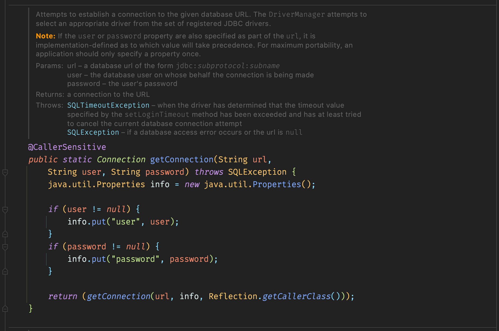

클라이언트가 클래스의 인스턴스를 얻는 방법은 크게 2가지가 존재한다.

1. public 생성자

2. 정적 팩토리 메서드

이 중 **정적 팩토리 메서드**를 사용해서 얻을 수 있는 장단점에 대해 알아보자.

## 정적 팩토리 메서드가 생성자보다 좋은 장점

### 1. 이름을 가질 수 있다

**생성자 이름으로만 표현하기 힘든 반환 객체의 특성을 이름을 통해 드러낼 수 있다.**

예를 들어 소수(*Prime number*)에 해당하는 BigInteger 인스턴스를 받고 싶다고 하자. `new BigInteger(int, int, Random)`와 `BigInteger.probablePrime()`, 둘 중 어느 메서드가 소수를 반환할 것 같은가?

하나의 시그니처로는 생성자를 하나만 만들 수 있다(여기서 말하고자 하는 부분은 시그니처의 매개변수인 것 같다).

> 시그니처(*Signature*)란?
>
> 메서드 시그니처는 자바 프로그래밍 언어에서 메서드 명과 매개변수의 순서, 타입, 개수를 나타낸다. 반환 타입과 exception은 시그니처가 아니다!
>
> 메서드 시그니처가 중요한 이유는 오버로딩인데 컴파일러가 시그니처를 통해 메서드 간의 차이를 식별하기 때문이다.

생성자는 동일한 매개변수를 가지는 생성자를 하나 이상 만들 수 없다. 그러고자 한다면 순서를 달리해야 하는데 이는 개발자로부터 혼란을 오게 만들기 십상이다.

그러나 정적 팩토리 메서드는 상황에 맞는 이름을 사용하여 동일한 매개변수를 받더라도 상황에 맞게 인스턴스를 생성하는 메서드를 여러 개 만들 수 있다.

### 2. 호출될 때마다 인스턴스를 새로 생성하지는 않아도 된다

불변 클래스의 경우 인스턴스를 미리 생성해두거나 새로 생성한 인스턴스를 캐싱하여 재활용한다. **이를 통해서 불필요한 인스턴스 생성을 피할 수 있다.**

언제 어느 인스턴스를 살아 있게 할 것인지를 통제할 수 있는데 이런 클래스를 인스턴스 통제 클래스(*instance-controlled class*)라 한다.

이로 인해 싱글턴으로 만들 수도, 인스턴스화 불가 클래스, 불변 값 클래스의 동치인 인스턴스가 하나뿐임을 보장( `a == b`만 `a.equals(b)`임을 보장)이 된다. 이는 플라이웨이트 패턴의 근간이다

> 플라이웨이트 패턴은 Pool을 만들어 두는 형식과 비슷하다.
>
> 사용되는 예는 Wrapper class의 `valueOf()`메서드나 String Pool 등이 있다.

아래의 Boolean 클래스를 보면 true와 false에 해당하는 인스턴스를 한 개씩만 만들어두고, `valueOf()`메서드에서는 이를 반환하는 형식을 취한다.


### 3. 반환 타입의 하위 타입 객체를 반환할 수 있는 능력이 있다

> 여기서 하위 타입이란 상속 또는 구현을 말한다.
>
> 예를 들면 ArrayList 클래스가 List 인터페이스를 구현하였다면 ArrayList는 List의 하위 타입이다.

**반환할 인스턴스의 클래스를 자유롭게 선택**할 수 있는데, 이는 인터페이스 기반 프레임워크를 만드는 핵심 기술이다.

Java8 이전에는 정적 메서드를 지원하지 않았다. 만약 이름이 `Type`인 인터페이스를 반환하는 정적 메서드가 필요하다면 `Types`라는 (인스턴스화 불가) 동반 클래스(*companion class*)를 만들어 안에 정의하는 게 관례였다.

대표적인 예시는 자바 컬렉션 프레임워크(*Java Collection Framework, JCF*s)이다.


Collections 클래스는 생성자가 private이기 때문에 인스턴스화 불가 클래스이다. 내부에서 총 45개의 유틸리티 구현체(위의 예시에서는 UnmodifiableList)들이 있고, 이들은 Collections의 정적 팩토리 메서드를 통해 얻을 수 있다.

외부에 Collections 클래스가 가지는 유틸리티 구현체를 드러내지 않기 때문에 **클라이언트가 API를 더욱 쉽고 간편하게 사용할 수 있다.** 그리고 반환한 인스턴스는 해당 인스턴스가 구현된 인터페이스를 통해 사용하게 된다.

그리고 책에서는 인스턴스를 인터페이스를 통해 사용하는 것은 좋은 습관이라고 소개하는데, 그 이유는 무엇일까?

아래 예시는 우리가 일반적으로 인터페이스를 통해 사용하는 방식에 해당한다.

```java
public static void main(String[] args) {
    List<String> array = new ArrayList<>();
}
```

생성된 ArrayList 인스턴스를 List 인터페이스로 받아서 사용한다.

이는 추후 구현체가 ArrayList에서 LinkedList로 변경이 되더라도 전체 코드에는 영향을 미치지 않기 때문에 변경에 유연하게 대처할 수 있다.

다시 본론으로 돌아와서, Java8로 넘어오면서 인터페이스에 정적 메서드를 지원하게 됨으로써 인스턴스화 불가 동반 클래스를 굳이 만들 필요 없이 인스턴스 내부에 둘 수 있다. 하지만 아직 정적 메서드로는 public만 허용하기 때문에 여전히 다른 코드들을 package-private으로 두어야 할 수 있다.

### 4. 입력 매개변수에 따라 매번 다른 클래스의 객체를 반환할 수 있다

반환 타입의 하위 타입이기만 하면 어떤 클래스의 객체를 반환하든 상관없다.

EnumSet을 보면 원소의 수에 따라 서로 다른 인스턴스를 반환한다. 원소의 개수가 64개 이하이면 RegularEnumSet 인스턴스를, 65개 이상이면 JumboEnumSet 인스턴스를 반환한다.


**인스턴스를 받아서 사용하는 클라이언트는 어떤 구현체로 되어있는지는 중요하지 않고, 알 필요도 없다.** 단지 EnumSet의 하위 타입이기만 하면 된다.

### 5. 정적 팩토리 메서드를 작성하는 시점에는 반환할 객체의 클래스가 존재하지 않아도 된다

**이런 유연함은 서비스 제공자 프레임워크(*service provider framework*)의 근간**이 된다. 대표적인 서비스 제공자 프레임워크는 JDBC(*Java Database Connectivity*)이다.

서비스 제공자 프레임워크는 크게 3가지 핵심 컴포넌트와 추가적인 1가지 컴포넌트로 구성되어 있다.

- 서비스 인터페이스(*service interface*): 구현체의 동작을 정의

- 제공자 등록 API(*provider registration API*): 제공자가 구현체를 등록할 때 사용

- 서비스 접근 API(*service access API*): 클라이언트가 서비스의 인스턴스를 얻을 때 사용

- 서비스 제공자 인터페이스(*service provider interface*): 서비스 인터페이스의 인스턴스를 생성하는 팩토리 객체를 설명(없으면 리플렉션 사용)


JDBC를 예시로 보면 위의 컴포넌트에 대하여 아래와 같은 요소들이 역할을 수행한다.

- 서비스 인터페이스: Connection

- 제공자 등록 API: DriverManager.registerDriver

- 서비스 접근 API: DriverManager.getConnection

- 서비스 제공자 인터페이스: Driver

이 중 서비스 접근 API는 조건을 명시해서 사용하거나 조건을 명시하지 않으면 기본 구현체를 반환하거나 지원하는 구현체들을 돌아가며 반환한다. 이 부분이 유연한 정적 팩토리라 볼 수 있다.


JDBC에서 `DriverManager.registerDriver()`메서드를 통해 Driver를 등록한다.



그 후 `DriverManager.getConnection()`메서드를 통해 DB 서버의 url, 사용자 이름과 비밀번호를 넘겨줘서 연결을 진행하는데, 이 정적 메서드는 내부의 private 메서드로 작업을 위임한다.


위의 private `getConnection()`메서드에서 `registerDriver()`메서드를 통해 등록된 드라이버들을 순회하면서 적절한 드라이버를 통해 Connection을 반환한다.

즉 `getConnection()`메서드가 작성된 시점에는 Driver가 존재하지 않았지만, 실행 시점에서 등록된 Driver를 통해 새로운 인스턴스를 할당받는 구조로 JDBC는 동작한다.

## 정적 팩토리 메서드가 생성자와 비교해 가지는 단점

### 1. 상속을 해야할 경우 정적 팩토리 메서드만 제공하면 하위 클래스를 만들 수 없다

상속을 하려면 public이나 protected 생성자가 필요한데 **정적 팩토리 메서드만 제공하면 상속이 불가능하다.**

하지만 상속을 할 수 없다는 것은 상속보다 컴포지션을 사용하기를 장려하고 불변 타입을 만드려면 이 제약을 지켜야 하므로 장점이 될 수도 있다.

### 2. 정적 팩토리 메서드는 프로그래머가 찾기 어렵다

**생성자처럼 명확하게 드러나지 않으니** 클라이언트는 직접 방법을 찾아야 하는 상황이 생길 수 있다.

아래의 예시를 보면 클라이언트는 아래와 같은 정적 팩토리 메서드는 API 문서로 작성되어 있지 않다면 찾아내기가 쉽지 않을 것이다.

```java
public class Person {
    private String name;
    private int age;

    private Person(String name, int age) {
        this.name = name;
        this.age = age;
    }

    public static Person whoAreYou(String name, int age) {
        Objects.requireNonNull(name, "이름을 알려주세요.");
        Objects.requireNonNull(age, "나이를 알려주세요.");

        return new Person(name, age);
    }
}
```

```java
public class Main {
    public static void main(String[] args) {
        Person person = new Person("lee", 27); // 생성자는 private로 막혀있기 때문에 사용할 수 없다.
        Person person = Person.??? // 정확한 API 문서가 없다면 어떤 팩토리 메서드를 통해 생성해야 할 지 찾기가 쉽지 않다.
    }
}
```

> 아마 이런 문제를 해결하기 위해 정적 팩토리 메서드의 명명 방식을 제안하는 것 같다.

생성자의 이름으로 흔히 사용하는 명명 방식은 아래와 같다.

- **from**: 매개변수를 하나 받아서 해당 타입의 인스턴스를 반환하는 형태의 메서드
  - `Date d = Date.from(instant);`

- **of**: 여러 매개변수를 받아 적절한 타입의 인스턴스를 반환하는 집계 메서드
  - `Set<Rank> faceCards = EnumSet.of(JACK, QUEEN, KING);`

- **valueOf**: from과 of의 더 자세한 버전
  - `BigInteger prime = BigInteger.valueOf(Integer.MAX_VALUE);`

- **instance 혹은 getInstance**: (매개변수를 받는다면) 매개변수로 명시한 인스턴스를 반환하지만, 같은 인스턴스임을 보장하지는 않는다.
  - `StackWalker luke = StackWalker.getInstance(options);`

- **create 혹은 newInstance**: instance 혹은 getInstance와 같지만, 매번 새로운 인스턴스를 생성해 반환함을 보장한다.
  - `Object newArray = Array.newInstance(classObject, arrayLen);`

- **getType**: getInstance와 같으나, 생성할 클래스가 아닌 다른 클래스에 팩토리 메서드를 정의할 때 쓴다. Type은 팩토리 메서드가 반환할 객체의 타입이다.
  - `FileStore fs = Files.getFileStore(path);`

- **newType**: newInstance와 같으나, 생성할 클래스가 아닌 다른 클래스에 팩토리 메서드를 정의할 때 쓴다. Type은 팩토리 메서드가 반환할 객체의 타입이다.
  - `BufferedReader br = Files.newBufferedReader(path);`

- **type**: getType과 newType의 간결한 버전이다.
  - `List<Complaint> litany = Collections.list(legacyLitany);`

## 정리하면

정적 팩토리 메서드와 생성자는 각자의 쓰임새가 있으니 **상대적인 장단점을 이해하고 사용하자.**

그렇다고 하더라도 정적 팩토리 메서드를 사용하는 게 **유리한 경우가 더 많으므로** 무작정 public 생성자를 제공하던 습관이 있다면 고치자.

## 참고 링크

> [메서드 시그니처(Method signature) - 워너-비](https://wanna-b.tistory.com/75)
>
> [메서드 시그니처(Method signature) - Dongy](https://dongyyy.github.io/java/2019/04/11/java-signature.html)
>
> [[구조 패턴] 플라이웨이트 패턴(Flyweight Pattern) 이해 및 예제 - Ready Kim](https://readystory.tistory.com/137)