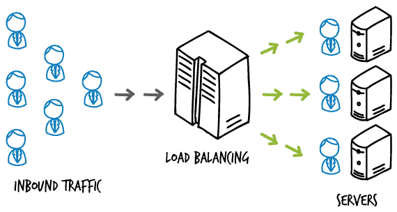

## 데이터와 데이터베이스

데이터와 데이터베이스의 정의는 아래와 같다.

- **데이터(*Data*)**: 컴퓨터 안에 기록되어 있는 숫자

- **데이터베이스(*Database*)**: 데이터의 집합, 특정 데이터를 확인하고 싶을 때 간단하게 찾아낼 수 있도록 정리된 형태

데이터베이스 내의 데이터는 영구적으로 보존되어야 한다. 주 기억장치(RAM)에만 데이터를 저장한다면 시스템이 종료되는 순간 모든 데이터는 날아간다. 그렇기 때문에 하드 디스크와 같은 비휘발성 저장장치를 사용하여 데이터를 저장해야 영구적으로 보존이 가능하다.

## 1. 시스템 내의 데이터베이스

데이터베이스는 데이터 센터의 서버에서부터 개인 사용자의 컴퓨터에까지 내장되어 있다. 휴대전화 내의 전화번호부도 일종의 작은 데이터베이스에 해당한다.

이처럼 데이터베이스는 일상생활과 밀접하게 관련되어있다.

## 2. DB와 DBMS

DB는 데이터베이스(*Database, DB*)의 약어이다. 이렇게 데이터가 저장된 데이터베이스를 효율적으로 관리하는 소프트웨어를 **데이터베이스 관리 시스템(*Database Management System, DBMS*)**라 부른다.

그렇다면 DBMS는 왜 필요할까?

DBMS를 사용해야 하는 목적 3가지를 알아보자.

### 1. 생산성

시스템에서 데이터의 **검색, 추가, 삭제, 갱신**과 같은 처리가 이루어지기 마련이다(이러한 작업을 보통 **CRUD**라 부른다).

DBMS는 이런 기본적인 기능을 제공한다. 시스템을 구축할 때부터 이런 기능을 직접 구현하는 것은 비용 측면에서도 효율적이지 못하다.

### 2. 기능성

데이터베이스는 **복수 유저의 요청에도 대응**할 수 있어야 하고 **대용량의 데이터를 빠르게 저장하고 검색**할 수 있어야 한다.

이런 기능을 DBMS가 제공한다.

### 3. 신뢰성

대규모 데이터베이스는 많은 요청에 대응할 수 있도록 만들어져있다. 이를 위해 하드웨어를 여러 대 구성하여 **신뢰성을 높이는 동시에 성능 향상**을 꾀하기도 한다.

또한, DBMS에서는 여러 대의 컴퓨터를 앞에 두고, 소프트웨어를 통해 확장성(*Scalability*)과 부하 분산(*Load Balancing*)을 구현하기도 한다. 이를 클러스터 구성 또는 스케일 아웃이라고 한다.

> **부하 분산(*load balancing*)**이란?
>
> **서버는 클라이언트로부터 받은 요청에 대한 응답을 진행**한다. 그런데 너무 많은 요청이 한 서버에 들어온다면 **서버는 부하를 이기지 못하고 동작을 멈추게 된다.**
>
> 이런 문제를 해결하고자 나온 방식이 **로드 밸런싱**이다. 로드 밸런싱은 **스케일 아웃(Scale-out)** 방식을 통하여 이런 문제를 해결하였다.
>
> 스케일 아웃 방식은 하나의 서버보다는 여러 대의 서버가 나눠서 일하는 방법이다. 반대되는 스케일 업(Scale-up) 방식은 서버가 더 빠르게 동작하기 위해 하드웨어 성능을 높이는 것이다.
>
> 로드 밸런싱은 스케일 아웃을 통해 여러 서버를 구축하고 요청을 받는 앞 단에서 트래픽을 여러 서버로 분산 시켜 처리하는 방식이다.
>
> 

## 3. 데이터베이스를 조작하는 언어 SQL

그렇다면 DB를 다루기 위해서는 DBMS를 다룰 수 있어야 한다. DBMS와 대화하는 데 필요한 것이 **SQL(*Structured Query Language*)**이다.

SQL은 여러 데이터베이스 중에서도 **관계형 데이터베이스(*Relational Database Management System, RDBMS*)**를 조작할 때 사용된다.

SQL 명령은 아래 3가지로 이루어져 있다.

### 1. DML(*Data Manipulation Language*)

데이터베이스에 데이터를 추가, 삭제하는 등 데이터를 조작할 때 사용한다.

대표적인 예시로는 `SELECT`, `INSERT`, `UPDATE`, `DELETE`가 있다.

### 2. DDL(*Data Definition Language*)

데이터를 정의하는 명령어이다. DBMS에는 데이터베이스 객체(대표적으로 테이블)를 통해 데이터를 관리하는데, 이와 같은 데이터베이스 객체를 생성, 삭제하는 명령어이다.

대표적인 예시로는 `CREATE`, `ALTER`, `DROP` 등이 있다.

### 3. DCL(*Data Control Language*)

데이터를 제어하는 명령어이다. 트랜잭션을 관리하는 명령과 데이터 접근 권한을 제어하는 명령이 포함되어 있다.

이를 조금 더 상세히 나누면 트랜잭션을 관리하는 명령은 TCL(*Transaction Control Language*), 접근 권한을 제어하는 명령은 DCL(*Data Control Language*)라고 한다.

대표적인 예시로는 `GRANT` 등이 있다.

## 정리하면

**데이터**는 **데이터베이스(DB)**를 통해 저장되고, 이를 관리하고 사용하기 위해서는 데이터베이스를 관리해주는 시스템인 **데이터베이스 관리 시스템(*DBMS*)**를 사용해야 한다.

DBMS를 사용하는 목적으로는 **생산성**, **기능성**, **신뢰성**을 확보하기 위함이다.

이런 DBMS는 **SQL(*Structured Query Language*)**을 통해 조작할 수 있는데, SQL은 특히 DBMS 중에서 **관계형 데이터베이스 관리 시스템(*RDBMS*)**를 조작하기 위해 사용된다.

SQL 명령의 종류로는 데이터를 조작하는 **DML**, 데이터를 정의하는 **DDL**, 데이터를 제어하는 **DCL**이 있다.

## 참고 링크

> [로드 밸런서(*Load Balancer*)란? - Nesoy Blog](https://nesoy.github.io/articles/2018-06/Load-Balancer)
>
> [[DB] DDL, DML, DCL 이란? - 불곰](https://brownbears.tistory.com/180)