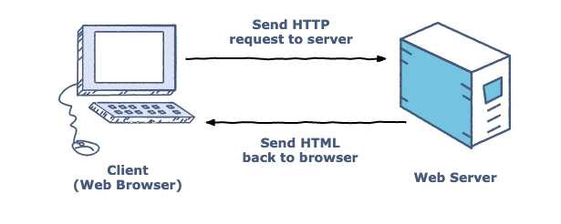

웹 시스템과 연동하는 RDBMS는 수없이 많은 요청에 응답해야 한다. 그렇기 때문에 많은 RDBMS는 **클라이언트/서버 모델**로 동작한다.

클라이언트는 (DB) 서버에 접속 요청이나 SQL 명령 실행 요청을 보낼 수 있고, 서버는 이를 처리하고 클라이언트에게 결과를 보낸다.

이번에는 데이터베이스를 네트워크에 연결된 **서버**라는 관점에서 생각해보도록 하자.

## 1. 클라이언트/서버 모델

**클라이언트/서버 모델**이란 사용자 조작에 따라 요청을 전달하는 **클라이언트**와 해당 요청을 받아 처리하는 **서버**로 소프트웨어를 나누고 복수의 컴퓨터상에서 하나의 모델을 구현하는 시스템을 말한다.

### 웹 시스템에서의 클라이언트/서버

**웹 시스템**은 **브라우저**가 클라이언트, **웹 서버**가 서버인 시스템이다.

웹 시스템에서 브라우저는 사용자가 지정한 URL과 연결된 웹 서버에 **요청(*Request*)**을 보낸다. 그리고 요청을 받은 웹 서버는 요청에 맞게 처리하여 브라우저에 **응답(*Response*)**을 보낸다.

이러한 작업 단위가 클라이언트/서버 시스템의 작업 **하나**이다.

실제 웹에서는 이러한 요청과 응답이 반복되면서 웹 페이지가 표시된다.

### RDBMS의 클라이언트/서버

**RDBMS**도 웹 시스템과 마찬가지로 **클라이언트/서버 시스템**으로 구성되어 있다.

하지만 단순히 요청과 응답을 반복하는 것은 아니다. 먼저, 웹 시스템에서는 없었던 **사용자 인증**이 진행되어야 한다.

RDBMS는 **사용자별로 데이터베이스 접근을 제한**할 수 있기 때문이다. 그래서 데이터베이스를 사용하기 위해서는 사용자 인증을 거쳐야 한다.

사용자 인증은 **사용자 ID**와 **비밀번호**로 실행되고, 만약 인증이 실패한다면 데이터베이스에 접속이 불가능하다.

### SQL 명령 실행

RDBMS에 접속하면 **SQL 명령**을 서버에 보낼 수 있다. 이때 **서버**는 **가동 중인 상태**로 **네트워크에 연결**되어 있어야 한다.

데이터베이스에 **한 번** 접속하면, 연결을 유지하여 **재접속 없이 여러 번** SQL 명령을 보낼 수 있다.

사용이 끝나면 데이터베이스와의 접속이 끊기는데, 일반적으로 **클라이언트가 종료**하면서 접속이 끊긴다.

## 2. 웹 애플리케이션의 구조

**웹 애플리케이션**은 일반적으로 **웹 서버**와 **데이터베이스 서버**의 조합으로 구축된다.

앞에서 설명한 웹 시스템은 클라이언트/서버 모델로 구성되며 **브라우저**가 클라이언트, **아파치와 같은 웹 소프트웨어**가 서버 역할을 한다. 클라이언트가 서버에게 요청하면 웹 서버는 클라이언트에게 응답한다.

> **아파치(Apache)**란?
>
> Apache HTTP Server(HTTPD)라고 불리며, 오픈소스 소프트웨어 그룹인 아파치 소프트웨어 재단에서 만드는 웹서버 프로그램이다.

웹 사이트가 **정적 파일(HTML)**만으로 구성되어 있다면 웹 서버만으로 시스템 구축이 가능하지만, 웹 애플리케이션이라 불릴 정도의 규모라면 **데이터베이스**가 필요하다.

웹 서버에서 **동적**으로 HTML을 생성하려면 제어용 프로그램이 필요하다.

웹 서버에는 **CGI(*Common Gateway Interface*)**라는 동적 콘텐츠를 위한 확장 방식이 있는데, 이를 이용하여 프로그램과 웹 서버 간을 연동, 통신하여 처리한다.

> **CGI(*Common Gateway Interface*)**란?
>
> 웹 서버와 외부 프로그램(CGI 프로그램 또는 CGI 스크립트) 사이에서 정보를 주고받는 방법이나 규약을 말한다. 간단하게 사용자의 요청에 의한 서버의 응답이라고 볼 수 있다.

그래서 실제로 데이터베이스에 접속하는 것은 이러한 **CGI 프로그램**이다.

이 상황에서는 웹 서버의 CGI 프로그램이 데이터베이스의 클라이언트가 된다. 물론 데이터베이스와 접속이 되어야 사용이 가능하다.

이처럼 클라이언트와 서버들은 **네트워크**로 연결되어 있기 때문에 웹 서버와 데이터베이스 서버는 **서로 다른 하드웨어**에 둘 수 있다.

시스템을 구성하는데 여러 대의 하드웨어를 둘 수 있어서 시스템을 유연하게 구성할 수 있다.

## 3. MySQL 서버와 mysql 클라이언트

**MySQL**은 RDBMS의 종류 중 하나이다.

> **MySQL**이란?
>
> MySQL(마이에스큐엘, /maɪ ˌɛskjuːˈɛl/)은 세계에서 가장 많이 쓰이는 오픈 소스의 관계형 데이터베이스 관리 시스템(RDBMS)이다. - [wikipedia](https://ko.wikipedia.org/wiki/MySQL)

**MySQL**을 사용하고 싶다면 PC(*local*)로 **MySQL 서버**를 실행한다.

PC 한 대로 클라이언트와 서버 모두 실행할 수 있는데 그러기 위해서는 네트워크 기능이 필요하다.

클라이언트는 서버를 접속하기 위해 네트워크를 경유해서 다시 PC의 서버로 되돌아오는데 이를 **루프백(*Loopback*) 접속**이라 한다.

> **루프백(*Loopback*)**이란?
>
> 루프백(Loopback, loop-back)이란 전기신호의 라우팅, 디지털 데이터 스트림(digital data streams), 또는 품목의 흐름이 의도적인 가공이나 수정 없이 원래의 장치나 장비로 돌아가는 것을 말한다. - [wikipedia](https://ko.wikipedia.org/wiki/%EB%A3%A8%ED%94%84%EB%B0%B1)

## 정리하면

웹 시스템에서는 많은 요청과 그에 대한 응답을 처리하기 위해 **클라이언트/서버 모델**을 사용한다.

단순히 정적 파일을 로딩하는 경우는 웹 서버로만 가능하지만 보다 동적이고 복잡한 웹 애플리케이션의 경우 **데이터베이스**도 필요로 하게 된다.

**RDBMS**도 마찬가지로 **클라이언트/서버 모델**로 동작하며 클라이언트가 요청한 **SQL 명령**을 데이터베이스 서버에서 실행하며, 그 결과를 다시 클라이언트로 전달해준다.

## 참고 링크

> [웹 시스템 구조 및 아키텍처 - Hyunjun Kim](https://medium.com/akiakma/%EC%9B%B9-%EC%8B%9C%EC%8A%A4%ED%85%9C-%EA%B5%AC%EC%A1%B0-%EB%B0%8F-%EC%95%84%ED%82%A4%ED%85%8D%EC%B2%98-605b981bf060)
>
> [아파치(Apache)란? - 한반가](https://thesauro.tistory.com/entry/%EC%95%84%ED%8C%8C%EC%B9%98Apache-%EB%9E%80)
>
> [CGI란 무엇인가 - sfeg-tistory](https://sfeg.tistory.com/196)