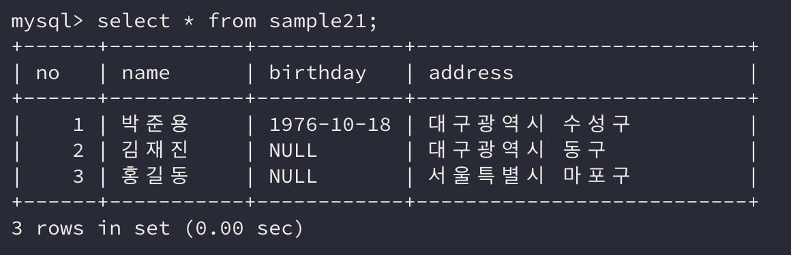

SQL 명령의 Hello World라 할 수 있는 `SELECT`는 아래와 같다.

```sql
SELECT * FROM 테이블명
```

이번에는 `SELECT`라는 SQL 명령에 대해 알아보자.

## 1. SELECT * FROM 테이블명 실행

```sql
SELECT * FROM sample21;
```

`SELECT` 명령에서 `SELECT`와 `*` 그리고 `FROM` 사이에는 스페이스를 넣어 구분한다. `FROM`과 sample21 사이에도 스페이스가 필요하다.

명령어 입력이 끝나면 세미콜론(`;`)을 입력하여 명령어가 종료되었음을 알려야 한다.

세미콜론이 입력되지 않으면 명령이 끝나지 않음으로 인식하기 때문에 SQL 명령이 서버로 전달되지 않고 개행만 이루어진다.

입력한 SQL 명령이 서버에 전달되면 서버는 이를 실행시키고 결과를 반환한다.



## 2. SELECT 명령 구문

`SELECT`는 **DML(*Database Manipulation Language*)**에 속하는 명령으로 SQL에서 자주 사용된다.

`SELECT` 명령은 데이터베이스의 데이터를 **읽어올 수 있다.** `SELECT` 명령은 **질의** 또는 **쿼리**라 불리기도 한다.

```sql
SELECT * FROM sample21;
```

위 SQL 명령에서 맨 앞의 `SELECT`는 SQL 명령의 한 종류이다.

그다음의 `*`(*asterisk*)는 **모든 열**을 의미하는 메타 문자이다.

그렇다고 해서 `*` 라는 이름의 열이 존재하는 것은 아니다. 단지 모든 열이라는 표현을 `*` 로 대체하는 것이기 때문에 실제 SQL 문을 실행할 때에는 `*` 가 모든 열의 이름으로 바뀐다고 생각하면 된다.

위의 코드를 풀어보면 아래와 같은 코드일 것이다.

```sql
SELECT no, name, birthday, address FROM sample21;
```

다음 `FROM`은 **처리 대상 테이블을 지정**하는 키워드이다. 해당 키워드 뒤에는 **테이블 명**이 따라 나온다.

SQL 명령은 키워드에 의해 **구**라는 단위로 나눌 수 있다. 해당 명령의 경우 `SELECT` 구와 `FROM` 구로 나눌 수 있다.

## 3. 예약어와 데이터베이스 객체명

```sql
SELECT * FROM sample21;
```

위의 SQL 명령에서는 여러 단어들이 등장하였다. 이 중 `SELECT`와 `FROM`이 구를 결정하는 **키워드**이자 **예약어**이다.

데이터베이스에는 테이블 외에 **다양한 데이터를 저장하거나 관리하는 어떤 것**을 만들 수 있는데 이것을 **데이터베이스 객체**라고 부른다.

예시로는 **뷰(*View*)**라는 것이 그에 해당한다.

데이터베이스 객체는 이름을 붙여 관리하고 **같은 이름으로 다른 데이터베이스 객체를 만들 수는 없다.**

또한 통상적으로 **예약어와 동일한 이름의 데이터베이스 객체는 만들 수 없다.**

### 대소문자 구별

예약어와 데이터베이스 객체 이름에는 **대소문자를 구별하지 않는다.**

```sql
select * from sample21;
Select * From Sample21;
SELECT * FROM SAMPLE21;
```

위의 세 가지 명령어는 모두 동일한 결과를 반환한다.

하지만 SQL 명령과 달리 데이터베이스 제품들은 **데이터의 대소문자는 구별**한다. 이는 설정으로 변경할 수 있으니 주의해야 한다.

## 4. Hello World를 실행한 결과 = 테이블

`SELECT` 명령을 실행하면 **표 형식의 데이터**가 출력된다.

이러한 표 형식의 데이터는 **행(*Tuple* 또는 *Record*)와 열(*Field* 또는 *Attribute*)**로 구성된다.

각각의 행과 열이 교차하여 만나는 부분을 **셀(*Cell*)**이라 부르고 셀에는 **하나의 데이터 값**이 저장되어 있다.

데이터값의 종류 중에는 `no`처럼 **수치형 데이터**도 있고 `name`처럼 **문자열형 데이터**도 있다. 또한 `birthday`와 같이 **날짜 시간형 데이터**도 있다.

그러나 중요한 점은 열은 **하나의 자료형만을 가질 수 있다는 점**이다. 예를 들어 수치형 데이터의 열에는 문자열형의 데이터가 들어올 수 없다.

## 5. 값이 없는 데이터 = NULL

`NULL`은 특별한 데이터 값으로, 아무것도 저장되어 있지 않은 상태를 의미한다.

`NULL`은 SQL에서 매우 중요한 개념인데 뒤에 가서 더 자세히 다루도록 하겠다.

## 정리하면

SQL 명령에는 여러 종류가 있지만, 그 중 `SELECT`에 대해 알아보았다.

SQL 명령을 구성하는 단어 중에서는 `SELECT`나 `FROM`과 같은 키워드가 있고, 이런 키워드를 단위로 **구**를 나눈다.

`SELECT`를 실행하면 데이터베이스에서 데이터를 조회해 올 수 있다.

데이터값은 몇 가지 종류를 가지고 같은 열에 위치한 데이터는 같은 값 형식을 가져야 한다.

## 참고 링크

> [관계형 데이터베이스 - TCP School](http://tcpschool.com/mysql/mysql_intro_relationalDB)
>
> [[DB] SQL문 기본 문법 - 검색편(select) - heejeong Kwon](https://gmlwjd9405.github.io/2019/04/25/db-sql-select.html)