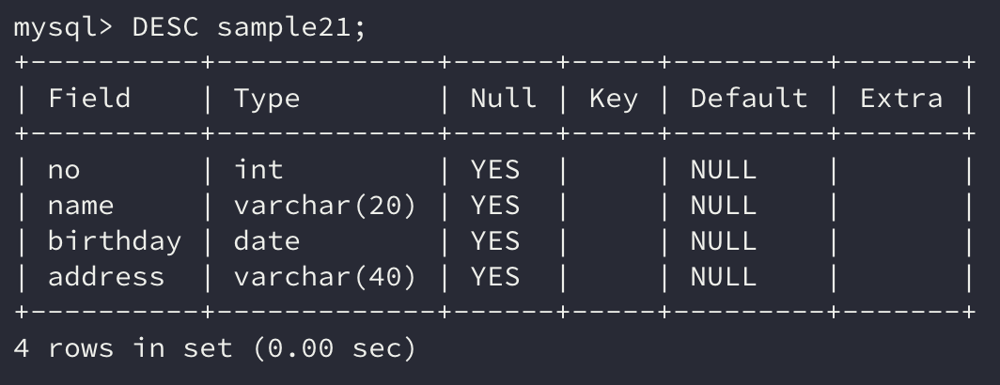

데이터가 저장된 테이블은 **한 개 이상의 열**로 구성되어 있다. 앞에서 살펴본 `SELECT` 명령은 `*` 를 사용하여 모든 열의 데이터를 가져왔다.

그러나 `SELECT` 명령은 조건을 통해 **특정 열에 대한 데이터**만 가져올 수도 있는데, 열의 정보를 안다면 `SELECT` 명령을 작성하기 더 쉬울 것이다.

이번에는 `DESC` 라는 명령을 통해 테이블의 구조를 참조하는 법을 알아보자.

```sql
DESC 테이블명;
```

## 1. DESC 명령

```sql
DESC sample21;
```

위 명령을 입력하면 아래와 같은 결과가 나온다.



이처럼 `DESC` 명령을 사용하면 **테이블의 구조**를 한 번에 파악할 수 있다. 그러나 한 가지 주의할 점은 `DESC`는 **SQL 명령이 아니다!**

아무튼 `DESC` 명령을 실행한 결과에 표시된 정보들을 하나씩 살펴보자.

Field는 해당 **열의 이름**이다.

Type은 해당 **열의 자료형**을 나타낸다.

Null은 해당 열에 **NULL 값을 허용하는지 여부(제약사항)**를 나타낸다. YES라면 **NULL 값을 허용**한다는 의미이다.

Default는 **값을 입력하지 않을 경우 할당되는 기본값**이다. 위의 테이블의 경우에는 모두 NULL 값이 들어간다.

## 2. 자료형

열에 지정할 수 있는 속성에는 여러 가지가 있지만, 그중 가장 중요한 속성은 **자료형**이다. 이러한 자료형에는 어떠한 종류들이 있는지 살펴보자.

### INTEGER 형

**수치형**의 하나이다. **정숫값을 저장**할 수 있으며 실수는 저장할 수 없다.

### CHAR 형

**문자열형**의 하나이다. **문자열을 저장**할 수 있으며 문자열형에서는 **최대 길이를 지정**해야 한다.

`CHAR(10)`로 자료형을 지정한다면 10자리의 문자로 된 문자열을 저장할 수 있다.

**길이가 고정**되어 길이를 벗어나는 문자열은 저장할 수 없기 때문에 **고정 길이 문자열 자료형**이라고 한다.

CHAR 형은 길이가 고정되기 때문에 나머지 빈 공간은 공백 문자로 채운다.

### VARCHAR 형

역시 **문자열형**의 하나이다. **문자열을 저장**할 수 있으며 마찬가지로 **최대 길이를 지정**해야 한다.

하지만 CHAR 형과 다른 점은 **데이터의 크기에 따라 저장 공간이 변한다는 것**이다.

길이가 **가변적**이기 때문에 **가변 길이 문자열 자료형**이라고 한다.

`VARCHAR(255)`로 자료형을 지정하면 **최대 길이가 255자리**인 것이지 **실제 공간은 저장된 데이터의 길이만큼만 사용**하게 된다.

### DATE 형

**날짯값**을 저장할 수 있는 자료형이다. 날짯값이란 2020-09-10과 같이 **연월일을 저장할 수 있는 자료형**이다.

### TIME 형

**시간**을 저장할 수 있는 자료형이다. 12:30:02와 같이 **시분초를 저장할 수 있는 자료형**이다.

추가로 BLOB, BIGINT, TIMESTAMP 등 더 많은 자료형이 존재한다. 이러한 자료형들은 따로 소개하도록 하겠다.

## 정리하면

데이터베이스에서 데이터를 조회하기 위해서는 데이터를 읽어올 **테이블의 구조**를 알아야지 SQL 명령을 작성하기 편리하다.

간단하게 `SELECT` 명령만 하더라도 `SELECT` 구 다음으로 `*` 가 아니라면 원하는 열의 이름을 지정해야 하는데, 테이블의 구조를 알지 못한다면 작성하기가 쉽지 않다.

이번에 배운 `DESC` 명령을 통해 **테이블의 구조를 파악**하고 **올바른 SQL 명령**을 작성하도록 하자

## 참고 링크

> [mysql 자료형 - bungouk6829](https://velog.io/@bungouk6829/mysql-%EC%9E%90%EB%A3%8C%ED%98%95)
>
> [[mysql] 자료형 - 엉으니](https://eongeuni.tistory.com/16)