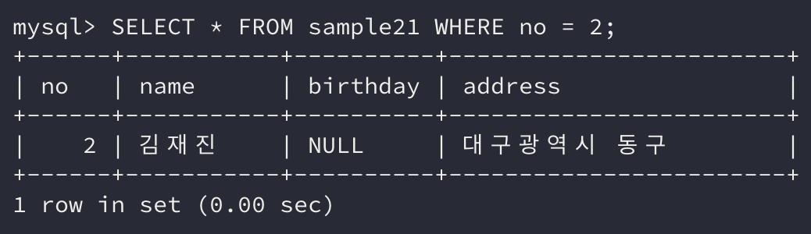

이번에는 **조건을 지정해서 데이터를 검색하는 방법**에 대해 알아보자.

데이터를 검색하는 `SELECT` 명령에서는 **원하는 행과 열**을 가져오는 방법이 있다.

**열을 선택**할 때는 `SELECT` 구를 사용하고 **행을 선택**할 때는 `WHERE` 구를 사용하는데, 어떻게 사용하면 원하는 데이터를 가져올 수 있는지 하나씩 살펴보자.

## 1. SELECT 구에서 열 지정하기

이전에는 `SELECT` 명령에서 `*` 를 사용하여 모든 열의 정보를 가져왔다.

```sql
SELECT * FROM sample21;
```


여기서 원하는 열만 보고 싶다면? `*` 가 위치한 곳에 **특정 열의 이름**을 지정하면 된다.

```sql
SELECT 열1, 열2 ... FROM 테이블명;
```

열은 **콤마(**`,`**)로 구분**지으며 **여러 개를 지정**할 수 있고, 그러면 선택한 열에 해당하는 데이터만 조회된다.

```sql
SELECT no, name FROM sample21;
```


위의 예시는 **no 열**과 **name 열**만 지정하여 데이터를 가져온 것이다.

실제 결괏값도 보면 birthday 열과 address 열은 검색되지 않고 **선택한 열에 대한 데이터만 조회**되었다.

만약 열을 지정하는 위치에 **아무런 값을 입력하지 않는다면 구문 에러가 발생**한다. 물론 **존재하지 않는 열**을 입력해도 **구문 에러**는 발생한다.

**열의 순서**는 **임의**로 정할 수 있다. 테이블과 동일한 순서대로 지정해야 한다는 규칙은 없다.


위의 예시를 보면 열을 **지정한 순서대로** 결과가 출력되는 것을 볼 수 있다.

## 2. WHERE 구에서 행 지정하기

테이블의 열은 많아야 몇십 개 정도지만 **행은 열보다 훨씬 많을 수 있다.**

행은 실제로 **하나의 데이터**를 나타내고, 규모가 큰 서버의 경우 **일반적으로 수백 건에서 많게는 수천만 건의 행**에 달하는 경우도 있다.

이처럼 많은 행에서 **원하는 데이터(행)를 조회**하기 위해서는 `WHERE` 구를 사용한다.

`WHERE` 구는 `FROM` 구 뒤에 표기한다. 예약어 `WHERE` **뒤에 조건**이 표기되고, **조건에 일치하는 행**만 `SELECT`의 결과로 반환된다.

```sql
SELECT 열 FROM 테이블명 WHERE 조건식;
```

### 구의 순서와 생략

SQL에서는 **구의 순서**가 정해져 있다.

`SELECT` → `FROM` → `WHERE` 순서로 등장하며 `SELECT` → `WHERE` → `FROM` 순으로 작성한다면 **구문 에러**가 발생한다.

`WHERE` 구와 같이 **생략이 가능한 구**가 있으며 만약 `WHERE` 구를 생략할 경우 **모든 행이 검색 대상**이 된다.

### WHERE 구

`WHERE` 구는 **조건식**을 포함한다. 조건식은 **열**과 **연산자**, **상수**로 구성되는 식이다.

```sql
SELECT * FROM sample21 WHERE no = 2;
```



위의 예시를 보면 `no = 2`는 올바른 조건식이다. 이 **조건에 일치하는 행**만 `SELECT` 명령의 결과로 반환된다.

### 조건식

앞서 소개한 예시의 `no = 2` 조건식을 보면 no가 2일 경우 **참**이 되는 조건식이다.

이 조건식을 조금 더 잘게 나눠보면  `no`, `=`, `2`로 나눌 수 있다.

먼저 `no`는 **열의 이름**이다. 그리고 `=`은 **연산자**이다.

이 연산자를 기준으로 **좌변과 우변의 항목으로 비교하고 비교한 결과를 반환**한다.

`=` 연산자의 경우는 **좌항과 우항, 2개의 항이 필요**한 **이항 연산자**이고, **비교한 결괏값이 참인지 거짓인지를 반환**하므로 **비교 연산자**라고 부른다.

그중 좌변과 우변의 값이 같으면 참을 반환하는 연산자이다.

따라서 결과는 **no가 2인 데이터만 검색**되게 된다.

### 값이 서로 다른 경우 <\>

비교 연산자는 `=` 연산자만 있는 것이 아니다. 만약 **값이 다른 경우**에 대한 데이터를 조회하고 싶다면 `<>` 연산자를 사용하면 된다.

`no <> 2` 조건식은 **no가 2가 아닌 경우 참**을, **2인 경우 거짓**을 반환하는 조건식이다.

```sql
SELECT * FROM sample21 WHERE no <> 2;
```


SELECT 명령의 결과를 보면 **no가 2가 아닌 데이터만 조회**됐음을 알 수 있다.

이처럼 결과로 반환되는 데이터는 **복수의 값도 반환**될 수 있다.

만약 조건에 일치하는 데이터가 없다면?

아무런 데이터도 반환하지 않을 것이다.

## 3. 문자열형 상수

그럼 조건식에서 **문자열형**을 사용하여 비교하고 싶다면 어떻게 사용할 수 있을까?

주의해야 할 점은 **SQL 명령에서 문자열형을 사용**하려면 **싱글 쿼트(**`''`**)**를 사용하여 표현해야 한다.

```sql
SELECT * FROM sample21 WHERE name = '홍길동';
```


**날짜시간형**의 경우도 **싱글 쿼트**로 감싸서 표현해야 하는데, 이때 **날짜**는 **하이픈(**`-`**)으로 구분**하고 **시간**은 **콜론(**`:`**)**으로 구분하여 표기한다.

```sql
SELECT * FROM 테이블명 WHERE created_at = '2020-09-09 12:25:06';
```

이처럼 조건식에서는 **비교하고자 하는 열과 동일한 자료형의 값**으로 조건식을 작성해야 한다.

이때 **자료형에 맞게 표기한 값(상수)**를 **리터럴(*Literal*)**이라 부른다.

## 4. NULL값 검색

테이블에서 **NULL 값을 검색**하기 위해서는 어떻게 해야할까?

먼저 위에서 배운 형식대로 조건식을 작성하여 검색해보자.

```sql
SELECT * FROM sample21 WHERE birthday = NULL;
```


명령을 실행한 결과로는 아무런 데이터도 반환되지 않았다.

### IS NULL

**NULL 값을 검색**할 때는 연산자가 아니라 `IS NULL`**이라는 술어를 사용**한다. 여기서 **술어**는 연산자와 같은 종류라 생각하면 된다.

```sql
SELECT * FROM sample21 WHERE birthday IS NULL;
```


조건식에 `IS NULL` **술어**를 사용하니 위와 같이 정상적으로 결과가 반환되었다.

만약 **NULL이 아닌 조건으로 검색**하고 싶다면 `IS NOT NULL` **술어**를 사용하면 된다.

## 5. 비교 연산자

앞서 `=` 과 `<>` 와 같은 **비교 연산자**를 살펴보았다.

이 외로도 SQL에서는 많은 **연산자와 술어**를 지원하는데 대표적으로 사용되는 연산자는 아래와 같다.

- `=`: 좌변과 우변의 값이 같을 경우 참이 된다.

- `<>`: 좌변과 우변의 값이 다를 경우 참이 된다.

- `>`: 좌변의 값이 우변의 값보다 크다면 참이 된다.

- `>=`: 좌변의 값이 우변의 값보다 크거나 같다면 참이 된다.

- `<`: 좌변의 값이 우변의 값보다 작다면 참이 된다.

- `<=`: 좌변의 값이 우변의 값보다 작거나 같다면 참이 된다.

위의 연산자에서 주의해야 할 점은 `>=`, `<=`, `<>`와 같은 연산자에서 사이에 스페이스가 들어가면 **연산자 두 개로 인식**하고 **구문 오류**를 발생할 수 있다.

## 정리하면

`SELECT` 명령은 데이터를 조회하는 명령이다. 하지만 데이터의 양이 많아질수록 모든 데이터를 조회해서 확인하기란 **불가능**에 가깝다.

이번에는 `SELECT` 구에 **데이터 조회에 필요한 열**을, `WHERE` 구에 **찾고자 하는 행의 조건식**을 작성해서 원하는 데이터만 가져오는 법을 배웠다. 특히 `WHERE` 구에 조건식을 어떻게 지정할 수 있는지와 조건식에 사용되는 연산자와 같은 개념도 함께 배웠다.

**원하는 데이터를 가져오는 능력**은 데이터베이스를 다룰 때 꼭 필요한 능력이다. 이번에 배운 개념들을 잘 익혀서 필요한 시점에 필요한 데이터만 가져올 수 있도록 연습해보자!