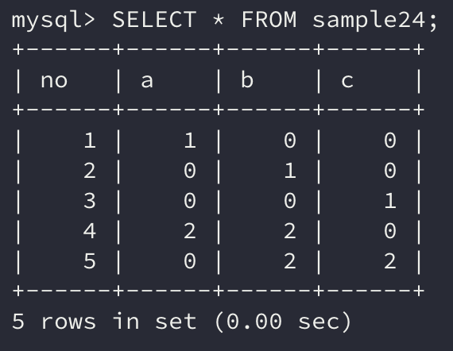
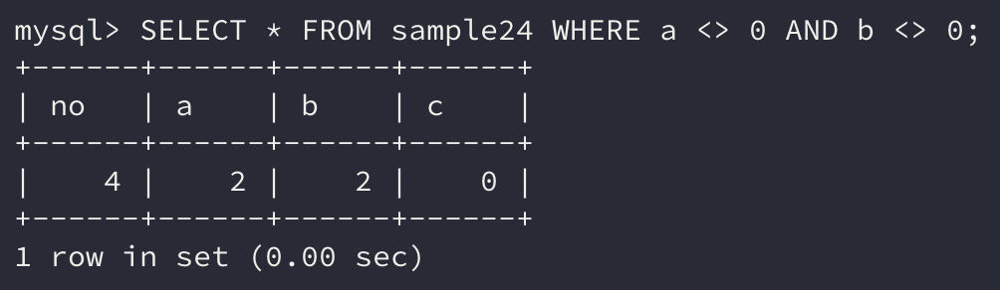
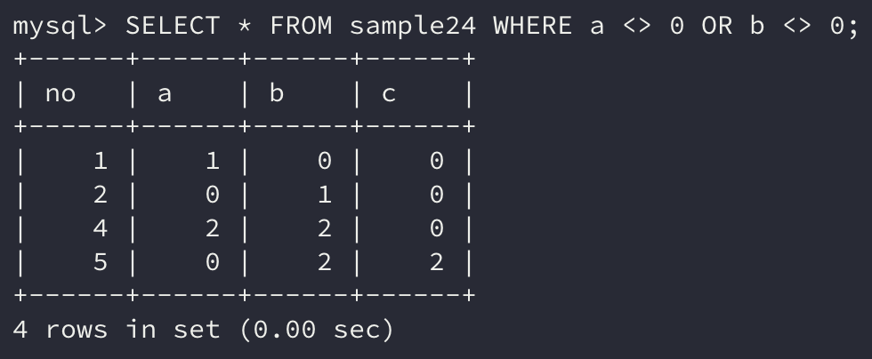
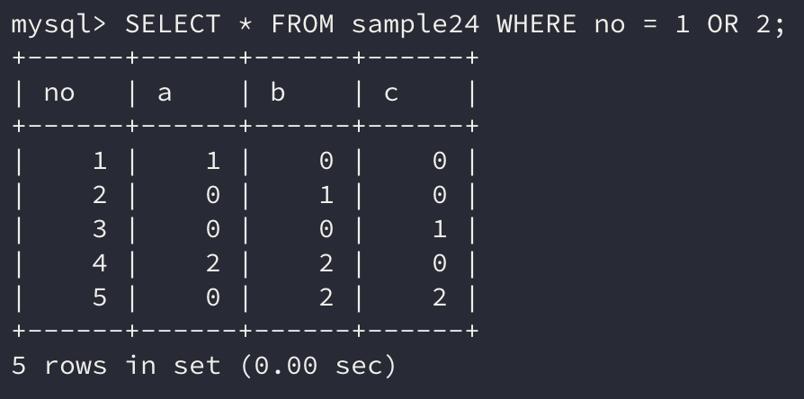
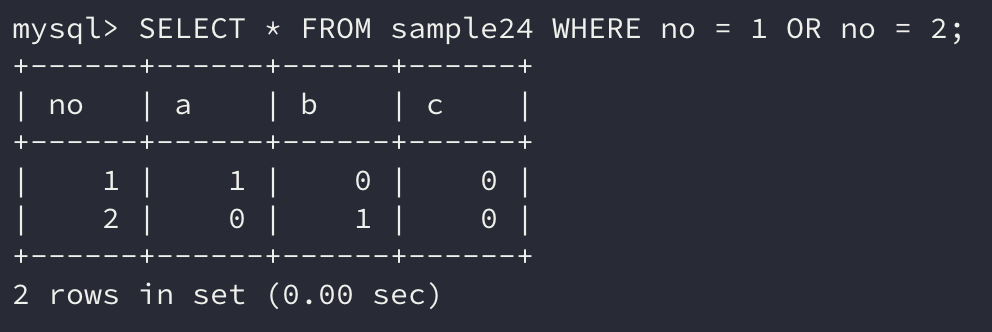
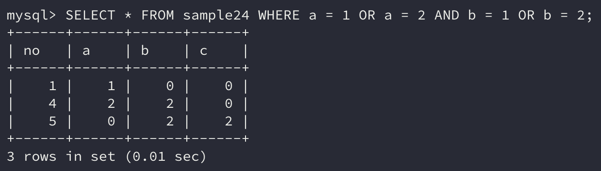
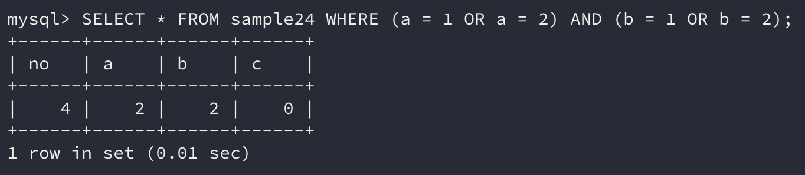
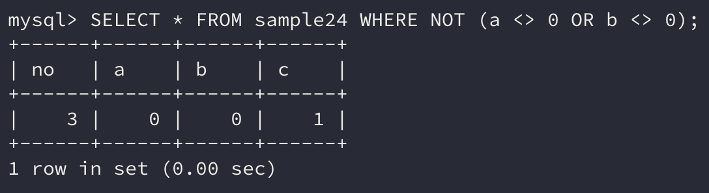

데이터를 검색하다 보면 한 가지 조건만으로는 원하는 결과를 얻기 어렵다.

간단한 예로 **25살 이상의 남자**를 검색하려면 몇 개의 조건이 필요할까? 나이는 25살 이상, 성별은 남자로 **두 가지의 조건**이 필요하다.

이처럼 원하는 데이터를 얻기 위해서는 몇 가지 조건을 **조합**해서 사용해야 한다.

조건을 조합하여 사용하는 경우엔 `WHERE` 구에 **복수의 조건을 지정**하고, `AND`, `OR`, `NOT`의 3가지 방법을 사용할 수 있다.

## 1. AND로 조합하기

복수의 조건을 조합할 때는 `AND`를 가장 많이 사용한다.

`AND`는 **논리 연산자**의 하나로 좌우에 항목이 있어야 하는 **이항 연산자**이다. **좌우의 식이 모두 참**이여야지 참을 반환한다.

```sql
조건식1 AND 조건식2
```

위와 같은 식으로 사용하고 간단한 예제를 통해 살펴보자.

```sql
SELECT * FROM sample24;
```



예제 테이블은 위와 같은 데이터를 가지고 있다. 여기서 **a열과 b열 모두 0이 아닌 데이터만 조회**하고 싶다면 어떻게 하면 될까?

우선 **같지 않다**라는 조건은 `<>` 연산자로 연산이 가능하다.

해당 연산자를 사용하여 `AND`를 사용한 조건식을 만들어보면 아래와 같을 것이다.

> 결과에는 **no열이 4인 행**만 나와야 할 것이다.

```sql
SELECT * FROM sample24 WHERE a <> 0 AND b <> 0;
```



`SELECT` 명령의 결과는 **no열이 4인 행만 출력**된 것을 알 수 있다.

`AND` 연산은 집합의 관점에서 살펴보면 **a열이 0이 아닌 집합과 b열이 0이 아닌 집합의 교집합**을 나타낸다.

즉 AND 연산자는 **교집합**으로 계산할 수 있고 **논리곱**을 계산하는 **논리 연산자**이다.

## 2. OR로 조합하기

`OR` 연산자는 **어느 쪽이든 참이 되면 참을 반환**하는 연산자이다.

`AND` 연산자와 마찬가지로 좌우에 항목을 모두 필요로 하는 **이항 연산자**이며 참의 유무를 반환하는 **논리 연산자**이다.

`OR` 연산자는 **좌우의 항목 중 하나만 참이 되면 참을 반환**한다고 했는데, 이는 **좌우의 항목 모두 거짓일 경우 거짓을 반환한다는 말과 동일**하다.

```sql
조건식1 OR 조건식2
```

위와 같은 식으로 사용하고 간단한 예제를 통해 살펴보자.

```sql
SELECT * FROM sample24 WHERE a <> 0 OR b <> 0;
```

위의 `SELECT` 명령은 **a열이 0이거나 또는 b열이 0인 열**을 검색하는 조건이다.

> 결과는 no가 1, 2, 4, 5가 나와야 할 것이다.



결과는 예상한 대로 **no열이 1, 2, 4, 5인 행만 조회**된 것을 볼 수 있다.

`OR` 연산자은 조건을 만족하는 집합으로 표현하면 **합집합**으로 계산할 수 있고 **논리합**을 계산하는 **논리 연산자**이다.

## 3. AND와 OR를 사용할 경우 주의할 점

지금까지의 예시를 살펴보면 `AND`나 `OR` 연산자의 좌우에는 조건식을 지정하였다.

사실 연산자의 좌우에 조건식이 아닌 **열의 이름이나 상수**만을 지정해도 **에러는 발생하지 않는다.** 하지만 **실제로 원하는 결과를 얻지 못할 수도 있다.**

앞에서 소개한 sample24 테이블에서 **no열이 1 또는 2인 행을 조회**하고 싶어서 아래와 같은 명령을 실행했다고 하자.

```sql
SELECT * FROM sample24 WHERE no = 1 OR 2;
```



이상하게도 실행한 결과는 모든 행이 반환되었다.

사실 조건식에 **열의 이름이나 상수가 들어갈 경우 조건식의 참과 동일**하게 판단한다. 위의 예시에서 `no = 1 OR 2` 조건식에서 **상수인 2가 참**이기 때문에 해당 조건은 항상 참이 되므로 모든 행이 조회된 것이다.

그래서 만약 앞에서 말한 **no열이 1 또는 2인 행을 조회**하는 명령을 실행하고 싶다면 아래의 명령이 올바른 조건식이 될 것이다.

```sql
SELECT * FROM sample24 WHERE no = 1 OR no = 2;
```



### AND와 OR를 조합해 사용하기

sample24 테이블에서 a열과 b열의 데이터는 모두 0, 1, 2 중 하나이다.

앞에서 작성했던 **a열이 0이 아니고 b열이 0이 아니다**라는 조건을 **a열이 1 또는 2이고 b열이 1 또는 2 이다**로 바꾸면 어떻게 될까?

우리가 예상하기에는 전자와 같은 결과가 나와야 할 것이다.

`SELECT` 명령을 `OR` 연산자를 사용하여 풀어보면 `a = 1 OR a = 2` 조건식과 `b = 1 OR b = 2` 조건식이 `AND` 연산자의 좌우에 지정되면 될 것이다.

```sql
SELECT * FROM sample24 WHERE a = 1 OR a = 2 AND b = 1 OR b = 2;
```

`SELECT` 명령을 작성하면 위와 같은데 실제 실행 결과는 어떻게 나올까?



이상하게도 이전의 조회 결과와 **다른 결과가 반환**되었다.

> no열이 1인 행은 b열의 값이 0이고 no열이 5인 행은 a열의 값이 0이다.

왜 이런 결과가 나온 것일까?

### 연산자의 우선순위

결과가 다른 이유는 `AND` 연산자의 우선순위가 `OR` 연산자보다 **높기 때문**이다. 이는 어렸을 적 풀던 수학 문제에서 자주 접하는 문제이다.

`AND` 연산자의 우선순위가 높다 보니 `a = 1 OR a = 2 AND b = 1 OR b = 2` 조건식에서 `a = 2 AND b = 1`이 가장 먼저 연산된 것이다.

즉, 위의 조건식은 3개의 조건식의 조합으로 계산되었다.

- `a = 1`

- `a = 2 AND b = 1`

- `b = 2`

해당 조건식을 우리가 의도한 순서대로 연산하고 싶다면 연산의 **우선순위를 우리가 설정**하면 가능하다.

이를 해결하기 위해선 수학의 기본 연산과 마찬가지로 **괄호**를 사용하면 된다.

```sql
SELECT * FROM sample24 WHERE (a = 1 OR a = 2) AND (b = 1 OR b = 2);
```



위의 명령을 실행하면 우리가 의도했던 결과가 제대로 조회됨을 볼 수 있다.

일반적으로 `OR` 조건식은 괄호로 묶어서 지정하는 경우가 많으며, 이러한 오류가 발생하는 상황을 미연에 막기 위해 **괄호를 붙이는 습관**을 들이는 것도 좋다.

## 4. NOT으로 조합

`NOT` 연산자는 지금까지 알아본 연산자와는 조금 다르게 우측에만 조건식이 오는 **단항 연산자**이다.

```sql
NOT 조건식
```

사용 방법은 위와 같으며 우측 조건식이 참이면 거짓을, 거짓이면 참을 반환하는 **논리 연산자**이다.

```sql
SELECT * FROM sample24 WHERE NOT (a <> 0 OR b <> 0);
```



위 연산의 조건은 **a열이 0이 아니거나 b열이 0이 아닌 행을 제외한 나머지 행을 조회**하는 연산이다.

`NOT`은 집합으로 표현하면 **여집합**으로 계산할 수 있다.

## 정리하면

실제로 데이터를 조회할 때는 **여러 조건의 조합**을 통해 조회하는 경우가 일반적이다.

그만큼 조건식을 **정확히 작성**하는 것이 중요하고 위에서 소개한 연산자들의 **우선순위에 주의**하며 조건식을 작성해야 할 것이다.