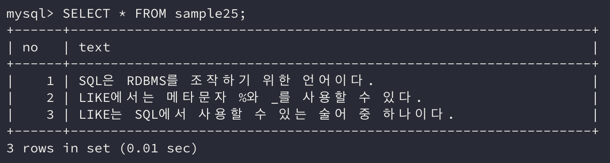
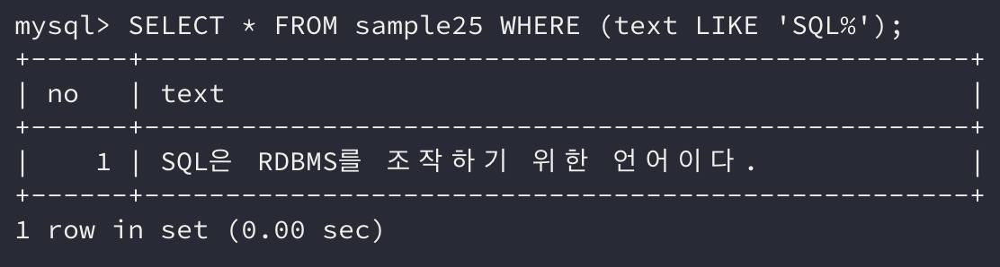
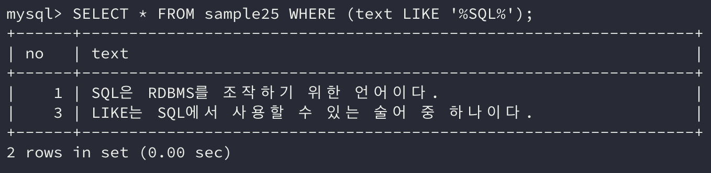
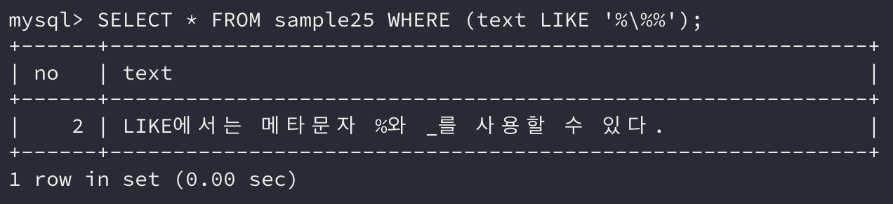

기존에 **값이 일치하는 데이터를 조회**할 때는 조건식에 `=` 연산자를 사용하여 조회하였다. 하지만 **특정 문자나 문자열이 포함되어 있는지를 검색**하고 싶은 경우는 어떻게 해야할까?

이번에는 이런 경우 사용하는 방법인 **패턴 매칭(또는 부분 검색)**에 대해 알아보자.

## 1. LIKE로 패턴 매칭하기

`=` 연산자로 검색할 경우에는 값이 완전히 일치해야 참을 반환한다. 하지만 `LIKE` **술어**를 사용하면 열의 값이 **부분적으로 일치하는 경우에도 참이 반환**된다.

`LIKE` 술어를 사용한 조건식은 아래와 같다.

```sql
열명 LIKE '패턴'
```

`LIKE` 술어는 **이항 연산자**처럼 **왼쪽에 매칭 대상**을 지정하고 **오른쪽에는 패턴을 문자열**로 지정한다. 단, **수치형 상수**는 지정할 수 없다.

**패턴을 정의**할 때는 `%` 그리고 `_`와 같은 **메타문자**를 사용할 수 있다.

**와일드 카드**라고 불리는 메타문자는 패턴 매칭 시 **임의의 문자 또는 문자열에 매치하는 부분**을 지정하기 위해 쓰이는 **특수 문자**이다.

**퍼센트(**`%`**)는 임의의 문자열**을 의미하고 **언더스코어(**`_`**)는 임의의 문자 하나**를 의미한다.

메타문자가 없어도 조회는 가능하지만 이럴 경우 **완전 일치로 검색**되므로 `LIKE` 술어를 사용하는 의미가 없어진다.

```sql
SELECT * FROM sample25;
```



예제 테이블의 text열에서 **SQL** 문자열을 포함하는 행을 **패턴 매칭**으로 검색해보자.

```sql
SELECT * FROM sample25 WHERE (text LIKE 'SQL%');
```



위 명령으로 조회한 결과는 이와 같다.

분명 no열이 3인 행도 SQL 문자열을 포함하는데 조회 결과에 포함되지 않은 이유가 무엇일까?

그 이유는 text열의 데이터가 **SQL 문자열로 시작하지 않았기 때문**이다. 다시 말해 SQL 문자열 **앞에도 문자열이 존재**하므로 `%` 메타문자를 패턴 앞에도 붙여줘야 한다.

```sql
SELECT * FROM sample25 WHERE (text LIKE '%SQL%');
```



이번에는 패턴에 일치하는 모든 데이터가 원하는 대로 조회되었다.

no열이 1인 행은 **SQL 문자열 앞에 아무런 문자열이 등장하지 않는다.** 그런데도 `%` 메타문자에 포함되는 이유는 `%` 메타문자가 **빈 문자열도 매칭**하므로 가능한 것이다.

`'SQL%'`와 같이 문자열의 맨 앞과 패턴을 비교하는 방법을 **전방 일치**라고 한다.

같은 맥락으로 `'%SQL%'`와 같이 문자열의 중간과 패턴을 비교하는 방법을 **중간 일치**, `'%SQL'`와 같이 문자열의 맨 끝과 패턴을 비교하는 방법을 **후방 일치**라고 한다.

## 2. LIKE로 %를 검색하기

예제 테이블에서 no열이 2인 행의 text열 값을 보면 **메타문자**인 `%`와 `_`가 포함되어 있다.

만약 메타문자와 동일한 문자로 `LIKE`로 검색할 경우 어떻게 패턴을 정의해야 할까?

프로그래밍 언어에서는 이런 경우 대체로 **이스케이프**라는 방법으로 처리한다.

**이스케이프 문자(**`\`**)**를 메타문자 앞에 붙이면 메타문자도 패턴에 사용할 수 있다.

```sql
SELECT * FROM sample25 WHERE (text LIKE '%\%%');
```



위와 같이 명령을 작성할 수 있다.

**메타문자가 여러 개**가 나오면 헛갈릴 수도 있지만 **이스케이프 문자(**`\`**)**가 보이면 바로 뒤의 메타문자는 **일반 문자열로 사용**되었다고 생각하면 패턴을 파악하기가 쉬울 것이다.

## 3. 문자열 상수 '의 이스케이프

메타문자는 **이스케이프**로 처리할 수 있음을 확인하였다.

그렇다면 패턴과 같이 문자열 상수 안에 `'`를 포함하고 싶다면 어떻게 해야 할까?

이때는 이스케이프 문자가 아니라 동일한 문자인 `'`를 앞에 한 번 더 붙여주면 된다.

```sql
WHERE (text LIKE 'It''s')
```

위의 예시를 보면 실제로 `It's`라는 문자열을 검색하는 명령임을 알 수 있다.

## 정리하면

이전에 `=` 연산자로는 동일한 값만 비교 가능한 아쉬움을 **패턴 매칭**으로 해결할 수 있음을 알게 되었다.

하지만 보다 복잡한 패턴을 비교해야 하는 경우는 패턴 매칭보다는 **정규 표현식(*Regular Expression*)**을 사용하는 편이 더 나을 수 있다.

**대부분의 데이터베이스가 정규 표현식을 지원**하고 정규 표현식이 **더 많은 메타문자를 지원**하기 때문에 간단한 패턴에 대해서 이러한 패턴 매칭을 사용하면 훨씬 유연하게 조회를 할 수 있을 것이다.