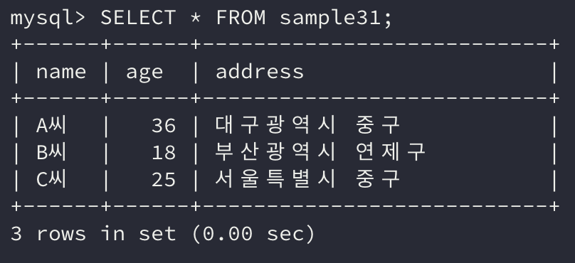
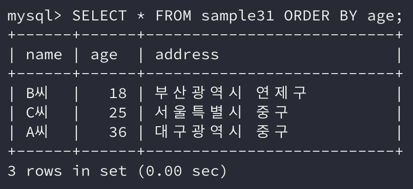
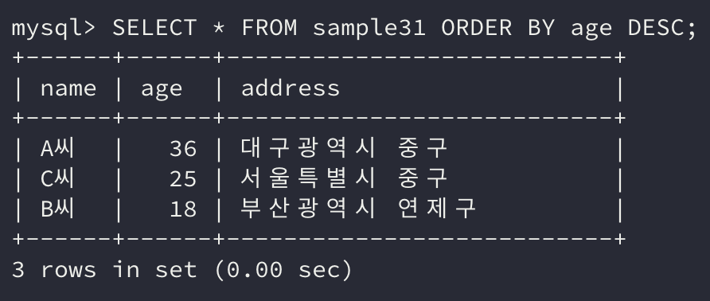
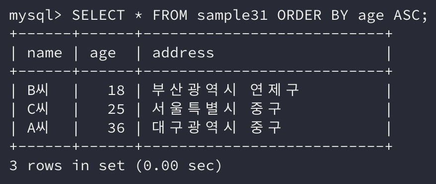
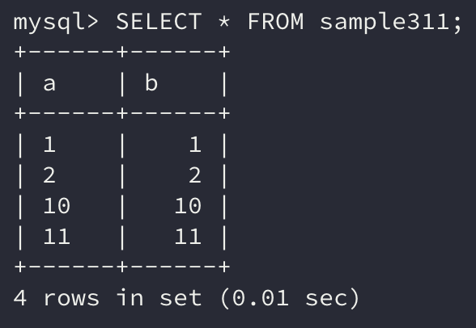
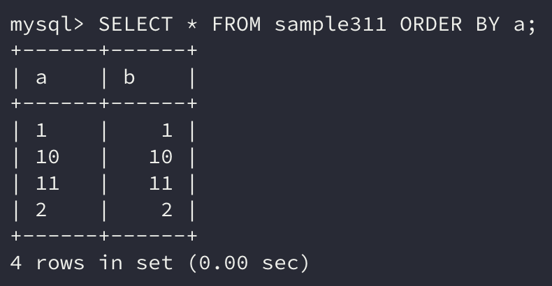
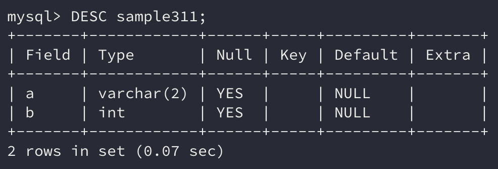

이전에는 조건에 해당하는 행을 검색하는 방법에 대해 알아보았다.

그렇다면 이번에는 검색한 결과를 원하는 순서에 맞게 **정렬하여 조회**하는 방법인 `ORDER BY` 대해 알아보도록 하자.

`ORDER BY` 구는 검색 결과의 행 순서를 바꿀 수 있는 구이다. `ORDER BY` 구를 지정하지 않을 경우엔 데이터베이스에 저장된 순서대로 반환된다.

## 1. ORDER BY로 검색 결과 정렬하기

`SELECT` 명령의 `ORDER BY` 구로 정렬하고 싶은 열을 지정한다. `ORDER BY` 구는 `WHERE` 구 뒤에 지정한다.

> 만약, `WHERE` 구가 없는 경우 `FROM` 구 뒤에 지정한다.

```sql
SELECT 열 명 FROM 테이블 명 WHERE 조건식 ORDER BY 열 명

SELECT 열 명 FROM 테이블 명 ORDER BY 열 명
```

실제 명령을 사용하면 어떤 결과를 반환하는지 예시를 통해 살펴보자.

```sql
SELECT * FROM sample31;
```



아래는 예제 테이블에 대해 `ORDER BY` 구를 지정한 검색 결과이다.

```sql
SELECT * FROM sample31 ORDER BY age;
```



## 2. ORDER BY DESC로 내림차순으로 정렬하기

`ORDER BY` 구의 지정한 열의 값에 따라 행의 순서가 바뀜을 확인하였다. 예제에서는 **오름차순의 순서대로 정렬**이 되었다.

**내림차순**으로 정렬을 하려면 열 명 뒤에 `DESC`를 붙여 지정한다.

```sql
SELECT * FROM sample31 ORDER BY age DESC;
```



결과를 보면 age열에 따라 **내림차순으로 정렬**됨을 알 수 있다.

오름차순은 사실 `ORDER BY` 구의 열 명 뒤에 `ASC`를 붙이는 것이다. **생략이 가능**하므로 아무런 값을 붙이지 않아도 오름차순으로 정렬되는 것이다.

```sql
SELECT * FROM sample31 ORDER BY age ASC;
```



> `DESC`는 하강(*descendant*), `ASC`는 상승(*ascendant*)의 약자이다.

## 3. 대소관계

`ORDER BY` 로 정렬할 때는 값의 대소관계가 중요하다. 다행히, **SQL에서 대소관계** 비교 또한 일반적인 **프로그래밍 언어와 비슷**하다.

먼저 **수치형** 데이터와 **날짜시간형** 데이터는 **숫자 크기**로 판별한다.

**문자열형** 데이터가 조금 복잡하다. 순서는 **알파벳, 한글 순**이며 **한글은 자음, 모음 순**이다. 따라서 하나씩 비교해보면 문자열형의 대소관계는 **사전식 순서**에 의해 결정된다.

### 사전식 순서에서 주의할 점

문자열형에는 우리가 생각하는 **문자**도 있지만 **숫자가 문자로 저장**된 데이터도 분명 있을 것이다.

이는 실제 데이터를 조회할 때는 **잘 구별이 가지 않는데**, 아래의 예를 통해 살펴보도록 하자.

```sql
SELECT * FROM sample311;
```



```sql
SELECT * FROM sample311 ORDER BY a;
```



**a열**은 **수치형 데이터**로 생각하고 a열에 대해 정렬을 했지만 실제로는 기대했던 다르게 행이 정렬되었다.

```sql
DESC sample311;
```



`DESC` 명령을 사용하여 테이블의 구조를 살펴보니 a열의 자료형은 **문자열형**이었다.

그렇기 때문에 위에서 a열을 기준으로 정렬하니 **문자열형의 형태로 정렬**이 되어 수치형 정렬로 기대했던 결과와 달랐던 것이다!

> 한번 잘 살펴보면 a열은 데이터가 **좌측 정렬**이 되어있고 b열은 **우측 정렬**로 되어있다. 아마 문자열형과 수치형을 구분 지어주기 위한 방법이 아닐까 생각한다.

이처럼 자료형에 따라 정렬의 결과는 천차만별로 달라지기 때문에 정렬하고자 하는 열이 **어떤 자료형인지 확인**하고 `ORDER BY` 구를 사용해야 할 것이다.

## 4. ORDER BY는 테이블에 영향을 주지 않는다.

`ORDER BY` 구를 이용하면 정렬된 결과가 나오지만, 이는 순전히 **클라이언트에게 보이기에 정렬된 순서**로 보이는 것이다.

실제로 데이터베이스는 순서를 전혀 변경이 일어나지 않는다.

`SELECT` 명령은 데이터를 검색하는 명령이다. 그래서 테이블의 데이터를 **참조만 할 뿐 변경은 하지 않는다.**

## 정리하면

이번에도 실제로 유용하게 활용될 만한 **정렬을 담당**하는 `ORDER BY` 구에 대해 알아보았다.

**데이터의 자료형에 따라 정렬되는 기준이 달라지기 때문**에 항상 이를 염두에 두고 사용해야 할 것이다.