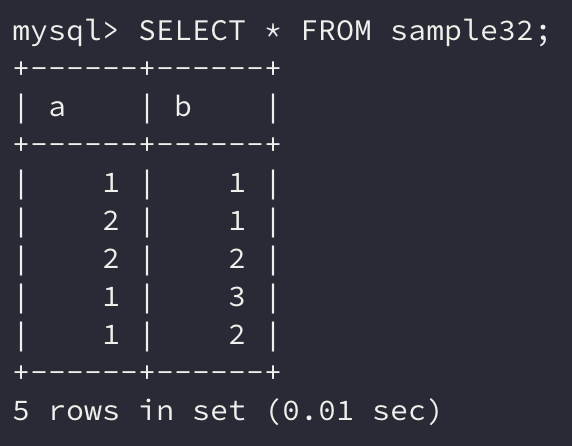
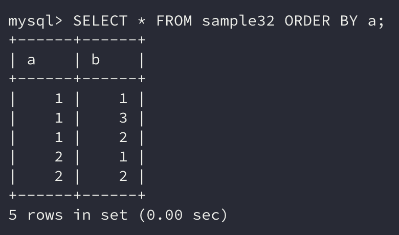
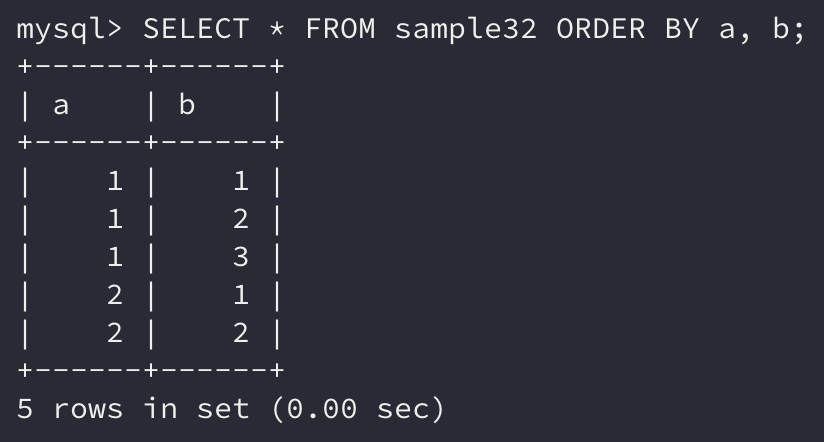
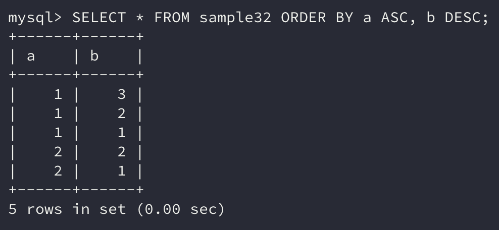
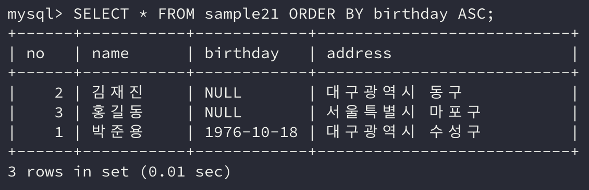

데이터를 조회할 때 `ORDER BY` 구를 사용하면 간단하게 행을 정렬할 수 있다는 것을 알게 되었다.

하지만 실생활에서 **한 개의 열에 대한 정렬**은 실생활에서 발생하는 요구조건을 만족시키기에는 턱없이 부족하다.

이번에는 **복수의 열을 지정해 정렬**하는 방법에 대해 알아보도록 하자.

```sql
SELECT 열 명
    FROM 테이블 명
    WHERE 조건식
    ORDER BY 열 명1 [ASC | DESC], 열 명2 [ASC | DESC] ...
```

## 1. 복수 열로 정렬 지정

이전처럼 한 가지의 열에 대해 정렬을 한다고 가정하자.

해당 열의 **데이터가 동일할 경우** 행의 순서는 어떻게 정해질까? 또 `ORDER BY` 구는 생략이 가능한데 생략한다면 행의 순서는 어떻게 정해질까?

정답은 당시의 **데이터베이스의 상황에 따라** 어떤 순서로 행을 반환할 지 결정된다는 것이다.

그렇기 떄문에 언제나 같은 순서로 결과를 얻고 싶다면 반드시 `ORDER BY` 구로 순서를 지정해야 한다.

```sql
SELECT * FROM sample32;
```



a열과 b열 모두 **수치형 데이터**이다. 이를 **1-1, 1-2 ...**와 같이 정렬하고 싶다면 어떻게 하면 될까?

```sql
SELECT * FROM sample32 ORDER BY a;
```



기존에 사용한 방법대로 **a열에 대해서만 정렬**하니 b열의 순서가 **1, 3, 2의 순서**대로 나온다(a열 값이 1인 행 기준).

a열의 값이 동일한 행은 **데이터베이스에 저장된 순서대로 나열**되기 때문에 이처럼 결과가 반환된 것이다.

### ORDER BY로 복수 열 지정하기

`ORDER BY` 구에는 복수로 열을 지정할 수 있다. `SELECT` 구에서 열을 지정한 것 처럼 **콤마(**`,`**)로 열 명을 구분**해 지정하면 된다.

```sql
SELECT * FROM sample32 ORDER BY a, b;
```



이번에는 우리가 원하는 대로 **a열을 기준으로 정렬**하고, **a열의 값이 동일한 행의 경우 b열을 기준으로 정렬**한 결과를 볼 수 있다.

## 2. 정렬방법 지정하기

복수 열을 지정하여 정렬하는 경우에도 **각각의 열에 정렬방법**을 지정할 수 있다.

```sql
SELECT * FROM sample32 ORDER BY a ASC, b DESC;
```



결과를 보면 **a열은 오름차순**으로 정렬이 진행되고 **b열은 내림차순**으로 정렬이 됨을 볼 수 있다.

여기서도 정렬방법을 생략하면 **기본 정렬 방법**으로 `ASC`가 된다. 그러나 **데이터베이스 제품군에 따라 기본값이 다를 수도 있기 때문에 주의**해야 한다.

정렬방법을 생략하지 않고 지정하면 명령문의 가독성 측면에서도 좋기 때문에 가능한 정렬방법을 **생략하지 말고 지정**하도록 하자.

## 3. NULL 값의 정렬순서

NULL 값은 **특성상 대소비교를 할 수 없어** 정렬 시에는 **별도의 방법으로 취급**된다.

이때 **특정 값보다 큰 값** 또는 **특정 값보다 작은 값** 두 가지로 나뉘며 이 중 하나의 방법으로 대소비교를 한다.

현재 사용 중인 **MySQL**의 경우 **NULL 값을 가장 작은 값으로 취급**하므로 `ASC`에서는 **가장 먼저**, `DESC`에서는 **가장 나중에** 표시한다.



위 조회 결과는 NULL이 포함된 birthday열을 **오름차순**으로 검색한 결과이다. **NULL값이 가장 먼저 등장**함을 볼 수 있다.

## 정리하면

우리가 유용하게 사용할 수 있는 `ORDER BY` 구의 **복수 지정 방법**을 살펴보았다. 실생활에 예를 들어도 여러 조건에 대한 정렬은 필수적이라 볼 수 있다.

`ORDER BY` 구를 작성할 때 데이터베이스에 종속적이지 않게 **정렬방법을 생략하지 않고 작성하는 습관**도 이번을 계기로 함께 들여가면 좋을 것 같다.