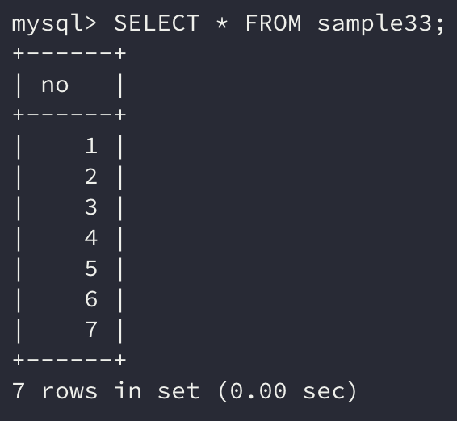
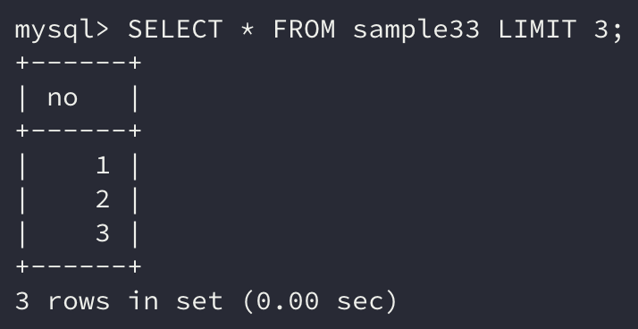
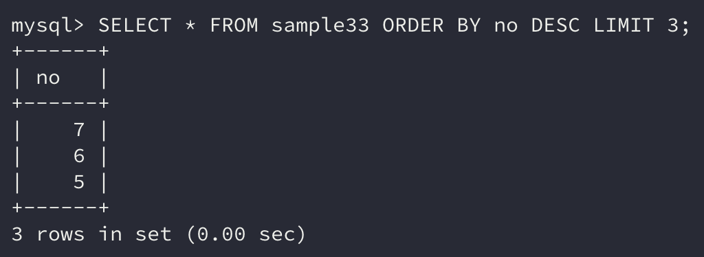
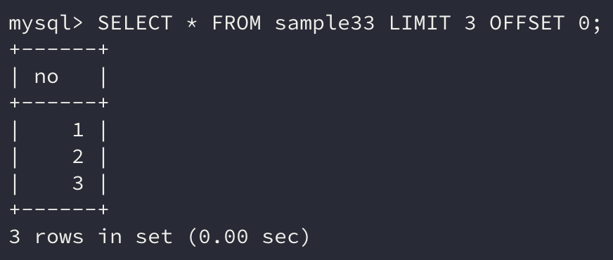
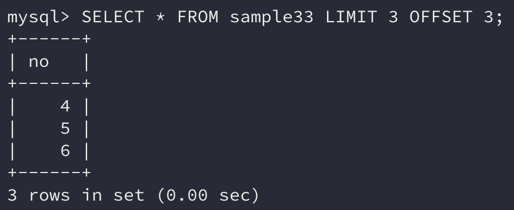

`SELECT` 명령에서 **결과값으로 반환되는 행을 제한**할 수 있었다.

이번에는 `LIMIT` 구로 **행의 갯수를 제한**하는 방법에 대해 알아보자. 이 방법은 많은 데이터를 페이지로 나눠서 보여주는 방법에서 사용된다.

```sql
SELECT 열 명 FROM 테이블 명 LIMIT 행수 [OFFSET 시작행]
```

## 1. 행수 제한

> 들어가기에 앞서, `LIMIT` 구는 **표준 SQL이 아니다.**
>
> **MySQL**과 **PostgreSQL**에서 사용할 수 있는 문법이라는 점에 유의하자.

`LIMIT` 구는 `SELECT` 명령의 마지막에 지정하는 것으로 `WHERE` 구나 `ORDER BY` 구의 뒤에 지정된다.

```sql
SELECT 열 명 FROM 테이블 명 WHERE 조건식 ORDER BY 열 명 LIMIT 행수
```

`LIMIT` 다음에는 **최대 행수**를 **수치**로 지정한다. 10으로 지정하면 **최대 행수를 10개까지** 보여주겠다는 의미이다.

이 말인즉슨, 10개보다 작은 데이터가 있으면 **해당하는 데이터의 개수만큼만** 보여주게 된다.

```sql
SELECT * FROM sample33;
```



예제 테이블을 보면 no열만 가지고 1부터 7까지의 연속된 숫자로 이루어져 있다.

위 테이블의 데이터를 **3개의 행만 반환**하도록 `LIMIT`**로 제한**해보자.

```sql
SELECT * FROM sample33 LIMIT 3;
```



명령의 결과는 **3개의 행만 반환**되었다. 즉, `LIMIT`로 지정하는 것은 **최대 행수**이다.

### 정렬한 후 제한하기

위와 같은 결과를 `WHERE` 구를 사용하여 얻을 수 있을까?

```sql
SELECT * FROM sample33 WHERE no <= 3;
```

이처럼 `SELECT` 명령을 작성하면 동일한 결과를 얻을 수 있을 것이다. 하지만 `LIMIT`와 `WHERE`은 **기능과 내부처리 순서가 전혀 다르다.**

`LIMIT`는 **반환할 행수를 제한하는 기능**으로 `WHERE` 구로 검색한 후 `ORDER BY`로 정렬한 뒤 최종적으로 처리하게 된다.

이를 확인해보기 위해 위의 데이터를 내림차순으로 정렬하고 3개의 행만 조회하도록 SQL 명령을 작성해보자.

```sql
SELECT * FROM sample33 ORDER BY no DESC LIMIT 3;
```



예상대로 no열을 내림차순으로 정렬하고 위에서 3개의 행에 해당하는 **7, 6, 5**가 표시되었다.

### LIMIT를 사용할 수 없는 데이터베이스에서의 행 제한

앞서 말했듯이 `LIMIT`는 **표준 SQL이 아니기 때문**에 다른 데이터베이스에서는 사용이 불가능하다.

그렇다면 다른 데이터베이스에서 `LIMIT`와 같은 역할을 하는 명령은 어떤 것이 있을까?

SQL Server는 `LIMIT`와 비슷한 기능을 하는 `TOP`을 사용할 수 있다.

```sql
SELECT TOP 3 * FROM sample33;
```

Oracle에는 `LIMIT`도 `TOP`도 없다. 대신 `ROWNUM`이라는 열을 사용해 `WHERE` 구로 조건을 지정해 행을 제한할 수 있다.

```sql
SELECT * FROM sample33 WHERE ROWNUM <= 3;
```

`ROWNUM`은 클라이언트에게 결과가 반환될 때 각 행에 할당되는 번호이다.

하지만, `ROWNUM`은 `WHERE` 구로 행을 제한하기 때문에 정렬(`ORDER BY`)하기 전에 처리되어 `LIMIT`로 행을 제한하는 경우와 결괏값이 다른 것이 차이점이다.

## 2. 오프셋 지정

시작할 때 말했듯이 대량의 데이터를 한 번에 불러와서 화면에 표시하는 것은 **기능적이나 속도 측면에서도 효율적이지 못하다.**

일반적으로 **페이지 나누기(*Pagination*)** 기능을 사용하는데 이때 `LIMIT`와 `OFFSET`을 사용하여 처리할 수 있다.

예를 들어 한 페이지당 5개의 데이터를 표시하도록 하려면 첫 페이지는 `LIMIT 5`로 결괏값을 표시하면 된다.

그리고 그 다음 페이지는 **6번째 행부터 5건의 데이터를 표시**하면 된다.

이때 몇 번째 행부터 데이터를 취득할 것인지를 가리키는 방법이 `OFFSET`이다.

```sql
SELECT * FROM sample33 LIMIT 3 OFFSET 0;
```



위 명령의 결과는 첫 번째 행부터 세 번째 행까지 표시되었는데, 이는 `OFFSET`을 적용하지 않았을 때와 동일한 결과이다.

`LIMIT` 구의 `OFFSET`은 생략 가능하며 **기본값은 0**이다.

`OFFSET`의 행 위치는 일반적인 프로그래밍 언어의 **배열 인덱스**와 동일하게 적용된다.

**0**이 가장 **첫 번째 행**이 되고 만약 **네 번째 행**을 얻고 싶다면 위치를 **3**으로 지정하면 된다.

```sql
SELECT 열 명 FROM 테이블 명 LIMIT 행수 OFFSET 위치;
```

두 번째 페이지를 표시하려면 위에서 설명한 대로 네 번째 행을 나타내는 **3**을 `OFFSET`의 위치에 지정하면 된다.

```sql
SELECT * FROM sample33 LIMIT 3 OFFSET 3;
```



결과는 예상한 대로 다음 페이지에 해당하는 **4, 5, 6**을 반환한다.

## 정리하면

이번에는 `SELECT` 명령을 실행할 때 **반환되는 행의 개수**를 `LIMIT` 구로 **제한하는 방법**을 알아보았다.

실제 서비스를 구현하다 보면 **불필요한 데이터나 요청은 성능 하락의 요인**으로 작용한다.

`LIMIT`와 `OFFSET`은 이러한 성능 하락을 막을 수 있는 방법의 하나인 **페이지 나누기(*Pagination*)**에서 쓰이는 만큼, 잘 숙지하고 사용할 수 있으면 **서비스의 성능 개선에 도움**이 될 것이다.