SQL이 데이터베이스를 조작하는 언어지만 **컴퓨터를 조작하는 언어**이기도 한 만큼 **기본적인 계산기능**을 포함하고 있다.

이번에는 그 중 **수치 연산**에 대해 배워보도록 하자.

## 1. 사칙 연산

**덧셈, 뺄셈, 곱셈, 나눗셈의 사칙 연산**과 **나눗셈의 나머지**에 대해 알아보자.

연산자는 기호로 표기하는데 각 연산에 대한 연산자들은 아래와 같다.

|연산자|연산|예|
|---|---|---|
|+|덧셈(가산)|1 + 2 => 3|
|-|뺄셈(감산)|1 - 2 => -1|
|*|곱셈(승산)|1 * 2 => 2|
|/|나눗셈(제산)|1 / 2 => 0.5|
|%|나머지|1 % 2 => 1|

이 중에서 **나머지 연산**의 경우 데이터베이스 제품에 따라 적용하는 함수가 다른데, `%` 대신 `MOD` 함수를 사용하는 경우도 있다.

### 연산자의 우선순위

연산자는 계산할 때 우선순위가 존재하는데 산술 연산자의 경우는 아래와 같다.

|우선순위|연산자|
|---|---|
|1|* / %|
|2|+ -|

**같은 그룹 내의 연산자**끼리는 **우선순위가 동일**하고, 같은 우선순위에서는 기본적으로 **왼쪽에서 오른쪽**으로 연산이 진행된다.

> 이는 일반적인 수학에서의 연산 우선순위와 동일하게 적용되는 개념이다.

SQL 명령에서는 여러 부분에서 산술 연산자를 사용할 수 있고, 그 중 `SELECT` 구나 `WHERE` 구 안에서도 연산이 가능하다.

## 2. SELECT 구로 연산하기

앞에서는 `SELECT` 구에는 **열 명을 지정한다**라고 배웠다. 그러나 이 외로도 **여러 가지 식**을 기술할 수도 있다.

이 식은 **열 명**, **연산자**, **상수**로 구성된다.

```sql
SELECT 식 1, 식 2 ... FROM 테이블 명
```

식을 기술할 수 있다는 것은 명령이 실행될 때 연산을 할 수 있다는 것을 의미한다.

```sql
SELECT * FROM sample34;
```

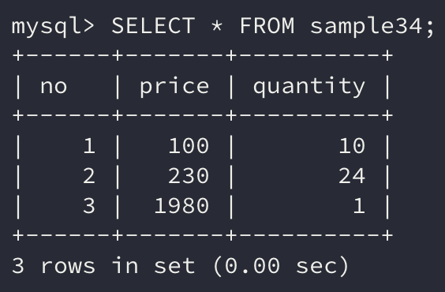

위의 예시 테이블의 **가격과 수량**으로 **금액을 계산**하는 경우를 생각해보자.

예를 들어 **가격이 100원인 상품을 10개 주문하면 주문 금액은 1,000원**이다. 이는 `가격 * 수량`이라는 연산식으로 계산할 수 있다.

예시 테이블에서는 **price가 가격**을, **quantity가 수량**을 의미한다. 따라서 **금액**은 `price * quantity`가 되며 `SELECT` 구로 지정해 계산할 수 있다.

```sql
SELECT *, price * quantity FROM sample34;
```

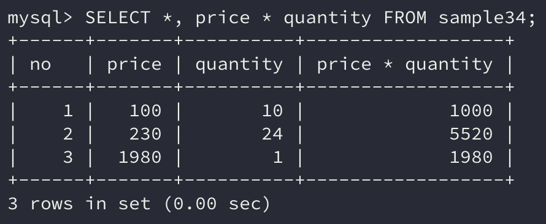

## 3. 열의 별명

위에서 `price * quantity` 연산을 실행한 결과는 **price * quantity**라는 이름의 열에 지정된다.

이렇게 열의 이름이 길고 연산이 의미하는 바를 알아보기 힘든 경우에는 **별명(*alias*)**을 붙여 열 명을 재지정 할 수 있다.

그렇다면 해당 연산의 결과를 **amount**라는 열로 조회해보자.

```sql
SELECT *, price * quantity AS amount FROM sample34;
```

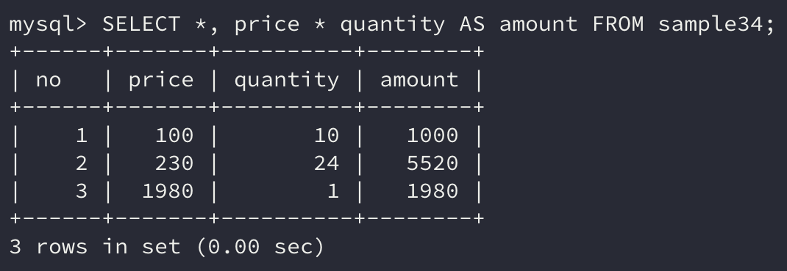

별명은 예약어 `AS`를 사용해 지정한다. `SELECT` 구에서는 콤마(`,`)로 구분하여 복수의 식을 지정할 수 있으며 **각각의 식에 별명**을 붙일 수 있다.

MySQL에서는 별명을 중복해서 지정해도 에러가 발생하지 않는다. 그러나 데이터를 사용하는 **프로그래밍 언어 단에서 문제가 발생할 수 있기 때문**에 기본적으로 **중복되지 않는 별명**을 지정하기를 권한다.

```sql
SELECT *, price * quantity amount FROM sample34;
```

위의 명령을 보면 `AS`는 생략할 수도 있다.

그리고 별명은 **영어, 숫자, 한글** 등으로 지정할 수도 있는데, 한글을 사용하는 경우 오작동을 방지하기 위해 **더블쿼트(**`""`**, MySQL에서는 백쿼트(**`` ` ``**))**로 둘러싸서 지정한다.

이 룰은 **데이터베이스 객체 이름**에 **ASCII 문자 이외의 것을 사용**할 경우에 해당한다.

```sql
SELECT *, price * quantity AS `금액` FROM sample34;
```

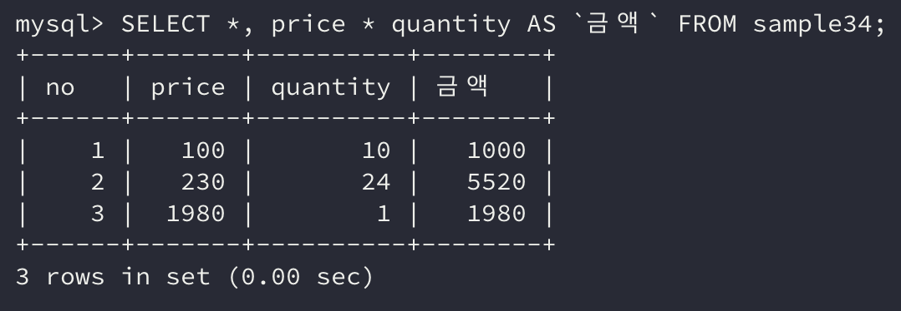

더블쿼트(이하 MySQL은 백쿼트)로 둘러싸면 명령구문을 분석할 때 **데이터베이스 객체의 이름**이라고 간주한다.

> **싱글 쿼트**로 감싸는 것은 **문자열 상수**이다.

기존에는 **예약어**를 데이터베이스 객체의 이름으로 지정하지 못하였다. 하지만 이 또한 더블쿼트로 둘러싸면 문제없이 지정할 수 있다.

또한 데이터베이스 객체의 이름으로 **숫자**도 지정하지 못했는데(수치형 데이터와 구별이 어렵기 때문에) 더블쿼트를 사용하면 가능하다.

> 하지만, Oracle에서는 숫자로 시작하는 이름을 허용하지 않는다.

데이터베이스에 따라 미묘한 차이가 있으나, 더블쿼트로 감싸면 객체명으로 간주하는 룰은 **표준 SQL**에 규정되어 있다.

## 4. WHERE 구에서 연산하기

`WHERE` 구에서의 연산 방법에 대해 알아보자.

```sql
SELECT *, price * quantity AS amount FROM sample34;
```

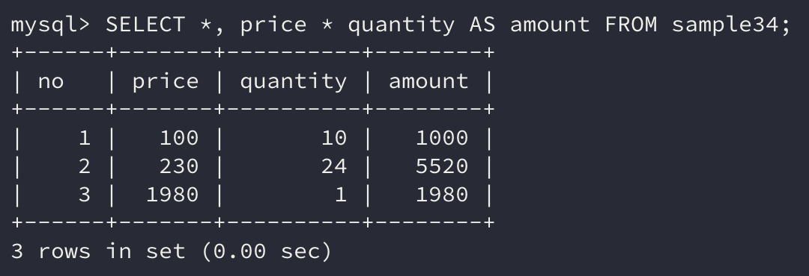

위의 예시에서 금액이 2000원 이상인 행만 조회해보자.

```sql
SELECT *, price * quantity AS amount
    FROM sample34
    WHERE price * quantity >= 2000;
```

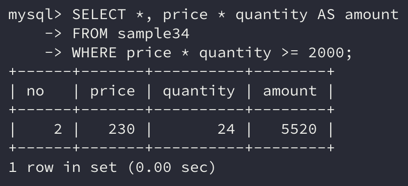

결과는 예상한 대로 no열이 2인 행만 조회되었다.

그런데 `WHERE` 구에 `price * quantity` 연산식을 **모두 쓰는 것**이 비효율적이라고 느껴지지 않는가?

앞서 `SELECT` 구에서 별명으로 설정한 amount로 연산해도 같은 결과가 반환되지 않을까?

하지만 실제로 `WHERE` 구에서 **별명으로 조건식을 지정**하면 amount라는 열이 **존재하지 않는다**는 에러가 발생한다. 그 이유에 대해 알아보도록 하자.

### WHERE 구와 SELECT 구의 내부처리 순서

`WHERE` 구에서의 **행 선택**, `SELECT` 구에서의 **열 선택은** 데이터베이스 서버 내부에서 `WHERE` **구 ->** `SELECT` **구의 순서**로 처리된다.

> 서버 내부의 처리순서까지 알아야 하나?

이런 생각이 들 수도 있다. 하지만 `SELECT` 명령에서 **처리순서는 매우 중요**하므로 꼭 알아두어야 한다.

**표준 SQL에는 내부처리 순서가 따로 정해져 있진 않다**. 하지만 **대부분 데이터베이스는 위의 순서를 따라 내부처리가 진행**된다.

`WHERE` 구로 행의 **조건이 일치하는지를 먼저 조사**한 후 `SELECT` 구에 **지정된 열을 선택해 결과로 반환**하는 식으로 처리한다.

앞서 위에서 amount 별명의 열을 `WHERE` 구에서 지정하면 에러가 발생하는 것은 이러한 이유 때문이다.

## 5. NULL 값의 연산

NULL은 이전에도 말했듯이 **특별하게 처리되는 값**이다. 그러므로 **연산에서 NULL이 포함된다면 결과로는 항상 NULL이 반환**된다.

- NULL + 1

- 1 - NULL

- 1 + 2 * NULL

- 1 / NULL

따라서 위의 연산의 결과는 모두 **NULL**이다.

## 6. ORDER BY 구에서 연산하기

`ORDER BY` 구에서도 연산을 할 수 있고 결괏값을 정렬할 수 있다.

```sql
SELECT *, price * quantity AS amount
    FROM sample34
    ORDER BY price * quantity DESC;
```

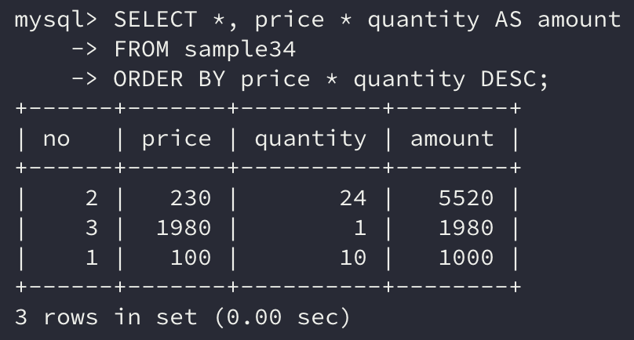

amount열이 내림차순으로 정렬된 것을 볼 수 있다.

`ORDER BY` 구는 서버에서 **내부적으로 가장 마지막에 처리**하기 떄문에 `SELECT` 구에서 지정한 **별명을 사용할 수 있다.**

```sql
SELECT *, price * quantity AS amount
    FROM sample34
    ORDER BY amount DESC;
```

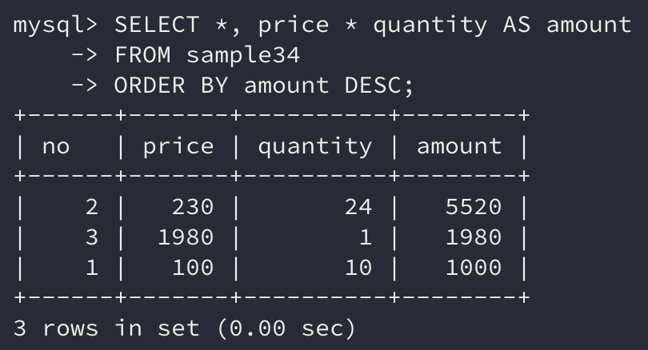

이처럼 별명을 통해 `ORDER BY` 구를 사용할 수 있는 이유는 내부처리 순서가 `WHERE` 구 -> `SELECT` 구 -> `ORDER BY` 구 순서대로 처리되기 때문이다.

> 추후, SQL 명령의 처리순서를 따로 소개하도록 하겠다.

## 7. 함수

연산에서는 연산자 이외에도 **함수**를 사용해 연산할 수도 있다.

연산자는 좌우의 항목이 연산 대상이 된다면 함수는 계산 대상을 **인수(*parameter*)**로 지정한다. 이는 일반적인 프로그래밍 언어의 함수와 같은 형식이다.

예를 들어 나머지를 구하는 함수는 `%` 연산자와 `MOD` 함수가 있는데 각각의 사용방법은 조금씩 다르다.

> `MOD` 함수는 MySQL이나 Oracle에서 사용할 수 있는 함수로 나눠질 수와 나눌 수, 2개를 인수로 받아 나눈 나머지를 반환한다.

```sql
10 % 3 -> 1
MOD(10, 3) -> 1
```

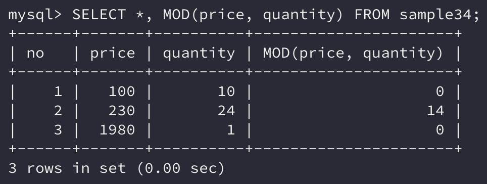

## 8. ROUND 함수

반올림을 할 때 사용하는 함수는 `ROUND` 함수이다.

```sql
SELECT * FROM sample341;
```

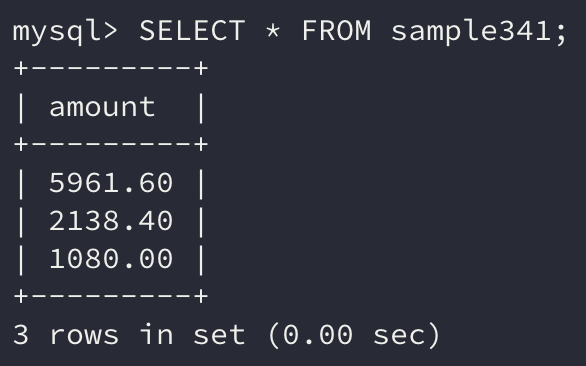

```sql
SELECT *, ROUND(amount) FROM sample341;
```

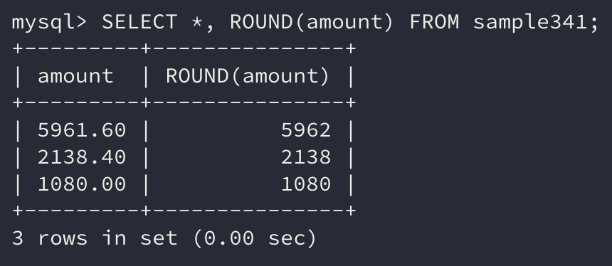

예제 테이블을 보면 amount열은 소수점을 포함하는 데이터가 저장되어 있다.

`ROUND` 함수를 사용하면 **소수점 아래를 반올림**하여 정수만 남게 된다.

> **INTEGER 형**은 **정수**밖에 저장할 수 없기 때문에 amount열은 **DECIMAL 형**으로 정의되었다.
>
> **DECIMAL 형**은 **정수부와 소수부의 자릿수를 지정**할 수 있는 자료형이다.

### 반올림 자릿수 지정

위의 `ROUND` 연산은 소수점 첫째 자리를 기준으로 반올림한 값을 반환하였다. 하지만 `ROUND` 함수는 **반올림할 자릿수를 지정**할 수 있다.

```sql
SELECT *, ROUND(amount, 1) FROM sample341;
```

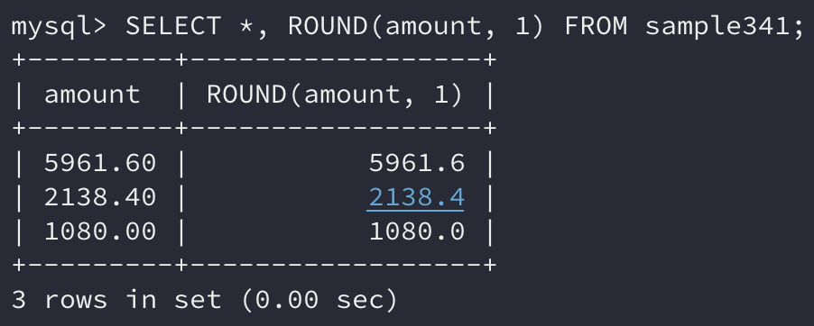

`ROUND` 함수의 두 번째 인수로 1을 지정하면 소수점 둘째 자리에서 반올림한다.

**두 번째 인수**의 값이 **0이면 소수점 첫째 자리, 1은 소수점 둘째 자리**에서 반올림을 한다.

두 번째 인수로 **음수**도 지원하는데 **-1은 1단위, -2는 10단위, -3은 100단위**와 같이 지정 가능하다.

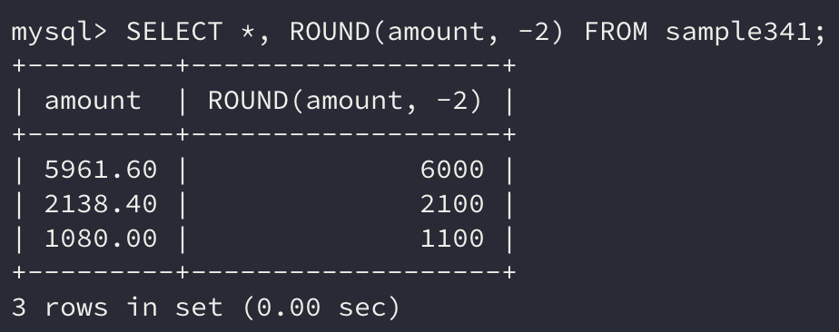

그 밖에도 다양한 함수들이 존재한다.

버림은 `TRUNCATE` 함수, 삼각함수 연산인 `SIN`, `COS`, 또 루트를 계산하는 `SQRT` 등이 있다.

## 정리하면

데이터베이스는 **기본적인 산술 연산을 지원**하기 때문에 필요에 따라서 데이터를 가져와 연산하기보다는 **연산을 한 데이터를 가져와 처리하는 것**이 더 효율적일 수 있다.