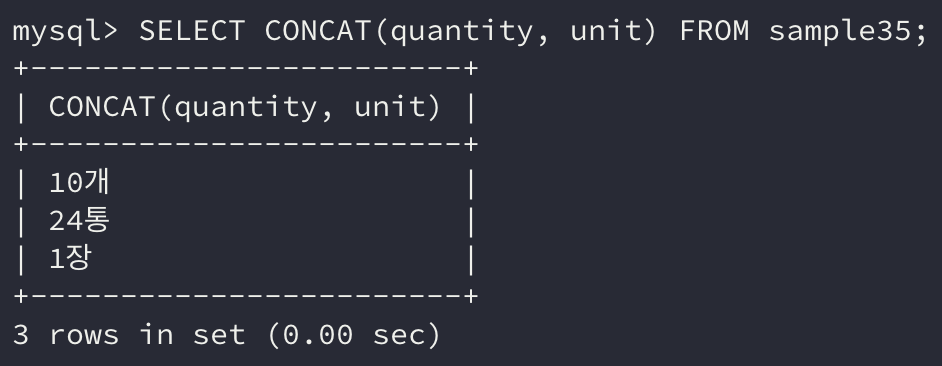

이번에는 **문자열형 데이터**를 연산할 수 있는 **문자열 연산**에 대해 알아보자.

## 1. 문자열 결합

문자열 결합은 **문자열 데이터를 결합**하는 연산이다.

> 'ABC' 문자열 데이터와 'DEF' 문자열 데이터를 결합하면 'ABCDEF' 문자열이 된다.

|연산자/함수|연산|데이터베이스|
|---|---|---|
|+|문자열 결합|SQL Server|
|\|\||문자열 결합|Oracle DB2, PostgreSQL|
|CONCAT|문자열 결합|MySQL|

> 실습 중인 MySQL은 `CONCAT`을 사용하여 문자열 결합이 가능하다.

```sql
SELECT * FROM sample35;
```


```sql
SELECT CONCAT(quantity, unit) FROM sample35;
```



예제 테이블의 quantity열과 unit열을 **결합**하였다.

그러나 여기서 다른 점은 quantity열은 **INTEGER 형 열**이었다. **수치형 데이터를 문자열형 데이터와 결합**하면 **연산은 가능하지만, 결과로 문자열형 데이터가 반환**된다.

## 2. SUBSTRING 함수

`SUBSTRING` 함수는 문자열의 **일부분을 반환**해주는 함수이다. 데이터베이스에 따라서는 함수명이 `SUBSTR`인 경우도 있다.

생성 일자, 시간을 **하나의 문자열로 붙여서 가져오기 때문**에 이러한 데이터를 처리할 때 주로 사용된다.

```sql
SELECT SUBSTRING('20200914', 1, 4);
```


```sql
SELECT SUBSTRING('20200914', 5, 2);
```


위와 같이 문자열을 처리해줄 수 있다.

## 3. TRIM 함수

`TRIM` 함수는 **문자열의 앞뒤로 여분의 스페이스가 있을 경우 이를 제거**해주는 함수이다. **고정 길이 문자열형(*CHAR*)**에서 많이 사용하는 함수이다.

CHAR 형의 문자열형에서는 **문자열 길이가 고정되며 남는 공간은 스페이스**로 채워진다. 이 **스페이스를 제거**할 때 `TRIM`함수를 사용할 수 있다.

```sql
SELECT TRIM('  2020  ');
```


## 4. CHARACTER_LENGTH 함수

`CHARACTER_LENGTH` 함수는 **문자열의 길이를 계산해 돌려주는 함수**이다. **가변 길이 문자열형(*VARCHAR*)**은 **문자열의 길이가 각기 다르기 때문**에 이 경우 주로 사용된다.

**문자 단위로 계산된 길이가 반환**되고 `CHAR_LENGTH`**로 줄여서 사용**할 수 있다.

```sql
SELECT CHAR_LENGTH('123456');
```


또한 `OCTET_LENGTH` 함수가 있는데 이 함수는 문자열의 길이를 바이트 단위로 계산하여 반환한다.

여기서 **주의해야 할 점**은 데이터베이스에 문자열이 저장될 때 **인코딩 방식에 따라 문자 1개당 바이트 값이 다르다**는 점이다.

VARCHAR 형의 **최대 길이** 역시 **바이트 단위로 지정**한다.

### 문자세트(*character set*)

> 한중일의 인쇄 문화에서는 반각과 전각이라는 용어를 사용해 문자의 폭을 설명하기도 한다.

**알파벳의 경우 반각문자**, **한글은 전각문자**라고 할 수 있다. 반각문자와 전각문자의 차이는 **화면상에서 너비**로 알 수 있다.

반각의 **알파벳, 숫자, 기호**는 **ASCII 문자**라고 불린다.

한글은 **EUC-KR**, **UTF-8** 등의 **인코딩 방식**을 주로 사용하는데, 이러한 인코딩 방식은 **데이터베이스나 테이블을 정의할 때 변경**할 수 있다. 이를 **RDBMS에서는 문자세트**라고 부른다.

여기서 핵심은 **한 문자가 몇 바이트인지는 쓰이는 문자세트에 따라 다르다**라는 것이다.

`CHAR_LENGTH`는 **문자 단위로 길이를 측정**하므로 크게 영향을 받지 않는다.

그러나 앞서 소개한 **바이트 단위로 길이를 반환**하는 `OCTET_LENGTH`의 경우 기대한 결과가 **문자세트에 따라 달라질 수 있다는 것**이다. 그렇기에 주의할 필요가 있다.

- **EUC_KR**: ASCII 문자는 1바이트, 한글은 2바이트

- **UTF-8**: ASCII 문자는 1바이트, 한글은 3바이트

## 정리하면

실제로 데이터를 처리할 때 **많은 데이터가 문자열 형식**으로 들어온다. 문자열 형식이 형식에 대한 **제약을 덜 받고 사용자가 유연하게 처리**할 수 있기 때문이다.

그러다 보니 전달받은 데이터를 **원하는 형태로 가공**하기 위해서는 **문자열 연산은 필수**라고 볼 수 있다.

문자열 처리 연산에 익숙해져서 데이터를 잘 다룰 수 있는 개발자가 되어보자!