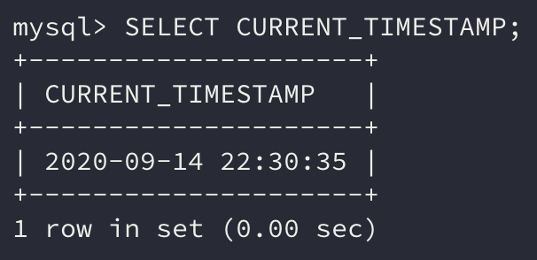
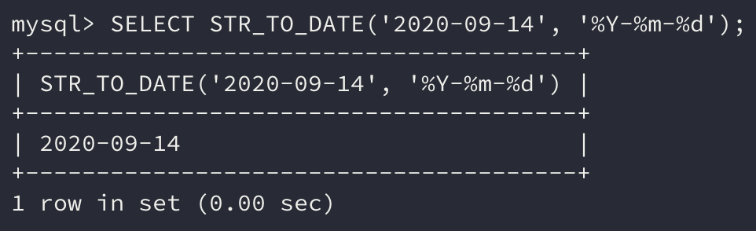
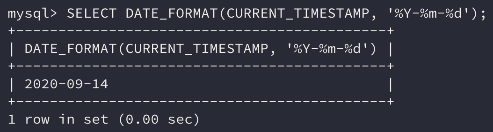
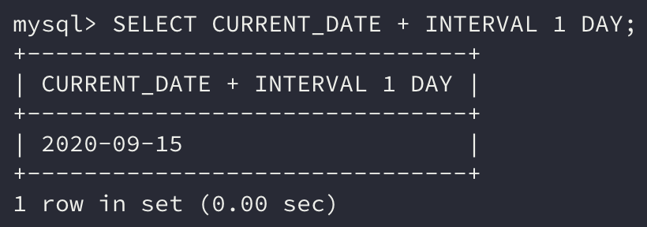
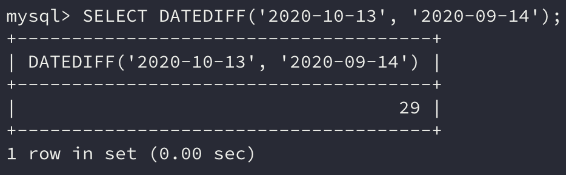

이번에는 **날짜 연산**에 대해 배워보자.

날짜, 시간 데이터를 저장하는 방법은 **데이터베이스 제품에 따라 크게 달라진다.**

날짜와 시간 전부를 저장할 수 있는 자료형을 지원하거나 날짜는 DATE 형, 시간은 TIME 형, 날짜와 시간은 DATETIME 형과 같이 세분화해서 지원하는 데이터베이스 제품도 있다.

여기서는 **날짜시간형**을 기준으로 알아보자.

## 1. SQL에서의 날짜

날짜나 시간 데이터는 수치 데이터와 같이 **사칙 연산**을 할 수 있다.

날짜시간 데이터를 연산하면 결괏값으로 **동일한 날짜시간 유형의 데이터**를 반환하는 경우도 있고, 또는 **기간(간격)의 차를 나타내는 기간형(*interval*) 데이터**를 반환하는 경우도 있다.

### 시스템 날짜

```sql
SELECT CURRENT_TIMESTAMP;
```



표준 SQL에서는 `CURRENT_TIMESTAMP` 함수를 실행하면 **현재 시스템의 시간**을 표시한다. 이 함수는 특별한 함수이기 때문에 **따로 인자를 필요로 하지 않는다.**

현재 사용 중인 MySQL에서는 `FROM` 구도 **생략이 가능**하다. 하지만 Oracle과 같은 전통적인 데이터베이스에서는 생략이 불가능하니 주의하자.

> `CURRENT_TIMESTAMP`는 **표준 SQL로 규정되어 있는 함수**이다. Oracle에서는 `SYSDATE` 함수, SQL Server에서는 `GETDATE` 함수를 사용해도 시스템 날짜를 확인할 수 있다.
>
> 하지만 이는 표준화되기 전에 만들어진 함수이기 때문에 **사용하지 않는 것을 추천**한다.

### 날짜 서식

임의의 날짜를 저장하고 싶을 경우에는 직접 **날짜 데이터를 지정**해야 한다.

날짜 표기 방법은 지역마다 다른데 데이터베이스에서는 **날짜 데이터의 서식을 임의로 지정, 변환할 수 있는 함수를 지원**한다.

Oracle의 경우 `TO_DATE` 함수를 통해 **문자열을 날짜형 데이터**로 변환할 수 있으며 `TO_CHAR` 함수를 통해 **날짜형 데이터를 문자열**로 변환할 수 있다.

MySQL의 경우는 `STR_TO_DATE` 함수와 `DATE_FORMAT` 함수가 위와 같은 역할을 한다.

```sql
SELECT STR_TO_DATE('2020-09-14', '%Y-%m-%d');
```



```sql
SELECT DATE_FORMAT(CURRENT_TIMESTAMP, '%Y-%m-%d');
```



> `DATE_FORMAT` 함수를 사용할 때는 어떠한 형식으로 출력할 것인지에 대한 구분기호를 사용해야 한다. 기본적인 몇 가지에 대해서만 살펴보도록 하자.
>
> - `%Y`: 4자리 년도
>
> - `%m`: 2자리 월
>
> - `%d`: 2자리 일자
>
> - `%a`: 짧은 요일 이름(영문)
>
> - `%H`: 시간(24시간)
>
> - `%i`: 분
>
> - `%S`: 초
>
> - `%T`: hh:mm:SS
>
> - `%r`: hh:mm:SS AM, PM

## 2. 날짜의 덧셈과 뺄셈

날짜시간형 데이터는 **기간형 수치 데이터와 덧셈 및 뺄셈**을 할 수 있다.

```sql
SELECT CURRENT_DATE + INTERVAL 1 DAY;
```



위의 명령을 보면 INTERVAL 1 DAY는 1일 후라는 의미의 기간형 상수이다.

기간형 상수는 **SQL 표준이 없기 때문**에 데이터베이스마다 사용법이 다르다.

### 날짜형 간의 뺄셈

날짜시간형 데이터 간에 뺄셈도 할 수 있다.

Oracle의 경우 `-` 연산자를 사용해서 두 날짜 사이에 차이를 알 수 있는데 MySQL에서는 `DATEDIFF` **함수를 사용**하여 계산할 수 있다.

```sql
SELECT DATEDIFF('2020-10-13', '2020-09-14');
```



## 정리하면

날짜시간형 데이터도 실제로 사용할 상황이 많이 주어진다. 특정한 객체나 데이터를 **생성한 시간**을 저장하는 `createdAt`처럼 말이다.

날짜는 계산하기 더 까다로운 만큼 이러한 함수를 잘 사용한다면 편하게 데이터를 처리할 수 있을 것이다.

## 참고 링크

> [[MySQL] DATE_FORMAT 날짜 형식 설정 - 좋은 블로그](https://devjhs.tistory.com/89)
>
> [[MySQL] 날짜 차이 가져오기 (DATEDIFF, TIMESTAMPDIFF 함수) - 확장형 뇌 저장소](https://extbrain.tistory.com/78)
>
> [STR_TO_DATE 사용하기[MySQL] - 교실](https://mindols.tistory.com/117)