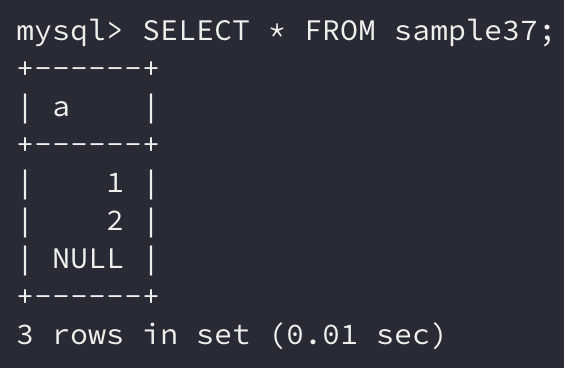
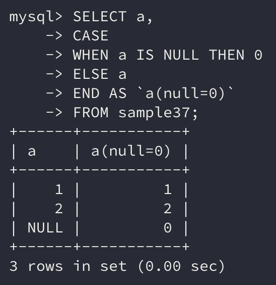
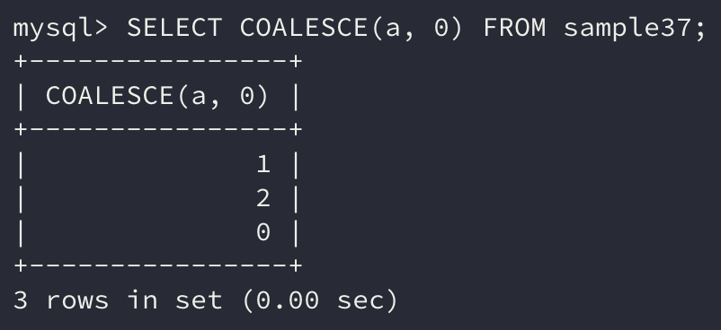
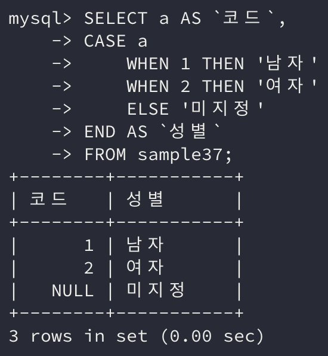

**독자적으로 데이터를 변환하고 싶은 경우** 사용하는 `CASE` 문에 대해 알아보자.

```sql
CASE
    WHEN 조건식1 THEN 식1
    [WHEN 조건식2 THEN 식2 ...]
    [ELSE 식3]
END
```

## 1. CASE 문

지금까지 살펴본 다양한 연산자와 함수를 사용하면 대부분의 계산을 처리할 수 있다. 하지만 **RDBMS에 갖추어져 있는 기존의 연산자나 함수만으로는 처리할 수 없는 것**도 있을 것이다.

> 예를 들어 NULL 값은 어떠한 연산을 해도 **NULL을 반환**한다.

이런 상황에서 간단한 처리의 경우는 `CASE` 문으로 해결이 가능하다.

```sql
CASE
    WHEN 조건식1 THEN 식1
    [WHEN 조건식2 THEN 식2 ...]
    [ELSE 식3]
END
```

먼저 `WHEN` 절에는 **참과 거짓을 반환하는 조건식**을 기술한다. 해당 조건을 만족하여 **참이 되는 경우는** `THEN` **절에 기술한 식이 처리**된다.

거짓이라면 다음 `WHEN` 절로 넘어가고 **모든 조건을 만족하지 못한다면** `ELSE` 절에 있는 식이 처리된다. `ELSE` 절은 생략 가능한데, 만약 생략하면 `ELSE NULL`로 간주하고 처리한다.

```sql
SELECT * FROM sample37;
```



```sql
SELECT a,
CASE
    WHEN a IS NULL THEN 0
    ELSE a
END AS `a(null=0)`
FROM sample37;
```



위의 예시를 보면 a열의 데이터가 NULL이면 0을, 아니면 a값을 그대로 반환하는 `CASE` 명령이다.

### COALESCE

사실 NULL 값을 변환하는 경우라면 `COALESCE` 함수를 사용하는 편이 더 쉽다.

```sql
SELECT COALESCE(a, 0) FROM sample37;
```



`COALESCE` 함수는 여러 인수를 지정할 수 있는데, 주어진 인수 중 **가장 먼저 NULL이 아닌 값이 들어오면 해당 값을 반환**한다.

## 2. 또 하나의 CASE 문

숫자로 이루어진 코드를 알아보기 더 쉽게 문자열로 변환하고 싶은 경우 `CASE` 문을 많이 사용한다.

간단한 예를 들어 특정한 열에서는 숫자 1의 경우 남자, 2는 여자를 나타낸다고 하자.

이를 수치 그대로 1, 2를 보여주는 것보다는 1은 남자로, 2는 여자로 **값을 변환해서 보여주는 것**이 더 알아보기 쉬울 것이다.

이와 같이 **수치(코드)를 문자화하는 것을 디코드(*decode*)**라 부르고 반대로 **수치화하는 것을 인코드(*incode*)**라 부른다.

```sql
WHEN a = 1 THEN '남자'
WHEN a = 2 THEN '여자'
```

### 검색 CASE 문과 단순 CASE 문

`CASE` 문은 검색 `CASE`와 단순 `CASE` 두 개 구문으로 나눌 수 있다. 앞에서 설명한 `CASE` 문은 검색 `CASE` 문이다.

검색 `CASE` 문은 아래와 같다.

```sql
CASE
    WHEN 조건식1 THEN 식1
    [WHEN 조건식2 THEN 식2 ...]
    [ELSE 식3]
END
```

그리고 이번에 소개하는 단순 `CASE` 문은 아래와 같다.

```sql
CASE 식1
    WHEN 식2 THEN 식3
    WHEN 식4 THEN 식5
    ELSE 식6
END
```

식1의 값이 `WHEN` 절의 식2의 값과 같은지 비교하고, 값이 같다면 식3의 값이 **결괏값**이 된다. 만약 다르다면 다음 `WHEN` 절로 넘어간다.

```sql
SELECT a AS `코드`,
CASE a
    WHEN 1 THEN '남자'
    WHEN 2 THEN '여자'
    ELSE '미지정'
END AS `성별`
FROM sample37;
```



단순 `CASE`를 살펴보면 먼저 `CASE` 절 뒤에 **비교할 항목을 지정**한다. 여기서는 a열이 비교할 항목이기 때문에 a가 지정되어 있다.

그 덕분에 아래 `WHEN` **절 뒤에는 비교할 값만 지정**하면 된다.

```sql
SELECT a AS `코드`,
CASE
    WHEN a = 1 THEN '남자'
    WHEN a = 2 THEN '여자'
    ELSE '미지정'
END AS `성별`
FROM sample37;
```

검색 `CASE`로 작성하면 이처럼 조건식이 길어져 SQL 명령이 전체적으로 길어보인다.

## 3. CASE를 사용할 경우 주의사항

지금까지는 `CASE` 문을 `SELECT` 구에서만 사용했지만 `CASE` 문은 어디서든 사용이 가능하다.

`WHERE` 구와 `ORDER BY` 구에서도 사용할 수 있다.

### ELSE 생략

주의할 점은 `ELSE`**를 생략하면 자동적으로** `ELSE NULL`**로 처리**하는 점이다.

실수로 `ELSE`를 생략하면서 **의도치 않게 NULL이 반환**될 수도 있으니 `ELSE`는 **생략하지 않고 지정**하는 것이 좋다.

### WHEN에 NULL 지정하기

단순 `CASE`에서는 `WHEN` 절 뒤에 상숫값을 지정하는 경우가 많을 것이다. 그런데 만약 `WHEN` 절 뒤에 **NULL을 지정**한다면 어떻게 될까?

예상한 대로 **정상적으로 처리되지 않는다.**

단순 `CASE` 문에서 `CASE` 절 뒤에 지정한 식과 `WHEN` 절 뒤에 지정한 식을 비교할 때는 **동등 연산자(**`=`**)를 사용**한다.

앞서 살펴봤듯이 **NULL의 성질 중 하나는 연산자로 연산이 되지 않는다**고 하였다. 이러한 성질 때문에 `WHEN` 절 뒤에 NULL을 지정하면 기대한 결과가 반환되지 않는 것이다.

만약 NULL 값에 대한 판단을 하려면 `IS NULL` **술어를 사용**해야 하고, 이런 경우는 **검색** `CASE`**를 사용**하여 문제를 해결해야 한다.

### DECODE NVL

Oracle에는 이 같은 디코드를 수행하는 `DECODE` 함수가 내장되어 있다. 그러나 이는 **Oracle에만 지원되는 함수**인 만큼 다른 데이터베이스 제품에서는 사용할 수 없다.

그에 비해 `CASE` 문은 표준 SQL로 지정된 덕분에 많은 데이터베이스 제품이 지원한다.

그리고 NULL 값을 변환하는 함수도 특정 데이터베이스에는 개별적으로 존재하는데, 이보다는 표준 SQL에 지정된 `COALESCE` 함수를 사용하는 것이 더 좋다.

## 정리하면

이번에는 조건에 따라 원하는 값을 다르게 주고 싶은 경우 사용하는 `CASE` 문에 대해 알아보았다.

**특정 데이터를 상황에 맞게 유연하게 처리**할 수 있기 때문에 잘 알아두면 좋을 것 같다.