지금까지는 **데이터베이스에 저장된 데이터를 어떻게 조회하는지**에 대해 알아보았다면, 지금부터는 **데이터베이스에 어떻게 데이터를 저장할 수 있는지**에 대해 알아보도록 하자.

`SELECT` 명령은 데이터 검색을 위한 것으로 **데이터베이스 서버가 클라이언트에 결과를 반환(데이터를 전송)**하였다면, 데이터를 추가하는 경우는 **클라이언트가 데이터베이스 서버에게 데이터를 전송**하는 형식을 취한다.

이때 사용되는 명령이 `INSERT` 명령인데 이번에는 `INSERT` 명령을 살펴보자.

```sql
INSERT INTO 테이블 명 VALUES(값1, 값2, ...)
```

## 1. INSERT로 행 추가하기

RDBMS는 `INSERT` 명령을 사용해 **테이블의 행 단위로 데이터를 추가**한다.

```sql
SELECT * FROM sample41;
```

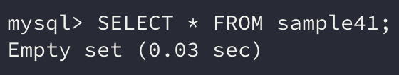

예제 테이블에는 어떠한 데이터도 저장되어 있지 않은 상태이다. `INSERT` 명령을 통해 데이터를 추가하려면 각 열의 값을 지정해야 한다.

그렇다면 각 열에는 **어떤 유형의 데이터**를 저장할 수 있는지 확인한 후 `INSERT` 명령을 이용하여 데이터를 저장해보자.

```sql
DESC sample41;
```

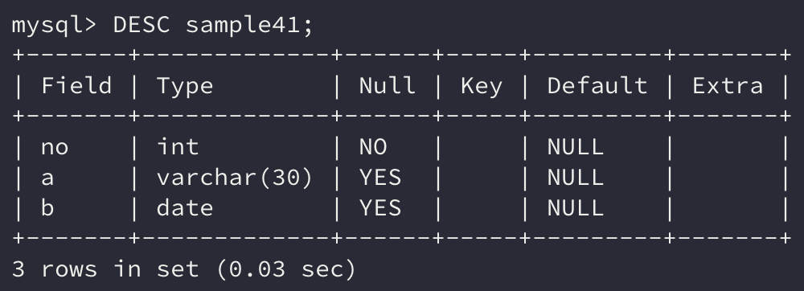

```sql
INSERT INTO sample41 VALUES(1, 'ABC', '2020-09-15');
```

`INTO` 뒤에는 데이터를 저장할 데이터베이스 이름을, `VALUES` 구에는 저장하고자 하는 데이터들을 지정하면 된다.

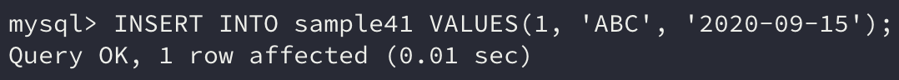

다만, `INSERT` 명령이 정상적으로 실행되어도 위의 이미지처럼 **처리상태만 표시**되고 어떤 데이터가 저장되었는지는 알려주지 않는다.

그렇다면 실제로 `SELECT` 명령을 통해 데이터가 정상적으로 저장되었는지를 확인해보자.

```sql
SELECT * FROM sample41;
```

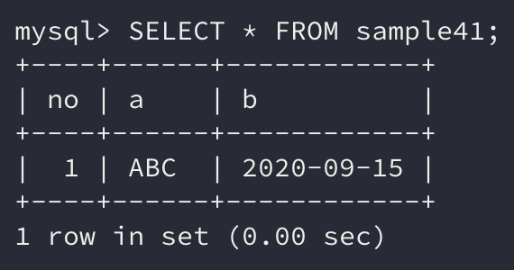

## 2. 값을 저장할 열 지정하기

`INSERT` 명령으로 **행을 추가**할 경우 값을 저장할 열을 지정할 수 있다.

열을 지정할 경우 **테이블명 뒤에 괄호로 묶어 열명을 나열**하고, `VALUES` **구에 값을 지정**해야 한다.

`VALUES`에 값을 지정하는 경우에는 **지정한 열과 동일한 개수와 순서로 값을 지정**해야 한다.

```sql
INSERT INTO 테이블 명 (열1, 열2, ...) VALUES(값1, 값2, ...)
```

예제 테이블에 실제로 지정된 열에 대한 데이터를 넣어보자.

```sql
INSERT INTO sample41(a, no) VALUES('XYZ', 2);
```

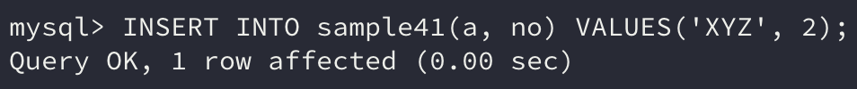

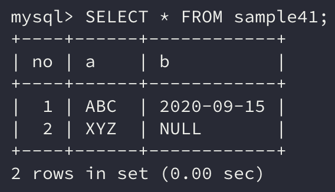

별도로 값을 지정하지 않은 b열에는 **기본값인 NULL이 들어감**을 알 수 있다.

## 3. NOT NULL 제약

행을 추가할 때 열을 NULL로 지정하고 싶은 경우에 `VALUES` 구에 NULL로 값을 지정할 수 있다.

```sql
INSERT INTO sample41(no, a, b) VALUES(NULL, NULL, NULL);
```

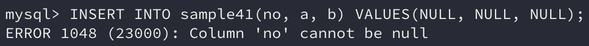

그러나 위의 `INSERT` 명령을 실행하면 에러가 발생한다. 이는 no열에 대해 **NULL 값을 허용하지 않겠다는 NOT NULL 제약**이 걸려있기 때문이다.

> 이처럼 테이블에 저장하는 데이터를 설정을 제한하는 것을 통틀어 **제약(*Constraint*)**이라고 한다.

이처럼 만약 특정한 열에 NULL을 허용하고 싶지 않다면 **NOT NULL 제약을 걸어두는 편이 좋다.**

## 4. DEFAULT

`DESC` 명령으로 테이블의 열 구성을 살펴보면 **Default**라는 항목을 찾을 수 있는데, 이는 **명시적으로 값을 지정하지 않았을 경우 사용하는 초깃값**을 의미한다.

열을 지정해 행을 추가할 때 **지정하지 않은 열은 Default 값을 사용하여 저장**된다.

```sql
DESC sample411;
```

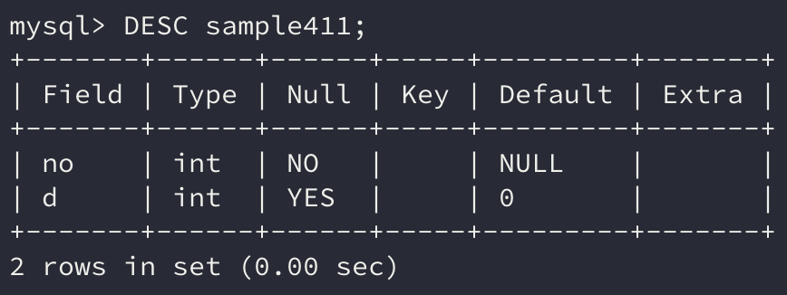

예제 테이블을 보면 d열의 **Default 값이 0**으로 되어있다. 그렇다면 d열에 데이터를 지정한 경우와 하지 않은 경우를 확인해보자.

```sql
INSERT INTO sample411(no, d) VALUES(1, 1);
```

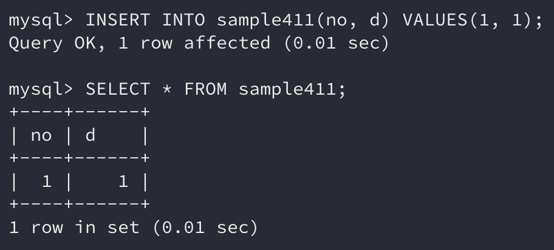

```sql
INSERT INTO sample411(no, d) VALUES(2, DEFAULT);
```

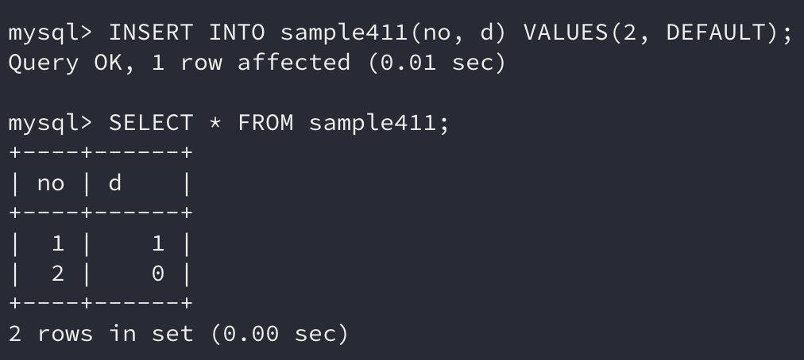

### 암묵적 Default 저장

위처럼 `VALUES` 구에 명시적으로 `DEFAULT`라고 입력하지 않고 **생략해도 Default값으로 행이 추가**된다. 이러한 방법을 **암묵적 방법**, 위와 같이 직접 입력하는 방법을 **명시적 방법**이라 한다.

```sql
INSERT INTO sample411(no) VALUES(3);
```

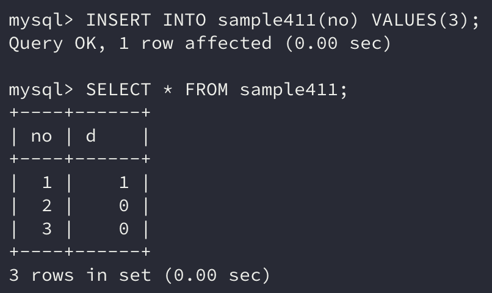

## 정리하면

이번에는 클라이언트가 원하는 **데이터를 데이터베이스에 저장하는 명령**인 `INSERT`에 대해 알아보았다.

서비스에서는 데이터를 읽고 저장하는 작업이 가장 빈번하게 이루어지는 만큼 실제로도 사용이 많이 되는 SQL 명령이다.

앞으로도 자주 등장할 명령이기 때문에 잘 익혀두면 유용할 것이다.