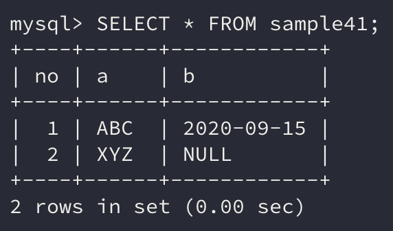
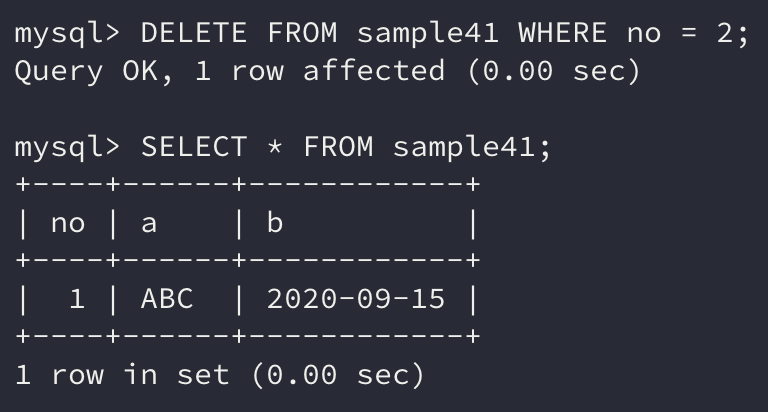

데이터베이스에서 **데이터를 삭제하는 명령**인 `DELETE`에 대해 알아보자

```sql
DELETE FROM 테이블 명 WHERE 조건식
```

## 1. DELETE로 행 삭제하기

RDBMS에서 데이터를 삭제할 경우에는 행 단위로 `DELETE` 명령을 수행한다.

```sql
DELETE FROM 테이블 명 WHERE 조건식
```

먼저 데이터를 삭제하기 이전에 어떤 데이터가 있는지 `SELECT` 명령으로 확인해보자.

```sql
SELECT * FROM sample41;
```



여기서 데이터를 삭제할 때

```sql
DELETE FROM sample41;
```

위의 `DELETE` 명령처럼 `WHERE` 구를 지정하지 않으면 sample41 테이블의 **모든 데이터가 지워진다.**

`DELETE`도 `SELECT`와 마찬가지로 `WHERE` 구를 입력하지 않으면 **모든 행을 대상으로 동작**하기 때문이다.

특정 행을 삭제하기 위해서는 `WHERE` 구를 지정하여 삭제해야 한다.

```sql
DELETE FROM sample41 WHERE no = 2;
```



조건에 해당하는 no열의 값이 2인 행이 **삭제되었다.**

`DELETE` 명령은 행 단위로만 수행되고 열에 대해서는 수행되지 않는다. 즉, **행은 삭제를 할 수 있지만 열은 삭제가 불가능하다.**

또한 `DELETE` 명령을 실행하면 따로 재확인 창이 뜨지 않고 바로 명령이 수행된다. **잘못하면 중요한 데이터가 날아갈 수도 있으니 항상 신중하게 명령을 수행**해야 한다.

## 2. DELETE 명령 구

`WHERE` 구에서 대상이 되는 행을 검색하는 것은 `SELECT` 명령과 `DELETE` 명령 모두 같다. 단지 조건에 맞는 행을 조회 결과로 반환하는지, 아니면 삭제하는지의 차이이다.

그리고 `ORDER BY` 구의 경우는 사용할 수 없다. 어떤 행부터 삭제할 지는 의미가 없기 때문이다.

> 하지만 MySQL에서는 `ORDER BY`로 정렬하고 `LIMIT`를 사용하여 삭제할 데이터를 지정할 수 있다고 한다.

## 정리하면

이번에는 **데이터를 삭제하는 명령**인 `DELETE`에 대해 알아봤다.

데이터베이스는 **영속성**을 지닌다. 그렇기 때문에 **데이터를 지우는 행위 또한 매우 신중을 기해야 하는 행위**이다.

`DELETE` 명령을 수행할 때는 한 번 더 확인하고 명령을 안전하게 수행해야 하겠다.
