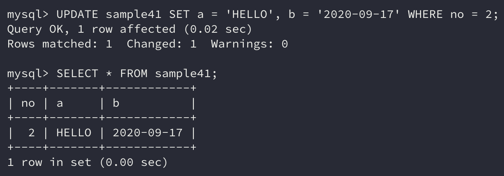

테이블에 저장되어 있는 **데이터를 갱신**하기 위해서는 `UPDATE` 명령을 사용한다.

```sql
UPDATE 테이블 명 SET 열1 = 값1, 열2 = 값2, ... WHERE 조건식
```

## 1. UPDATE로 데이터 갱신하기

RDBMS에서는 `UPDATE` 명령으로 **데이터를 갱신**할 수 있다. `UPDATE` 명령을 실행하기 전에 예제 테이블의 모습을 확인해보자.

```sql
SELECT * FROM sample41;
```


`DELETE`와 다르게 `UPDATE`는 **셀 단위로 데이터를 갱신**할 수 있다.

그래서 `WHERE` **구에 조건을 지정하면 그에 일치하는 행을 갱신**할 수 있다. 만약 `WHERE` 구를 생략한 경우에는 `DELETE`와 마찬가지로 **테이블의 모든 행이 갱신**된다.

`UPDATE` 명령에서는 `SET` 구를 사용하여 **갱신할 열과 값을 지정**한다. 문법은 `SET 열명 = 값`인데, 이때 `=`는 비교 연산자가 아니라 **대입 연산자**이다.

또한 **존재하지 않는 열에 대해 갱신을 시도하면 에러가 발생**한다.

**갱신할 값은 갱신할 열에 알맞는 자료형을 사용**하여야 하고, 갱신할 열이 **복수인 경우 콤마(**`,`**)를 사용**하여 나열한다.

```sql
UPDATE sample41 SET b = '2020-09-16' WHERE no = 1;
```


no열이 1인 행의 **b열 값이 2020-09-16으로 갱신**되었다.

`UPDATE` 명령도 `DELETE` 명령과 마찬가지로 `WHERE` **절을 생략하는 경우 모든 행을 대상**으로 한다. 또한 **잘못 지정한 경우에도 예상치 못한 결과가 발생**할 수 있으므로 유의하자.

## 2. UPDATE로 갱신할 경우 주의사항

`UPDATE` 명령은 **이미 존재하는 행에 대해 값을 갱신**하므로 **이전의 값과 이후의 값의 두 가지 상태**를 생각할 수 있다.

그렇다면, 만약 아래와 같은 명령을 실행하면 결과가 어떻게 될까?

```sql
UPDATE sample41 SET no = no + 1;
```

이 명령에서는 `WHERE` 구가 지정되어 있지 않으므로 **갱신 대상은 테이블의 모든 행**이 된다.

위에서 기대하는 결과는 no열의 값이 이전 값보다 1이 증가한 결과일 것이다.


결과를 보면 **no열의 값이 이전보다 1이 증가**됨을 알 수 있다.

## 3. 복수열 갱신

`UPDATE` 명령의 `SET` 구에서는 **콤마로 구분**하여 갱신(`,`)할 값을 **여러 개 지정**할 수 있다.

```sql
UPDATE sample41 SET a = 'HELLO' WHERE no = 2;
UPDATE sample41 SET b = '2020-09-17' WHERE no = 2;
# 위의 명령을 한 줄로 줄이면 아래와 같다.
UPDATE sample41 SET a = 'HELLO', b = '2020-09-17' WHERE no = 2;
```



### SET 구의 실행 순서

여러 개의 열을 한 번에 갱신할 수 있어 편리하기는 하지만, 그 전에 **어떤 순서로 갱신**을 하는지 알아보자.

```sql
UPDATE sample41 SET no = no + 1, a = no; # 1번
UPDATE sample41 SET a = no, no = no + 1; # 2번
```

위의 두 명령은 `SET` 구에서 나열된 식의 순서가 다르다. 그렇다면 결과는 어떤 순서로 갱신을 할까?

사실 결과는 **데이터베이스 제품에 따라 다르게 처리**된다. MySQL의 경우 두 명령의 결과가 다르고 Oracle의 경우 두 명령의 결과가 동일하다.

지금은 MySQL로 실습을 진행 중이니 MySQL에서 어떻게 동작하는지 확인해보자.

```sql
SELECT * FROM sample41;
```


```sql
UPDATE sample41 SET no = no + 1, a = no;
```


위의 결과는 no열의 값은 **이전 값에 비해 1 증가**하고 a열의 값은 **증가된 no열의 값과 동일**하다.

```sql
UPDATE sample41 SET a = no, no = no + 1;
```


위의 결과는 a열의 값은 **이전과 동일한 값**이고 no열의 값은 **이전 값에 비해 1 증가**했다.

즉, `SET` 구에 나열한 식의 순서대로 연산이 진행됨을 알 수 있다.

> Oracle에서 이와 같은 명령을 실행하면 **두 명령 모두 동일한 결과를 반환**하는데, MySQL에서 **2번째 명령과 같은 결과**를 반환한다.
>
> 동일한 `UPDATE` 명령에서 갱신한 결과는 그 명령 내에서 바로 반영되지 않고, 모든 갱신이 끝나야지 값에 반영하는 형식으로 보인다.

## 4. NULL로 갱신하기

`UPDATE` 명령에서 **열의 값을 NULL로 갱신**할 수 있다. 이런 작업을 흔히 **NULL 초기화**라고 한다.

```sql
UPDATE sample41 SET a = NULL;
```


> `UPDATE` 명령에서도 열에 대한 **제약은 유지**된다. 따라서 **NOT NULL 제약**이 걸린 열을 NULL로 초기화하려 하면 **에러가 발생**한다.

## 정리하면

**데이터의 값을 갱신**하는 `UPDATE` 명령에 대해 알아보았다. `UPDATE` 명령도 역시 자주 사용되는 명령이다.

> 결국 모든 명령이 다 자주 사용된다고 하는 것 같다...

특정 데이터베이스에 따라 `SET` **구의 순서가 중요**하다는 것과 `WHERE` 구를 **생략**하면 **전체 행에 대해 갱신이 적용**된다는 부분을 주의하며 사용하자.