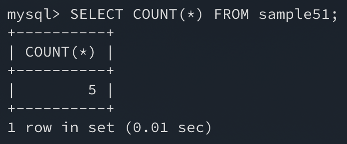

SQL은 데이터베이스라 불리는 **데이터 집합**을 다루는 언어이다. 이 같은 **집합의 개수나 합계**가 궁금하다면 **SQL이 제공하는 집계함수**를 사용하여 간단하게 구할 수 있다.

대표적인 **집계함수의 종류**로는 `COUNT`, `SUM`, `AVG`, `MIN`, `MAX`가 있는데 이번에는 `COUNT`에 대해 알아보자.

## 1. COUNT로 행 개수 구하기

집계함수는 일반 함수와 다르게 **인수로 집합을 지정**한다. 이 때문에 **집합함수**라고 부른다.

`COUNT` 함수는 인수로 주어진 **집합의 개수를 구해 반환**하는데 예제를 통해 확인해보자.

```sql
SELECT * FROM sample51;
```


```sql
SELECT COUNT(*) FROM sample51;
```



예제 테이블에는 총 5개의 행이 있음으로 `COUNT`의 결괏값도 5이다. 인수로 지정된 `*`는 `SELECT` 구에서 사용하는 것처럼 **모든 행**을 말한다.

집계함수의 특징은 **복수의 값(집합)에서 하나의 값을 계산해내는 것**이다.

> 집합으로 부터 하나의 값을 계산하는 것을 **집계**라고 부른다.

이러한 이유로 집계함수를 `SELECT` 구에 쓰면 `WHERE` 구의 유무와 관계없이 결괎갑으로 하나의 행을 반환한다.

### WHERE 구 지정하기

예제 테이블에서 name이 A인 행을 검색하여 `COUNT`로 개수를 구해보자.

```sql
SELECT COUNT(*) FROM sample51 WHERE name = 'A';
```


`SELECT` 구는 `WHERE` 구보다 **나중에 처리**된다. 따라서 `WHERE` 구로 조건을 지정하면 검색된 행이 `COUNT`로 넘겨진다.

그 결과 name열에 A라는 값을 가진 **2개의 행에 대한 갯수**가 반환되었다.

## 2. 집계함수와 NULL값

`COUNT`의 인수로 열 명을 지정할 수 있다. 열 명을 지정하면 **그 열에 한해서 행의 개수**를 구할 수 있다.

이때 **NULL**값은 집계함수에서 **제외처리**된다.

```sql
SELECT * FROM sample51;
```


```sql
SELECT COUNT(no), COUNT(name) FROM sample51;
```


no열의 개수는 **5**개, name열의 개수는 **4**개가 나왔다. name에는 **NULL을 가지는 행이 한 개 존재**했기 떄문인 것을 알 수 있다.

다만 `COUNT(*)`와 같은 경우 **모든 행의 갯수를 구하는 것**이기 때문에 **NULL값에 영향을 받지 않는다.**

## 3. DISTINCT로 중복 제거하기

SQL에서는 집합 내에서 **중복된 값을 제거**하는 `DISTINCT` 함수를 제공한다.

```sql
SELECT ALL name FROM sample51;
```


```sql
SELECT DISTINCT name FROM sample51;
```


`SELECT` 구에 지정하는 `ALL` 또는 ` DISTINCT`는 **중복된 값을 제거할 것인지를 설정**하는 스위치와 같은 역할을 한다.

둘 중 아무것도 지정하지 않는 경우 `ALL`**로 결과가 처리**된다.

## 4. 집계함수에서 DISTINCT

이번에는 **name열에서 NULL 값을 제외하고, 중복하지 않는 데이터의 개수를 구하는 경우**를 생각해보자.

`WHERE` 구의 경우 중복된 값인지 여부를 확인할 수 없고 `DISTINCT COUNT` 순서로 하면 `COUNT`가 먼저 계산되기 때문에 불가능하다.

이 경우 **집계함수의 인수**로 `DISTINCT`를 사용한 **수식을 지정**하면 된다.

```sql
SELECT COUNT(ALL name), COUNT(DISTINCT name) FROM sample51;
```


## 정리하면

집계함수는 **집합을 인수로 사용하여 연산을 할 수 있다는 점**에 유의해야 한다.

**통계성 SQL 명령**을 사용하는 경우 자주 사용될 수 있는 만큼 집계함수에 숙련도를 높여 두는 것이 좋을 것이다.