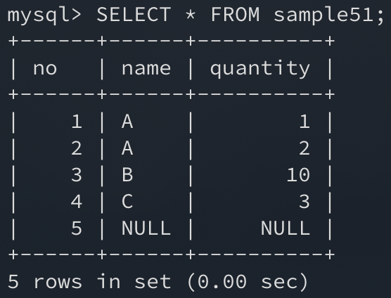
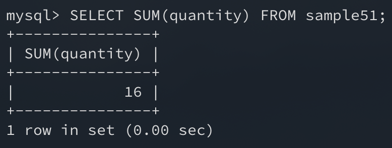
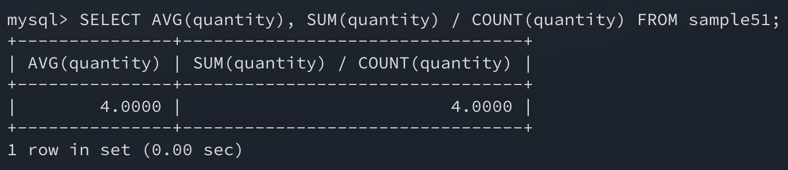
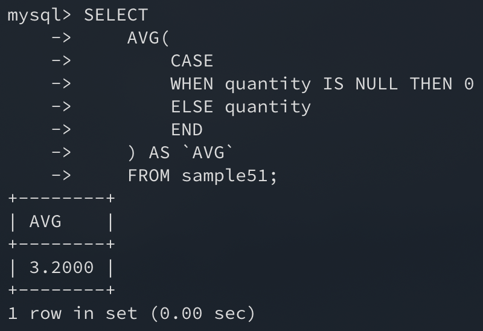
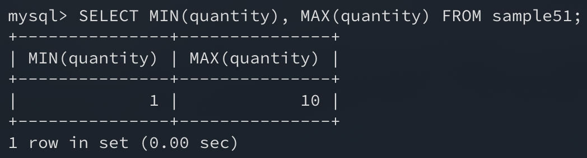

이번에는 `COUNT` **이외의 집계함수**에 대해 알아보자.

## 1. SUM으로 합계 구하기

집합의 합계는 `SUM` 집계함수를 사용하여 구할 수 있다.

```sql
SELECT * FROM sample51;
```



```sql
SELECT SUM(quantity) FROM sample51;
```



주의할 점은 `SUM` 집계함수에서 지정되는 집합은 **수치형 뿐**이다. **문자열형이나 날짜시간형의 집합에서는 합계를 구할 수 없다.**

또한 `COUNT`와 마찬가지로 **NULL값은 연산에서 제외**한 뒤 결과를 낸다.

## 2. AVG로 평균내기

평균값의 경우는 `AVG` 집계함수를 사용하여 구할 수 있다.

```sql
SELECT AVG(quantity), SUM(quantity) / COUNT(quantity) FROM sample51;
```



이 결과는 총합(`SUM`)에서 개수(`COUNT`)를 나눈 결과와 동일하다.

물론 여기서도 **NULL값은 연산에서 제외**된다. 만약 **NULL값을 0으로 계산**해서 평균을 내고 싶다면 **CASE문을 함께 사용**하면 된다.

```sql
SELECT
    AVG
    (
        CASE
        WHEN quantity IS NULL THEN 0
        ELSE quantity
        END
    ) AS `AVG`
    FROM sample51;
```



## 3. MIN, MAX로 최솟값, 최댓값 구하기

최솟값과 최댓값은 `MIN` 집계함수와 `MAX` 집계함수를 사용하여 구할 수 있다.

이 함수들은 **문자열형과 날짜시간형에도 사용**할 수 있다. 물론 **NULL값을 무시**하는 것은 다른 집계함수와 같다.

```sql
SELECT MIN(quantity), MAX(quantity) FROM sample51;
```



## 정리하면

집계함수는 **통계 결과**를 뽑아낼 때 유리하다.

물론 많은 프로그래밍 언어들이 지원하는 기능이기도 하고 구현도 어렵지 않다. 하지만 이런 간단한 로직들을 데이터베이스에서 구해서 가져온다면 코드상의 **실제 비즈니스 로직이 훨씬 더 명확**해지지 않을까 생각한다.