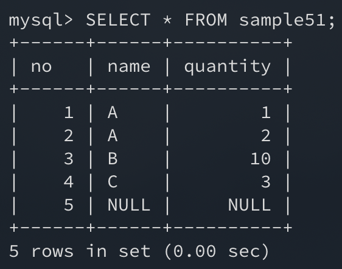

앞서 만난 집계함수는 집합을 인수로 받았는데, 지금까지의 집합은 전체 또는 `WHERE` 구로 검색한 결과들이었다.

이번에는 `GROUP BY` 구를 사용하여 집계함수로 넘겨줄 집합을 그룹으로 나누는 방법에 대해 알아보자.

## 1. GROUP BY로 그룹화

```sql
SELECT * FROM sample51;
```



여기서 name열의 값을 살펴보면 A인 행이 2개, B, C인 행이 각각 1개인 것을 확인할 수 있다.

name열에서 같은 값을 가진 행끼리 묶어 그룹화한 집합을 집계함수에게 넘겨줄 수 있는데, 이때 그룹으로 나누는 방법이 `GROUP BY` 구이다.

`GROUP BY` 구에는 그룹화할 열을 지정하는데 복수로 지정할 수도 있다.

```sql
SELECT name FROM sample51 GROUP BY name;
```


예제처럼 열을 지정하여 그룹화하면 지정한 열의 값이 같은 행이 하나의 그룹으로 묶인다.

그래서 결과를 보면 `DISTINCT` 함수를 사용한 것과 같이 중복을 제거하는 효과를 볼 수 있다.

실제로 `GROUP BY` 구를 집계함수와 함께 쓰지 않는다면 별 의미가 없다.

만약 `COUNT`나 `SUM`과 같은 집계함수와 사용하면 어떻게 결과를 반환하는지 확인해보자.

```sql
SELECT COUNT(name), SUM(quantity)
    FROM sample51
    GROUP BY name;
```


위 예시를 보면 name열로 그룹화가 된 행들에 대해 name열의 개수와 quantity열의 합계를 반환함을 볼 수 있다.

## 2. HAVING 구로 조건 지정

집계함수는 `WHERE` 구의 조건식에서는 사용할 수 없다.

```sql
SELECT name, COUNT(name)
    FROM sample51
    WHERE COUNT(name) = 1
    GROUP BY name;
```

name열로 그룹화하여 행이 1인 그룹을 검색하고 싶었지만 `GROUP BY`와 `WHERE`의 내부처리 순서로 인해 문제가 발생한다. `WHERE` 구로 행을 검색하는 처리가 `GROUP BY` 구로 그룹화하는 것보다 먼저 실행되기 때문이다.

내부처리 순서는 `WHERE` 구 -> `GROUP BY` 구 -> `SELECT` 구 -> `ORDER BY` 구 순서로 실행된다.

그렇다면 집계한 결과에서 조건에 맞는 값을 따로 걸러낼 수 없을까?

`SELECT` 명령에서는 `HAVING` 구를 사용하면 집계함수를 조건식에 지정할 수 있다.

`HAVING` 구는 `GROUP BY` 구의 뒤에 기술하며 `WHERE` 구와 동일하게 조건식을 지정할 수 있다. 조건식에는 그룹별로 집계된 열의 값이나 집계함수의 계산 결과가 전달된다고 생각하면 된다.

```sql
SELECT name, COUNT(name) FROM sample51 GROUP BY name;
```


```sql
SELECT name, COUNT(name)
    FROM sample51
    GROUP BY name
    HAVING COUNT(name) = 1;
```


그룹화보다도 나중에 처리되는 `ORDER BY` 구에서는 집계함수를 문제없이 사용할 수 있다.

그럼 전체적으로 내부처리 순서는 `WHERE` 구 -> `GROUP BY` 구 -> `HAVING` 구 -> `SELECT` 구 -> `ORDER BY` 구 순서대로 진행됨을 알 수 있다.

다만 `GROUP BY` 구와 `HAVING` 구는 `SELECT` 구보다 먼저 실행되므로 `SELECT` 구에서 설정한 별칭은 사용할 수 없다는 점에 유의하자.

> MySQL과 같이 유연한 데이터베이스는 `SELECT` 구에서 지정한 별칭을 `HAVING` 구에서도 사용할 수 있도록 지원한다.
>
> 하지만 지원하지 않는 데이터베이스도 있다는 것에 유의하자.

## 3. 복수 열의 그룹화

`GROUP BY`를 사용할 때 주의할 점이 하나 더 있는데, `GROUP BY`에서 지정한 열 이외의 열은 집계함수를 사용하지 않은 상태에서 `SELECT` 구에 기술해선 안 된다.

말이 어려우니 예시를 들어보자.

```sql
SELECT no, name, quantity FROM sample51 GROUP BY name;
```

위의 `SELECT` 명령을 보면 `GROUP BY`에 지정한 열은 name열 뿐이지만 `SELECT` 구에 지정된 열은 no, name, quantity이다.

이 상황이 왜 문제가 생기는지 보면 `GROUP BY`로 그룹화하면 클라이언트로 반환되는 결과는 그룹당 하나의 행이 된다.

하지만 name열 값이 A인 그룹에서 quantity열의 값은 1과 2로 2개가 존재한다. 하나의 행을 반환해야 하는데 검색된 행이 2개이므로 에러가 발생하는 것이다.

집계함수를 사용하면 이 문제는 해결된다. 집계함수는 여러 행을 1개의 결과로 반환하기 때문에 위의 명령을 아래와 같이 수정하면 정상적으로 동작한다.

```sql
SELECT MIN(no), name, SUM(quantity)
    FROM sample
    GROUP BY name;
```

`GROUP BY` 구에 지정한 열이 no열과 quantity열이라면 `SELECT` 구에서 둘을 함께 반환해도 문제없다.

## 4. 결괏값 정렬

`GROUP BY`로 그룹화해도 실행 결과 순서를 보장할 수는 없다.

이런 경우 `ORDER BY` 구를 사용하여 결과를 정렬하면 된다. `ORDER BY` 구는 내부처리 순서가 가장 마지막이기 때문에 큰 제약 없이 사용할 수 있다.

```sql
SELECT name, COUNT(name) AS count_name, SUM(quantity) AS sum_quantity
    FROM sample51
    GROUP BY name
    ORDER BY sum_quantity DESC;
```


## 정리하면

`GROUP BY` 구는 앞서 배운 집계함수의 활용도를 배로 만들어 줄 수 있는 편리한 구이다. 그러나 그만큼 주의해서 사용해야함을 느낄 수 있었다.

SQL 명령의 내부처리 순서가 실제 결괏값을 반환하는데 영향을 많이 미친다.

어떤 구가 어떤 순서로 처리되는지 정확히 기억하고 잘 사용해야 할 것이다.