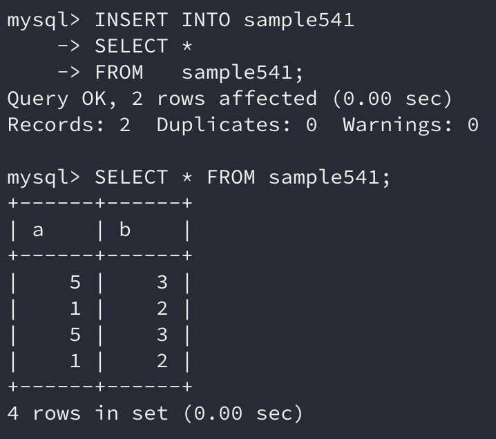

서브쿼리는 `SELECT` 명령에 의한 데이터 질의로, 상부가 아닌 하부의 부수적인 질의를 의미한다.

```sql
(SELECT 명령)
```

서브쿼리는 SQL 명령문 안에 지정하는 하부 `SELECT` 명령으로 **괄호로 묶어 지정**한다.

서브쿼리 내에는 `SELECT` 구, `FROM` 구, `WHERE` 구 등 `SELECT` 명령의 각 구를 지정할 수 있고, 주로 `SELECT` 명령의 `WHERE` 구에서 자주 사용된다.

## 1. DELETE의 WHERE 구에서 서브쿼리 사용하기

```sql
SELECT * FROM sample54;
```


예제 테이블에서 a열의 값이 가장 작은 행을 삭제하려면 어떻게 하면 될까? 예제 테이블은 크기가 작기 때문에 20이 최솟값임을 한 눈에 알 수 있다.

```sql
DELETE FROM	sample54 WHERE a = 20;
```

이처럼 간단하게 작성할 수 있지만 만약 행이 수백, 수천개가 넘는다면 직접 최솟값을 찾아서 SQL 명령을 작성하는 것은 무리이다.

그렇다면 먼저 a열의 최솟값을 찾는 쿼리를 작성해보자.

```sql
SELECT MIN(a) FROM sample54;
```


이 명령의 결과를 `DELETE` 명령의 `WHERE` 구에서 사용하면 하나의 `DELETE` 명령으로 원하는 행을 삭제할 수 있다.

```sql
DELETE FROM sample54 
WHERE  a = (SELECT MIN(a) 
            FROM   sample54);
```

서브쿼리를 사용하면 이렇게 `DELETE`와 `SELECT`를 결합시킬 수 있다. **괄호로 둘러싼 서브쿼리 부분을 먼저 실행한 후** `DELETE` **명령을 실행**한다고 생각하면 된다.

> 하지만 MySQL에서는 데이터를 수정하거나 갱신할 경우 동일한 테이블을 서브쿼리에서 사용할 수 없다.
>
> 따라서 에러가 발생하지 않으려면 **인라인 뷰로 임시 테이블을 만들도록 처리**해야 한다.
>
> ```sql
> DELETE FROM sample54 
> WHERE  a = (SELECT a 
>             FROM   (SELECT MIN(a) AS a 
>                     FROM   sample54) AS x);
> ```


위와 같이 정상적으로 동작하는 것을 볼 수 있다.

## 2. 스칼라 값

서브쿼리를 사용할 때는 서브쿼리의 `SELECT` 값이 어떤 값을 반환하는지 주의할 필요가 있다.

주로 4가지의 일반적인 패턴으로 값을 반환한다.

1. **하나의 값을 반환하는 패턴**

   ```sql
   SELECT MIN(a) FROM sample54;
   ```

2. 복수의 행이 반환되지만 열은 하나인 패턴

    ```sql
   SELECT a FROM sample54;
    ```

3. 하나의 행이 반환되지만 열이 복수인 패턴

   ```sql
   SELECT MIN(a), MAX(a) FROM sample54;
   ```

4. 복수의 행, 복수의 열이 반환되는 패턴

   ```sql
   SELECT no, a FROM sample54;
   ```

이때 첫 번째 패턴만 다른 패턴들과 다르다. 이는 다른 패턴들과 달리 하나의 값만 반환하기 때문이다.

단일 값으로 통용되지만, 데이터베이스 업계에서는 **스칼라값**이라 불리는 경우가 많다.

스칼라값은 **서브쿼리로 사용하기 쉽다는 장점**이 있다. 단일 값을 반환하기 때문에 `WHERE` 구에서 `=` 연산자로 비교할 수 있기 때문이다.

앞선 `DELETE` 명령에서도 스칼라값을 반환하는 서브쿼리를 사용하여 연산이 진행되었다.

이처럼 스칼라값을 반환하는 서브쿼리를 특별히 **스칼라 서브쿼리**라고 부르기도 한다.

## 3. SELECT 구에서 서브쿼리 사용하기

지금까지는 `WHERE` 구에서 서브쿼리를 사용하는 예시를 보여줬지만, 그 밖에도 `SELECT` 구, `UPDATE`의 `SET` 구 등 다양한 구 안에서 지정할 수 있다.

문법적으로 서브쿼리는 하나의 항목으로 취급한다. 하지만 실행하면 에러를 발생하는 경우가 자주 있는데 이는 스칼라값의 반환 여부에 따라 생기는 현상으로, **서브쿼리를 사용할 때는 스칼라 서브쿼리로 되어있는지 확인**해야 한다.

`SELECT` 구에서 서브쿼리를 사용할 때는 스칼라 서브쿼리를 사용해야 한다.

```sql
SELECT (SELECT COUNT(*) 
        FROM   sample51) AS sq1, 
       (SELECT COUNT(*) 
        FROM   sample54) AS sq2; 
```


## 4. SET 구에서 서브쿼리 사용하기

`UPDATE`의 `SET` 구에서 서브쿼리를 사용해보자.

```sql
UPDATE sample54 
SET    a = (SELECT a 
            FROM   (SELECT MAX(a) AS a 
                    FROM   sample54) AS x); 
```


`SET` 구에서 서브쿼리를 사용할 때도 스칼라값을 반환하도록 스칼라 서브쿼리를 지정할 필요가 있다.

위의 예제에서는 `UPDATE` 명령을 적절하게 사용한 것은 아니지만 '이렇게 갱신을 할 수 있다' 정도로만 보면 될 것이다.

## 5. FROM 구에서 서브쿼리 사용하기

`FROM` 구에도 테이블이 아니라 서브쿼리를 지정할 수 있다. `FROM` 구에는 기본적으로 테이블을 지정하는 만큼 서브쿼리도 다른 구에서와는 다르게 사용한다.

`FROM` 구에서는 **서브쿼리가 스칼라값이 아닌 값을 반환해도 된다.** 물론 스칼라값을 반환해도 상관없다.

```sql
SELECT * 
FROM   (SELECT * 
        FROM   sample54) sq; 
```


위의 명령은 `SELECT` 구 안에  `SELECT` 구가 있는 것처럼 보이는데 이를 **중첩(nested) 구조 또는 내포 구조**라고 부른다.

이러한 중첩 구조는 몇 단계든 구성이 가능하다.

### 실제 업무에서 FROM 구에 서브쿼리를 지정하여 사용하는 경우

MySQL에는 `LIMIT` 구가 있어서 정렬 후 상위 몇 개의 행을 조회할 수 있었지만, Oracle의 경우는 `ROWNUM`으로 행의 개수만 제한할 수 있고 정렬 후 몇 건의 행을 추출할 수가 없었다. `ROWNUM`의 경우  `WHERE` 구로 인해 번호가 할당되기 때문이다.

그러나 이런 상황을 서브쿼리로 해결할 수 있다.

```sql
SELECT * 
FROM   (SELECT * 
        FROM   sample54 
        ORDER  BY a DESC) sq 
WHERE  ROWNUM <= 2; 
```

이 명령은 MySQL에서의 아래 명령과 동일하다.

```sql
SELECT * 
FROM   sample54 
ORDER  BY a DESC 
LIMIT  2; 
```


## 6. INSERT 명령과 서브쿼리

`INSERT` 명령도 `VALUES` 구의 일부로 서브쿼리를 사용하거나 `VALUES` 구 대신 `SELECT` 명령을 사용하는 두 가지 방법이 있다.

먼저 `VALUES` 구의 값으로 서브쿼리르 사용하는 예를 살펴보자.

```sql
INSERT INTO sample541 
VALUES      ((SELECT COUNT(*) 
              FROM   sample51), 
             (SELECT COUNT(*) 
              FROM   sample54) ); 
```


이때 **서브쿼리가 반환하는 스칼라 값의 자료형은 갱신하려는 열의 자료형과 동일**해야 한다.

### INSERT SELECT

이번에는 `VALUES` 구 대신에 `SELECT` 명령을 사용하는 예를 살펴보자.

```sql
INSERT INTO sample541 
SELECT 1, 
       2; 
```


흔히 `INSERT SELECT`라 부르는 명령으로 `INSERT` 명령과 `SELECT` 명령을 합친 것과 같은 명령이다.

`SELECT` 명령이 반환하는 값이 `VALUES`로 들어가는 것과 같은데 `SELECT` **명령이 반환하는 열 수와 자료형이** `INSERT` **할 테이블과 일치**하기만 하면 된다.

열 구성이 똑같은 테이블이라면 이러한 방법으로 **테이블의 행을 복사**할 수도 있다.

```sql
INSERT INTO sample541 
SELECT * 
FROM   sample541;
```



## 정리하면

이번에는 **서브쿼리**에 대해 알아보았다.

서브쿼리는 단순히 주어진 테이블로만 연산하는 것이 아니라 우리가 배운 명령을 **좀 더 활용**해서 데이터를 처리할 수 있도록 도와주는 방법이다.

데이터베이스의 데이터를 좀 더 유연하게 다룰 수 있도록 도와주는 방법이기 때문에 익혀두면 많은 도움이 될 것이다.