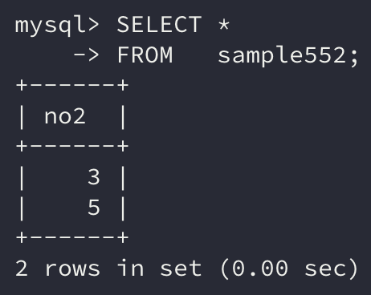

이번에는 `EXISTS` 술어와 함께 조합하여 사용할 수 있는 **상관 서브쿼리**에 대해 알아보자.

```sql
EXISTS(SELECT 명령)
```

`EXISTS`를 사용하는 경우 **서브쿼리가 반드시 스칼라 서브쿼리일 필요는 없다.** 단지 **반환된 행이 있는지 유무**만 확인하여 **참, 거짓을 반환**한다.

## 1. EXISTS

서브쿼리를 사용하여 검색할 때 **데이터가 존재하는지 여부를 판별하기 위해 사용되는 술어**가 `EXISTS` 이다.

```sql
SELECT * 
FROM   sample551;
```


```sql
SELECT *
FROM   sample552;
```



여기서 sample551의 행을 sample552의 행에 존재하는 값에 대한 행을 있음으로, 없는 행은 없음으로 갱신해보자.

이때 몇 가지 갱신 방법이 있겠지만 여기서는 `WHERE` 구를 사용하여 처리해보자.

```sql
UPDATE sample551 
SET    a = '있음' 
WHERE  EXISTS (SELECT * 
               FROM   sample552 
               WHERE  no2 = no);
```


이처럼 존재하는 행인 3, 5에 대한 a열의 값이 갱신되었다.

`EXISTS` 술어에 서브쿼리를 지정하면 서브쿼리가 행을 반환할 경우에 참을 돌려준다. **한 줄이라도 존재하면 참을, 만약 한 줄도 없다면 거짓을 반환한다.**

## 2. NOT EXISTS

없음의 경우 행이 존재하지 않으면 참이 되므로 `NOT EXISTS` 술어를 사용하면 된다.

```sql
UPDATE sample551 
SET    a = '없음' 
WHERE  NOT EXISTS(SELECT * 
                  FROM   sample552 
                  WHERE  no2 = no);
```


## 3. 상관 서브쿼리

앞서 우리가 사용한 명령에서 괄호로 묶은 부분이 **서브쿼리(자식)**가 된다.

```sql
UPDATE sample551 
SET    a = '있음' 
WHERE  EXISTS (SELECT * 
               FROM   sample552 
               WHERE  no2 = no);
```

자식인 서브쿼리에는 sample552 테이블의 no2열 값과 부모의 no열 값과 일치하는 행을 검색한다.

이처럼 **부모 명령과 자식인 서브쿼리가 특정 관계를 맺는 것을 상관 서브쿼리**라 부른다.

**부모 명령과 떼어내서 독립적으로 사용할 수 있는 것은 상관 서브쿼리가 아니다.**

```sql
SELECT *
FROM   (SELECT *
        FROM sample552);
```

그러나 상관 서브쿼리는 부모 명령과 떼어내면 단독으로 명령을 처리할 수 없다.

```sql
SELECT *
FROM   sample552
WHERE  no2 = no;
```

> 마지막 `no2 = no`  명령에서 no열은 존재하지 않는 열이기 때문에 에러가 발생할 것이다.

### 테이블 명 붙이기

만약 부모의 행과 자식의 행의 이름이 동일할 경우 `WHERE no = no`와 같은 상황이 생기는데 이때 명령이 제대로 동작할까?

특정 데이터베이스는 동작이 가능하도록 지원하지만 대부분은 열이 애매하다는 에러가 발생한다.

> MySQL의 경우 동일한 열의 이름을 사용해도 내부적으로 열 앞에 테이블 명을 지정하기 때문에 에러가 발생하지 않는다.

이럴 경우 열의 앞에 **테이블 명**을 붙이면 문제없이 동작함을 알 수 있다.

```sql
UPDATE sample551 
SET    a = '있음' 
WHERE  EXISTS (SELECT * 
               FROM   sample552 
               WHERE  sample552.no2 = sample551.no);
```

## 4. IN

스칼라값끼리 비교할 때는 `=` 연산자를 사용하지만 집합을 비교할 때는 사용할 수 없다. 이때 `IN`을 사용하면 **집합 안의 값이 존재하는지를 조사**할 수 있다.

서브쿼리를 사용할 때 `IN`을 통해 비교하는 경우도 많다.

앞서 사용한 `UPDATE` 명령에서는 sample552 테이블의 행 3, 5가 존재하는 지 여부에 따라 행을 갱신했다.

이때 서브쿼리를 사용하지 않고 3 또는 5인 행만 갱신한다고 지정하고 싶을 때 `IN`을 사용하면 된다.

```sql
열 명 IN(집합)
```

```sql
UPDATE sample551 
SET    a = '있음' 
WHERE  no IN ( 3, 5 );
```

위의 명령은 앞에서 사용한 `UPDATE` 명령과 동일한 일을 수행한다.

또한 `IN`의 집합에는 **서브쿼리를 사용할 수 있다.**

```sql
UPDATE sample551 
SET    a = '있음' 
WHERE  no IN (SELECT no2 
              FROM   sample552);
```

이와 같은 경우 서브쿼리는 **스칼라 서브쿼리가 될 필요는 없다.** `IN`은 집합을 지정할 수 있기 때문에 **여러 행으로 이루어진 서브쿼리여도 가능**하다.

> 반면 **여러 열을 반환하는 서브쿼리는 사용할 수 없다.**
>
> 집합으로 연산을 하는데 열이 여러 개일 경우 집합 연산이 불가능하기 때문이다.

또한 값이 포함되지 않음을 확인하고 싶다면 `NOT IN`을 사용하면 된다.

### IN과 NULL

`IN`에서는 집합함수들과는 다르게 NULL값이 있어도 무시하지 않는다. 그러나 NULL값을 비교하지도 못한다.

> NULL = NULL은 연산이 불가능하기 때문이다.

즉, NULL을 비교할 때는 `IS NULL`과 같은 술어를 사용하여 연산하여야 한다.

## 정리하면

이번에는 부모 명령과 연관을 가지는 **상관 서브쿼리**와 행의 존재 여부를 확인할 수 있는 `EXISTS`, `IN`에 대해 알아봤다.

단순히 **유무를 파악**하여 연산을 해야하는 경우 유용하게 쓰일 수 있는 명령이고, **서브쿼리와 함께 사용할 수 있기 때문**에 어떤 값을 서브쿼리로 지정할 수 있는지를 잘 파악해서 사용하자.