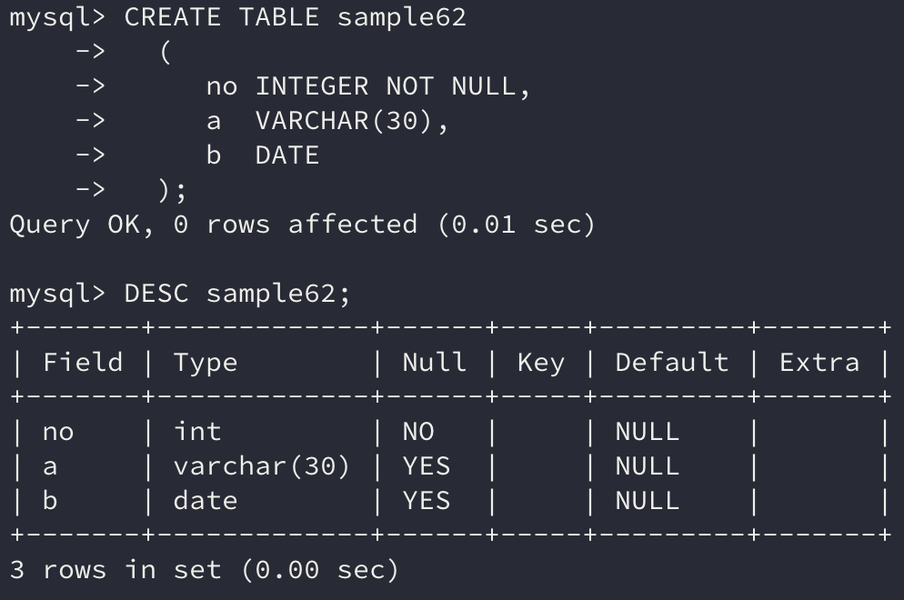
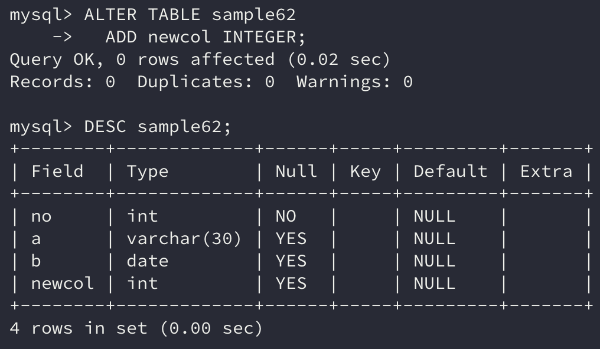
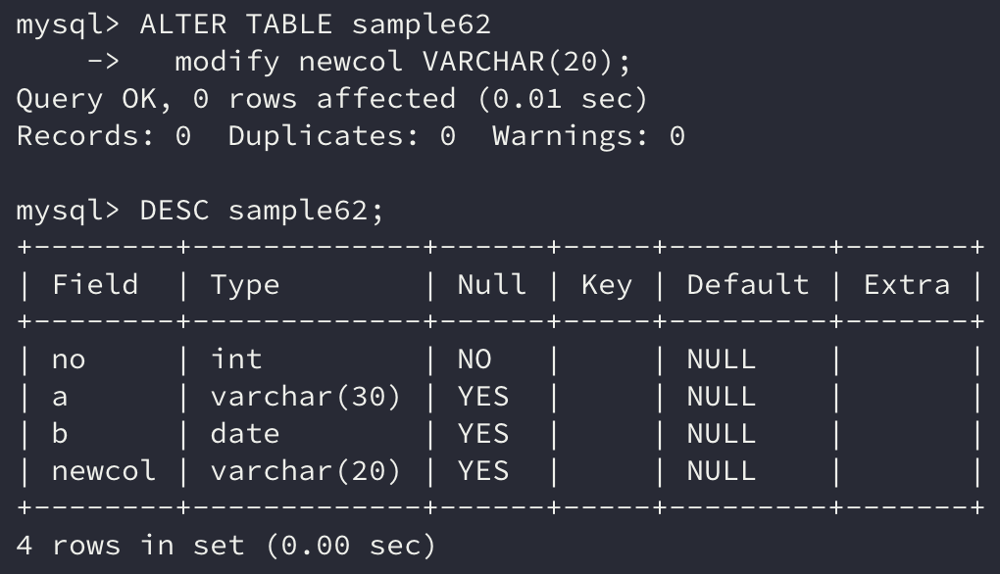
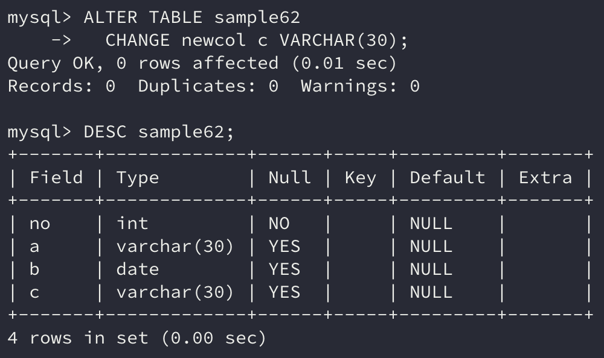
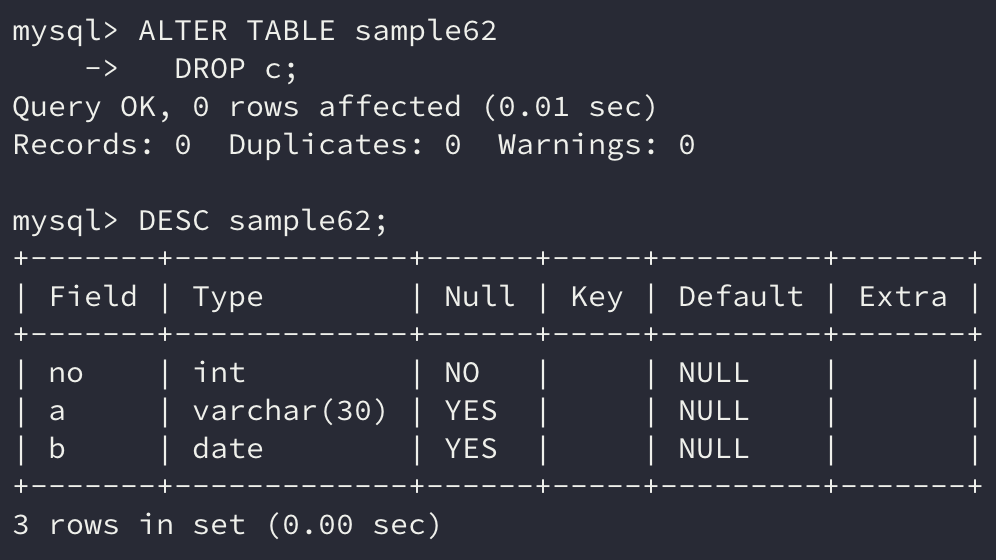

이번에는 테이블을 작성, 삭제, 변경하는 방법에 대해 알아보자.

```sql
CREATE TABLE 테이블명 (열정의1, 열정의2, ...)
DROP TABLE 테이블명
ALTER TABLE 테이블명
```

이전에 배운 `SELECT`, `INSERT`, `DELETE`, `UPDATE`는 SQL 명령 중에서 **DML(*Database Manipulation Language*)**로 분류된다. DML은 데이터를 조작하는 명령이다.

한편 **DDL(*Database Definition Language*)**은 데이터를 정의하는 명령으로 **스키마 내의 객체를 관리**할 때 사용한다.

이번에는 **테이블을 관리하는 DDL 명령**에 대해 알아보자.

## 1. 테이블 작성

DDL은 모두 같은 문법을 사용한다. `CREATE`로 작성, `DROP`으로 삭제, `ALTER`로 변경할 수 있다.

뒤에는 **어떤 데이터베이스 객체를 작성, 변경, 삭제할 것인지 지정**한다. 만약 테이블을 대상으로 하면 `CREATE TABLE`과 같이 사용하고 뷰를 대상으로 하면 `CREATE VIEW`와 같이 사용한다.

테이블을 생성할 때는 `CREATE TABLE` 명령에 이어 작성하고 싶은 **테이블 명**, 그리고 **괄호로 묶어 열을 정의**한다. 열은 콤마(`,`)로 구분하여 연속해 지정한다.

```sql
CREATE TABLE 테이블명(
    열정의1, 
    열정의2,
    ...
)
```

열 명은 열에 붙이는 이름인데, **명명 규칙에 맞게** 이름을 붙여준다. 그리고 자료형은 `INTEGER`나 `VARCHAR` 등을 지정한다.

기본값을 설정할 때는 `DEFAULT`로 지정하되, 자료형에 맞는 리터럴로 기술한다. 기본값은 생략이 가능하다.

> 생략하면 **NULL**이 기본값으로 지정된다.

마지막으로 열이 NULL을 허용할 것인지를 지정한다. `NULL`을 명시하거나 생략하면 NULL이 허용되고 `NOT NULL`을 명시하면 열에는 NULL이 올 수 없다.

따라서 열 정의는 아래와 같다.

``` sql
열명 자료형 [DEFAULT 기본값] [NULL | NOT NULL]
```

앞서 배운 내용을 바탕으로 직접 테이블을 생성해보자.

```sql
CREATE TABLE sample62 
  ( 
     no INTEGER NOT NULL, 
     a  VARCHAR(30), 
     b  DATE 
  );
```



## 2. 테이블 삭제

필요 없는 테이블은 `DROP` 명령을 사용하여 삭제할 수 있다.

```sql
DROP TABLE 테이블명
```

`DROP TABLE`에서 지정하는 것은 테이블 명 뿐이다. 또한 삭제할 때 재확인을 하지 않는다.

그러므로 실수로 테이블을 삭제하지 않도록 **신중하게 명령을 실행**해야 한다.

### 데이터 행 삭제

`DROP TABLE`은 테이블을 삭제하는 명령인데 테이블을 삭제하면서 데이터도 함께 삭제된다.

테이블의 정의를 그대로 둔 채 데이터를 삭제하려면 앞에서 배운 DML 중 하나인  `DELETE` 명령을 사용해서 지워야 하지만, 이는 **행 단위로 작업을 처리하기 때문에 비용이 많이 든다.**

이런 경우 DDL로 분류되는 `TRUNCATE TABLE` 명령을 사용한다.

`TRUNCATE TABLE` 명령은 행을 지정할 수 없지만 **모든 행을 삭제할 때 빠른 속도로 삭제**할 수 있다.

```sql
TRUNCATE TABLE 테이블명
```

## 3. 테이블 변경

테이블을 작성해버린 뒤에도 열 구성은 얼마든지 변경할 수 있는데, 이때 테이블 변경은 `ALTER TABLE` 명령을 통해 이루어진다.

```sql
ALTER TABLE 테이블명 변경명령
```

테이블을 작성한 후 열을 추가하거나 데이터 최대 길이를 변경하는 등 구성을 바꿔야 하는 경우가 생긴다.

`DROP TABLE`을 하고 다시 `CREATE TABLE`을 할 수도 있지만, 이렇게 하면 이전에 존재했던 모든 데이터가 삭제된다.

이때 `ALTER TABLE` 명령을 사용하면 **데이터는 그대로 유지하면서 테이블의 구성만 변경**할 수 있다.

`ALTER TABLE`로 할 수 있는 작업은

- 열 추가, 삭제, 변경

- 제약 추가, 삭제

가 있다.

### 열 추가

`ALTER TABLE`에서 열을 추가할 때는 `ADD` 하부명령을 통해 실행할 수 있다.

```sql
ALTER TABLE 테이블명 ADD 열정의
```

열 정의는 `CREATE TABLE`과 동일하다. 

```sql
ALTER TABLE sample62 
  ADD newcol INTEGER;
```



이렇게 새로운 열을 추가할 때 기존에 존재한 데이터 행들에는 새로운 열의 값이 모두 **NULL값이 저장**된다.

만약 기본값을 함께 지정하면 기본값으로 데이터가 저장된다.

`NOT NULL` 제약을 붙일 경우에는 **필수적으로** `DEFAULT`**를 NULL 이외의 값으로 지정**해야 한다.

### 열 속성 변경

`ALTER TABLE`로 열 속성을 변경할 경우 `MODIFY` 하부명령을 통해 실행한다.

```sql
ALTER TABLE 테이블명 MODIFY 열정의
```

이때도 열 정의는 `CREATE TABLE`과 동일하다.

```sql
ALTER TABLE sample62 
  modify newcol VARCHAR(20);
```



**기존의 데이터 행이 존재하는 경우 속성이 변경됨에 따라 데이터 역시 변환**된다.

만약 자료형이 들어간 데이터라면 자료형 역시 바뀌는데 그 과정에서 에러가 발생하면 `ALTER TABLE` 명령은 실행되지 않는다.

그리고 `ALTER` 명령은 표준화가 아직 이뤄지지 않은 부분이 있어 데이터베이스에 따라 고유한 방언이 존재한다.

> MySQL과 Oracle에서는 `MODIFY` 하부명령을, 다른 데이터베이스에서는 `ALTER` 하부명령을 사용하기도 한다.

### 열 이름 변경

`ALTER TABLE`로 열 이름을 변경할 때는 `CHANGE` 하부명령으로 시행할 수 있다.

```sql
ALTER TABLE 테이블명 CHANGE [기존 열 이름] [신규 열 정의]
```

`CHANGE` 명령은 **열 이름뿐만이 아니라 열 속성도 변경**할 수 있다.

> Oracle의 경우 `RENAME TO` 하부명령을 사용한다.

```sql
ALTER TABLE sample62 
  CHANGE newcol c VARCHAR(30);
```



### 열 삭제

`ALTER TABLE`로 열을 삭제할 때는 `DROP` 하부명령을 사용한다.

```sql
ALTER TABLE 테이블명 DROP 열명
```

이때 존재하지 않는 열 명을 지정할 경우 에러가 발생한다.

```sql
ALTER TABLE sample62 
  DROP c;
```



## 4. ALTER TABLE로 테이블 관리

실제로 자주 사용하는 `ALTER TABLE`을 이용한 테이블 관리 예를 소개하겠다.

### 최대길이 연장

시스템을 운용하다 보면 데이터를 저장하는 공간이 부족해지는 일이 많다.

이런 경우 자료형만 변경해서 대응할 수 있는데, 문자열형의 경우 `ALTER TABLE`을 사용하여 자료형의 최대길이를 늘여 사용하기도 한다.

만약 길이를 줄이려고 한다면 기존에 존재하는 데이터에 의해 제약을 받게 된다. 기존에 존재하는 데이터의 길이보다 작게 줄일 수 없기 때문이다.

따라서 **일반적으로는 최대길이를 늘일 때 사용**한다.

### 열 추가

테이블에 열을 추가하는 일은 정말 빈번히 일어난다. 시스템의 확장 등 여러 이유가 있는데 이때 `ALTER TABLE`을 사용하여 열을 추가한다.

열을 추가하는 것은 따로 제약사항이 없다고 생각 돼서 시스템에 미치는 영향이 없으리라 생각한다.

하지만 테이블의 정의가 바뀌어버리는 일인 만큼 꽤 영향을 주므로 **적어도, 변경한 테이블에 행을 추가하는** `INSERT` **명령은 확인**해봐야 한다.

> 기존에 INSERT 명령을 사용하는 부분에서는 새로운 열이 추가됨에 따라 **열의 개수가 맞지 않아 에러가 발생**할 것이다.

## 정리하면

이번에는 데이터베이스 객체 중 하나인 **테이블을 작성, 삭제, 변경하는 방법**에 대해 알아봤다.

테이블에 데이터를 저장하기 때문에 **테이블을 잘 정의하고 유지해야지 데이터를 안전하게 저장**할 수 있을 것이다.