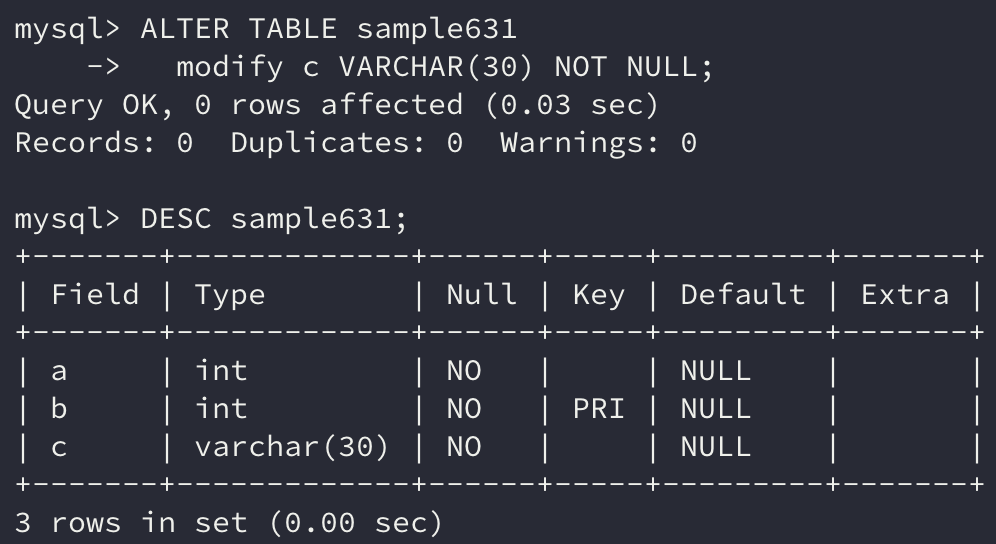

테이블에는 제약을 설정함으로써 저장될 데이터를 제한할 수 있다.

예를 들어 `NOT NULL` 제약은 NULL값이 저장되지 않도록 제한한다. 이 외로도 기본키(Primary Key) 제약이나 외부참조 제약 등이 있다.

## 1. 테이블 작성시 제약 정의

제약은 테이블에 설정하는 것이다.

`CREATE TABLE`로 테이블을 작성할 때 제약을 같이 정의한다.

```sql
CREATE TABLE sample631 
  ( 
     a INTEGER NOT NULL, 
     b INTEGER NOT NULL UNIQUE, 
     c VARCHAR(30) 
  );
```


a열에는 NOT NULL 제약이 걸려있다. b열에는 NOT NULL 제약과 UNIQUE 제약이 걸려있다.

이처럼 열에 대해 정의하는 제약을 열 제약이라 부른다.

복수열에 의한 기본키 제약처럼 한 개의 제약으로 복수의 열에 제약을 설명하는 경우는 테이블 제약이라 부른다.

```sql
CREATE TABLE sample632 
  ( 
     no     INTEGER NOT NULL, 
     sub_no INTEGER NOT NULL, 
     NAME   VARCHAR(30), 
     PRIMARY KEY (no, sub_no) 
  );
```


또한 제약에는 이름을 붙일 수 있다.

제약에 이름을 붙여두면 나중에 관리하기 쉬워지므로 가능한 한 이름을 붙이도록 하자. 제약 이름은 CONSTRAINT 키워드를 사용해서 지정한다.

``` sql
CREATE TABLE sample632 
  ( 
     no     INTEGER NOT NULL, 
     sub_no INTEGER NOT NULL, 
     NAME   VARCHAR(30), 
     CONSTRAINT pkey_sample PRIMARY KEY (no, sub_no) 
  );
```

## 2. 제약 추가

기존 테이블도 나중에 제약을 추가할 수 있는데, 이때 열 제약과 테이블 제약은 조금 다른 방법으로 추가한다.

### 열 제약 추가

열 제약을 추가할 경우 `ALTER TABLE`로 열 정의를 변경할 수 있다.

> 정의를 변경하기 전에 제약을 위반하는 데이터가 있는지 검사 후 문제가 없다면 추가한다.

```sql
ALTER TABLE sample631 
  modify c VARCHAR(30) NOT NULL;
```



### 테이블 제약 추가

테이블 제약은 `ALTER TABLE`의 `ADD` 하부명령으로 추가할 수 있다.

> 마찬가지로 제약을 위반하는지 여부를 검사 후 추가한다.

```sql
ALTER TABLE sample631 
  ADD CONSTRAINT pkey_sample631 PRIMARY KEY(a);
```


## 3. 제약 삭제

열 제약을 삭제하는 경우 제약을 추가할 때와 동일하게 열 정의를 변경한다.

```sql
ALTER TABLE sample631 
  modify c VARCHAR(30);
```


테이블 제약을 삭제하는 경우는 `ALTER TABLE`의 `DROP` 하부명령으로 삭제할 수 있다.

```sql
ALTER TABLE sample631 
  DROP CONSTRAINT pkey_sample631;
```

또는 기본키는 하나 뿐이므로 `PRIMARY KEY`를 삭제해도 된다.

```sql
ALTER TABLE sample631 
  DROP PRIMARY KEY;
```


## 4. 기본키

이번에는 기본키 제약을 설정하기 위해 테이블이 만족해야 할 조건을 알아보자.

```sql
CREATE TABLE sample634 
  ( 
     p INTEGER NOT NULL, 
     a VARCHAR(30), 
     CONSTRAINT pkey_sample634 PRIMARY KEY(p) 
  );
```


열 p가 예제 테이블의 기본키이다. 기본키로 지정할 열은 `NOT NULL` 제약이 설정되어 있어야 한다.

기본키는 테이블의 행 한 개를 특정할 수 있는 검색키이다. 그래서 기본키로 설정된 열이 중복하는 데이터 값을 가지면 제약에 위반한다.

> 데이터베이스에는 키(key)라는 단어가 자주 나온다.
>
> 검색키도 이 중 하나인데 검색할 때의 키워드라 생각하면 이해하기 쉬울 것이다.

예제 테이블에 행을 추가해가면서 살펴보자.

```sql
INSERT INTO sample634 
VALUES     (1, 
            'line 1'); 

INSERT INTO sample634 
VALUES     (2, 
            'line 2'); 

INSERT INTO sample634 
VALUES     (3, 
            'line 3');
```


p열의 값이 1, 2, 3으로 중복되지 않기 때문에 정상적으로 추가된다.

그렇다면 만약 이미 존재하는 p열의 값으로 데이터를 추가하면 어떻게 될까?

```sql
INSERT INTO sample634 
VALUES     (2, 
            'line 4');
```


위와 같이 중복된 키라고 나온다.

이는 INSERT 명령뿐만이 아니라 UPDATE 명령도 동일하게 동작한다.

이처럼 열을 기본키로 지정해 유일한 값을 가지도록 하는 구조가 바로 기본키 제약이다.

### 복수의 열로 기본키 구성하기

기본키를 구성하는 열은 복수라도 상관없다. 복수의 열을 기본키로 지정했을 경우, 키를 구성하는 모든 열을 사용해서 중복하는 값이 있는지 없는지를 검사한다.

## 정리하면

이번에는 테이블에 저장하는 값을 제한할 수 있는 제약에 대해 알아보았다.

기본키 제약이나 NOT NULL 제약은 테이블을 구성할 때 자주 만나게 되는 제약이다. 이러한 제약이 어떻게 이루어졌는지 이해하고 사용하면 데이터를 관리하는 데보다 편리할 것이다.