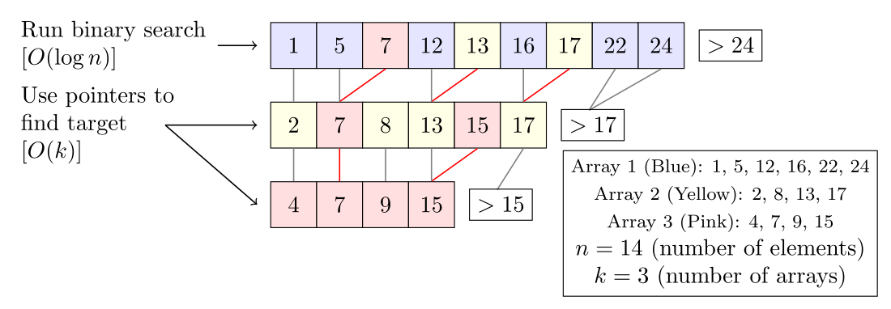
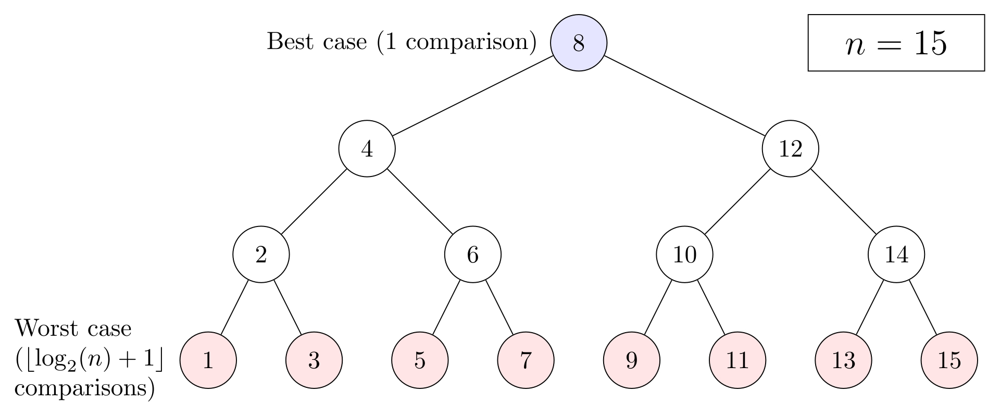

테이블에는 **인덱스**를 작성할 수 있다. 인덱스를 지정하면 얻을 수 있는 효과에 대해 알아보자.

## 1. 인덱스

**인덱스는 테이블에 붙여진 색인으로 검색 속도를 향상시켜주는 역할**을 한다.

테이블에 인덱스가 지정되어 있으면 효율적으로 검색할 수 있음으로 `WHERE`로 조건이 지정된 `SELECT` 명령의 처리 속도가 향상된다.

책의 목차나 색인에 제목, 키워드별 페이지 번호가 적혀있듯, 데이터베이스의 인덱스에는 **검색 시에 쓰이는 키워드와 대응하는 데이터 행의 장소가 저장**되어 있다.

인덱스는 테이블과 별개로 **독립된 데이터베이스 객체**이다. 그러나 인덱스만으로는 의미가 없기 때문에 **테이블에 의존하는 객체**라고 볼 수 있다.

대부분의 데이터베이스에서는 테이블을 삭제하면 인덱스도 삭제된다.

## 2. 검색에 사용하는 알고리즘

데이터베이스의 인덱스에 쓰이는 대표적인 검색 알고리즘으로는 **이진 트리**와 **해시**가 있다.

> 이진 트리는 탐색 방법이라기보다 **데이터 구조**에 가깝다.
>
> 여기에서의 탐색 방법은 이진 트리를 사용하는 **이진 탐색**이라 생각하면 된다.

### 풀 테이블 스캔(*full table scan*)

**인덱스가 지정되지 않은 테이블을 검색할 때는 풀 테이블 스캔이라 불리는 검색 방법을 사용**한다.

테이블의 모든 값을 처음부터 차례로 조사하는 방법으로 1000건의 데이터가 있다면 1000번 값을 비교한다.

### 이진 탐색(binary search)

**차례로 나열된(정렬된) 집합에 대해 유효한 검색 방법**이다. 순서대로 모든 값을 검색하는 것이 아니라 **집합을 반으로 나누어 조사**하는 검색 방법이다.

> 만약 책이 한 권 있고 우리가 451페이지를 찾는 방법은?
>
> 여러 가지가 있겠지만 그중 우리가 무의식적으로 쓰는 방법을 생각해보면 책의 중간쯤을 펴고 만약 451보다 작은 페이지라면 거기서부터 뒷부분을, 451보다 큰 페이지라면 앞부분을 찾아볼 것이다.
>
> 이런 방법을 반복하는 탐색 방법이 **이진 탐색**이다.
>
> 

이 방법은 데이터의 양이 늘면 늘수록 풀 테이블 스캔과 검색 횟수가 기하급수적으로 차이가 난다. 데이터의 수가 배로 늘어나더라도 비교 횟수는 1회밖에 안 늘어나기 때문이다.

### 이진 트리(binary tree)

이진 탐색은 검색 속도가 빠르지만 **데이터가 미리 정렬되어 있어야만** 사용할 수 있다. 하지만 테이블 내의 행을 언제나 정렬된 상태로 두는 것은 힘들다.

> 이는 삽입이 발생할 경우에도 매번 재정렬이 필요함을 추측해볼 수 있다.

일반적으로 테이블에 인덱스를 작성하면 테이블 데이터와 별개로 **인덱스용 데이터**가 저장장치에 만들어진다.

> 트리는 노드(node)라는 요소로 구성되어 있고 트리 중에서 두 개의 가지로 분기하는 구조를 이진 트리라고 한다.
>
> 

## 3. 유일성

만약 이진 트리 내에 같은 값을 가지는 노드가 여러 개 있을 때는 어떻게 하면 될까?

**이진 트리에서는 집합 내에 중복하는 값을 가질 수 없다.** 노드의 가지는 작은 쪽과 큰 쪽으로만 나누어지고, 같은 값이 있다면 새로운 가지가 필요하기 때문이다.

그러나 이렇게 노드에 같은 값을 가질 수 없다는 **키에 대하여 유일성을 가지게 할 경우만 유용**하다.

그래서 **기본키 제약**을 이진 트리로 인덱스를 작성하는 데이터베이스가 많은 것 같다.

## 정리하면

데이터베이스에서는 검색 작업이 빈번하게 이루어지는 만큼 **검색에 대한 최적화**는 성능 향상에 큰 도움을 줄 수 있다.

어떤 열을 기준으로 데이터를 많이 검색하는지 생각해보고 해당 열을 인덱스로 설정한다면 검색을 하는 데 있어서 많은 이점을 가질 수 있을 것이다.

