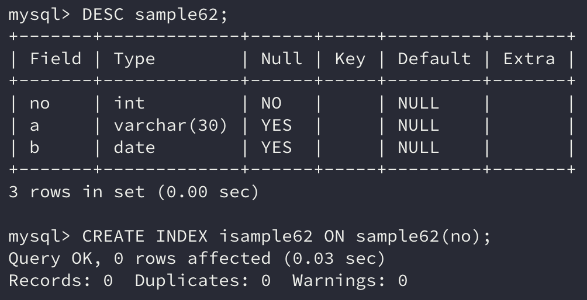
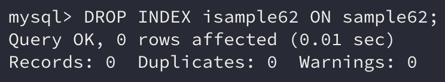
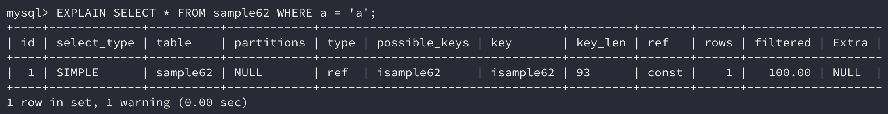

인덱스는 데이터베이스 객체 중 하나로 DDL을 사용해서 작성하거나 삭제한다.

표준 SQL에는 CREATE INDEX 명령은 없다. 하지만 대표적인 데이터베이스 제품에는 모두 인덱스 구조가 도입되어 있다.

## 1. 인덱스 작성

인덱스는 CREATE INDEX 명령으로 만든다. 인덱스에 이름을 붙여 관리하는데 이게 데이터베이스 객체가 될지 테이블의 열처럼 취급될지는 데이터베이스 제품에 따라 다르다.

> Oracle, DB2 등에서 인덱스는 스키마 객체가 된다. 따라서 스키마 내에 이름이 중복하지 않도록 지정해 관리한다.
>
> MySQL, SQL Server 등에서는 테이블 내의 객체가 된다. 따라서 테이블 내에 이름이 중복되지 않도록 지정해 관리한다.

인덱스를 작성할 때는 해당 인덱스가 어느 테이블의 어느 열에 관한 것인지 지정할 필요가 있다. 열은 복수로도 지정할 수 있다.

```sql
CREATE INDEX 인덱스명 ON 테이블명 (열명1, 열명2, ...)
```

인덱스를 작성할 때는 저장 장치에 색인용 데이터가 생성되는데, 데이터의 크기에 따라 시간과 저장 공간이 많이 사용된다.



## 2. 인덱스 삭제

인덱스는 DROP INDEX 명령으로 삭제한다. DROP 할 때는 다른 객체와 동일하게 인덱스 이름만 지정하면 된다.

하지만 테이블 내의 객체로서 작성하는 경우에는 테이블 이름도 지정한다(이때 인덱스를 구성하는 열은 지정할 필요가 없다).

```sql
DROP INDEX 인덱스명
```

```sql
DROP INDEX 인덱스명 ON 테이블명
```

> 만약 테이블을 삭제할 경우 인덱스도 함께 삭제된다.

예제 테이블에서 인덱스를 삭제해보자.

```sql
DROP INDEX isample62 ON sample62;
```



인덱스의 열을 WHERE 구로 조건을 지정하여 SELECT 명령으로 검색하면 처리속도가 향상된다.

반면에 INSERT 명령의 경우에는 인덱스를 최신 상태로 갱신하는 처리가 늘어나므로 처리속도가 조금 떨어진다.

```sql
CREATE INDEX isample62 ON sample62(a);
```

```sql
SELECT * FROM sample62 WHERE a = 'a';
```

만약 예제 테이블에서 조회할 때 WHERE 구에 지정된 조건식에서 사용하는 열이 인덱스일 경우 인덱스를 사용하여 조회한다.

## 3. EXPLAIN

인덱스 작성을 통해 쿼리의 성능 향상을 기대할 수 있다. 이때 실제로 인덱스를 사용해 검색하는지를 확인하려면 EXPLAIN 명령을 사용한다.

```sql
EXPLAIN SQL 명령
```

EXPLAIN 명령은 뒤에 확인하고 싶은 SQL 명령을 지정하면 되는데 실제로 SQL 명령이 실행되지는 않는다.

> 만약 실행해야지 명령이 연산 가능한 경우에 대해서만 실행한다.

EXPLAIN은 표준 SQL에는 존재하지 않는, 데이터베이스 제품 의존형 명령이다. 그러나 많은 데이터베이스는 이와 비슷한 명령을 지원한다.

```sql
EXPLAIN SELECT * FROM sample62 WHERE a = 'a';
```



해당 명령은 a열의 값을 참조하는데 isample62를 사용하여 검색한다.

## 4. 최적화

내부 처리에서는 `SELECT` 명령을 실행하기에 앞서 실행 계획을 세운다. EXPLAIN 명령은 이 실행 계획을 확인하는 명령이다.

이때 인덱스의 유무뿐만 아니라 인덱스를 사용할 것인지 여부를 내부 최적화 처리를 통해 판단한다.

만약 인덱스의 품질이 그냥 검색을 진행하는 것보다 나쁘다면 인덱스를 사용하지 않는다.

## 정리하면

이번에는 인덱스를 어떻게 작성하고 삭제하는지, 명령을 실행했을 때 인덱스를 사용하는지 여부를 확인할 수 있는 명령에 대해 알아보았다.

SELECT 명령을 실행하기 전에 실행계획을 세우는데 이때 인덱스를 사용할 수 있는지, 사용할 수 있다면 품질은 어떤지를 판단한다. 인덱스를 잘못 설정하면 오히려 모든 데이터를 조회하는 것보다 더 안 좋은 상황을 야기할 수도 있다.

데이터를 검색할 때 자주 사용되면서 행을 특정할 수 있는 열을 잘 선택해서 인덱스로 사용해야지 기대한 성능을 얻을 수 있을 것이다.