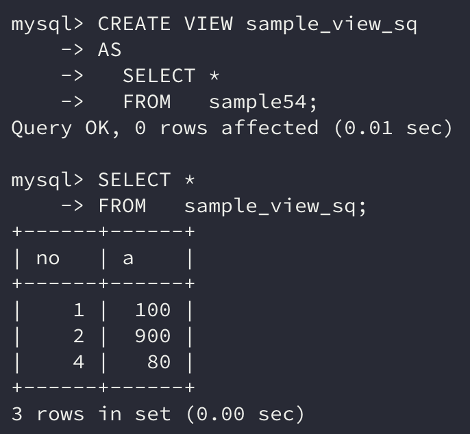
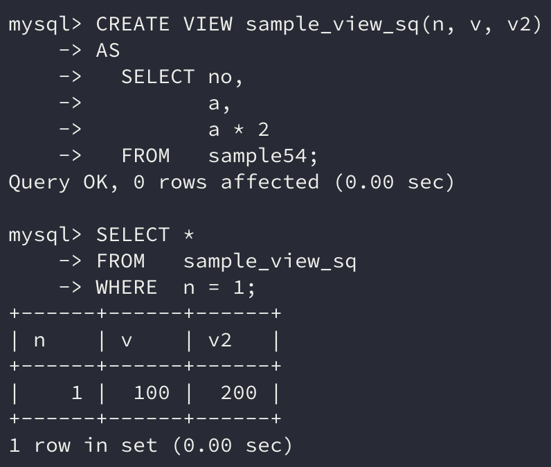
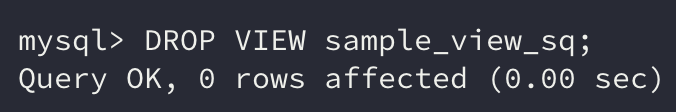

앞서 배운 서브쿼리는 `FROM` 구에 기술할 수 있었는데 여기에 이름을 붙이고 쓰기 쉽게 한 것이 **뷰**이다.

이번에는 뷰의 작성 및 삭제 방법, 뷰의 구조, 그리고 뷰의 구조상 약점과 회피 방법에 대해 알아보자.

## 1. 뷰

**뷰**는 **데이터베이스 객체로 등록할 수 없는** `SELECT` **명령을 객체로서 이름을 붙여 관리할 수 있도록 한 것**이다.

뷰를 참조하면 그에 정의된 `SELECT` 명령의 실행 결과를 테이블처럼 사용할 수 있다.

```sql
SELECT * FROM (SELECT * FROM sample54) sq;
```

위의 명령에서 서브 쿼리 부분을 뷰 객체로 만들면 아래와 같은 명령이 된다.

```sql
SELECT * FROM sample_view_sq;
```

sample_view_sq는 뷰의 이름이다. 뷰를 정의할 때는 **이름**과 `SELECT` 명령을 지정한다.

뷰를 만든 후에는 `SELECT` 명령에서 **뷰의 이름을 지정하면 참조**할 수 있다.

예시는 간단한 서브쿼리이지만 실제로 사용할 때는 `WHERE` 구로 조건을 지정하거나 `GROUP BY` 구로 집계하는 등 더 복잡한 명령으로 이루어지는 경우가 많다.

**자주 사용하거나 복잡한** `SELECT` **명령을 뷰로 만들어 편리하게 사용할 수 있는 것이 뷰**이다.

### 가상 테이블

뷰는 **가상 테이블**이라는 이름으로 불리기도 한다.

뷰는 테이블처럼 데이터를 쓰거나 지울 수 있는 **저장공간을 가지지 않기 때문**에 `SELECT` 명령에서만 사용하는 것을 추천한다.

## 2. 뷰 작성과 삭제

뷰는 **데이터베이스 객체**이기 때문에 **DDL로 작성하거나 삭제**한다.

**작성**할 때는 `CREATE VIEW`를, **삭제**할 때는 `DROP VIEW`를 사용한다.

### 뷰의 작성

```sql
CREATE VIEW 뷰명 AS SELECT 명령
```

`CREATE VIEW` 다음에 **뷰의 이름을 지정**하고 `AS`로 `SELECT` 명령을 지정한다.

```sql
CREATE VIEW sample_view_sq 
AS 
  SELECT * 
  FROM   sample54; 

SELECT * 
FROM   sample_view_sq; 
```



```sql
CREATE VIEW 뷰명(열명1, 열명2, ...) AS SELECT 명령
```

뷰의 열 지정을 **생략**한 경우 `SELECT` **구에서 지정하는 열 정보가 수집되어 자동적으로 뷰의 열로 지정**된다. 만약 열을 **지정**할 경우는 `SELECT` **명령의** `SELECT` **구에 지정한 열보다 우선**된다.

```sql
CREATE VIEW sample_view_sq(n, v, v2) 
AS 
  SELECT no, 
         a, 
         a * 2 
  FROM   sample54; 

SELECT * 
FROM   sample_view_sq 
WHERE  n = 1; 
```



### 뷰 삭제

뷰를 **삭제**할 경우에는 `DROP VIEW`를 사용한다.

```sql
DROP VIEW 뷰명
```

```sql
DROP VIEW sample_view_sq;
```



## 3. 뷰의 약점

**뷰**는 데이터베이스 객체로서 저장장치에 저장되지만, 테이블과 달리 **대량의 저장공간을 필요로 하지 않는다.** 데이터베이스에 저장되는 것은 `SELECT` **명령뿐이기 때문**이다.

그러나 **CPU 자원을 사용**하게 된다. `SELECT` 명령을 실행할 때 사용되는 연산능력이 CPU를 사용하기 때문이다.

그리고 뷰를 참조할 때마다 `SELECT` 명령이 실행된다.

### 머티리얼라이즈드 뷰(*Materialized View*)

뷰는 **뷰가 참조하는 테이블에 데이터가 많을 경우, 뷰를 중첩해서 사용하는 경우 처리속도가 떨어지기 쉽다.**

이런 상황을 회피하기 위해 사용할 수 있는 것이 **머티리얼라이즈드 뷰(*Materialized View*)**이다.

일반적인 뷰는 데이터를 일시적으로 저장했다가 쿼리가 실행 종료될 때 함께 삭제된다. 그에 비해 **머티리얼라이즈드 뷰는 데이터를 일시적으로 저장해 사용하는 것이 아니라 테이블처럼 저장장치에 저장해 두고 사용**한다.

뷰가 처음 참조되었을 때 데이터를 저장해 두고 이후 저장된 데이터를 그대로 사용한다. 다만 **뷰에 지정된 테이블의 데이터가 변경된 경우** `SELECT` **명령을 재실행하여 데이터를 다시 저장**한다.

> 변경 유무를 확인하고 재실행하는 것은 RDBMS가 자동으로 실행한다.

뷰에 지정된 테이블의 데이터가 **자주 변경되지 않는 경우**라면 **머티리얼라이즈드 뷰를 사용하여 뷰의 약점을 어느 정도 보완**할 수 있다.

> MySQL에서는 머티리얼라이즈드 뷰를 사용할 수 없다. 지금은 Oracle, DB2에서만 제공되는 객체이다.

### 함수 테이블

뷰는 **또 하나의 약점**으로 **단독으로 실행 가능한 SELECT 명령만 지정**할 수 있다는 것이다. 상관 서브쿼리처럼 부모 쿼리와 연관된 서브쿼리의 경우는 뷰의 `SELECT` 명령으로 사용할 수 없다.

이러한 뷰의 약점을 **함수 테이블**을 사용해 회피할 수 있다.

함수 테이블은 테이블을 결괏값으로 반환해주는 사용자 정의 함수이다. 함수에는 인수를 지정할 수 있기 때문에 **인수 값에 따른 WHERE 조건을 붙여 결괏값을 바꿀 수 있다.** 이는 **상관 서브쿼리**처럼 동작한다.

## 정리하면

서브쿼리로 사용되는 **뷰**에 대해 알아보았다.

뷰는 **복잡하거나 자주 사용하는** `SELECT` **명령을 하나의 데이터베이스 객체로 만들어 사용할 수 있는 방법**이다.

다만 뷰가 가지는 **약점을 잘 파악**하고 적절히 사용한다면 **쿼리를 훨씬 단순 명료하게 작성**할 수 있을 것이다.