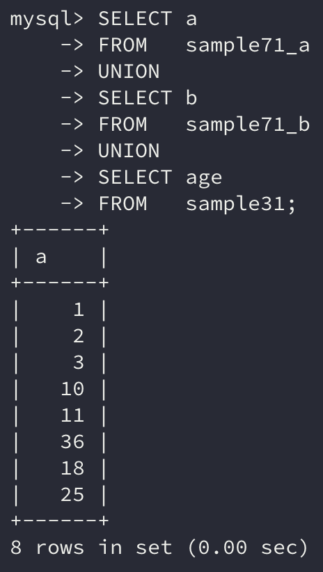

이번에는 하나의 테이블이 아닌 **복수의 테이블을 사용해 데이터를 검색하는 방법**에 대해 알아보자.

## 1. SQL과 집합

집합은 **요소**들로 이루어져 있다.

데이터베이스의 테이블을 집합에 비유해보면 **각각의 행이 하나의 요소**에 해당한다. `SELECT` 명령을 실행하면 데이터베이스에 질의하며 몇 개의 행을 반환한다.

이때 **반환된 결과 전체를 하나의 집합**이라 생각할 수 있다.

## 2. UNION으로 합집합 구하기

### UNION

집합에는 두 집합의 요소를 합치는 **합집합**이 있다. 이를 SQL에서는 `UNION` 키워드를 통해 사용할 수 있다.

`A UNION B` 명령을 사용하면 A와 B를 **합집합**한 결과를 얻을 수 있다.

```sql
SELECT * 
FROM   sample71_a;
```


```sql
SELECT * 
FROM   sample71_b;
```


위 두 예제 테이블의 원소를 합집합 연산을 하면 `{1, 2, 3, 10, 11}`이 나올 것이라 기대할 수 있다. 실제 `UNION` 연산을 사용하면 결과가 어떻게 반환되는지 확인해보자.

```sql
SELECT * 
FROM   sample71_a 
UNION 
SELECT * 
FROM   sample71_b;
```


결과는 예상한 대로 반환되었음을 볼 수 있다.

정리하면, **한 번의 쿼리 실행으로 두 개의** `SELECT` **명령이 내부적으로 실행되는 형식**이다.

`UNION`을 이용하면 개수를 상관하지 않고 `SELECT` 명령을 하나로 묶을 수 있다. 그러나 이때 각각의 `SELECT` 명령의 열의 내용은 서로 일치해야 한다. 이때 **열의 내용은 해당 열의 자료형**이다.

만약 테이블의 열의 구성이 전혀 다르다면 원하는 열을 `SELECT` 구에 지정함으로써 `UNION`을 실행할 수 있다.

```sql
SELECT a 
FROM   sample71_a 
UNION 
SELECT b 
FROM   sample71_b 
UNION 
SELECT age 
FROM   sample31;
```



### UNION을 사용할 때의 ORDER BY

`UNION`으로 `SELECT` 명령을 결합해 합집합을 구하는 경우, **각** `SELECT` **명령에** `ORDER BY`**를 지정해 정렬할 수는 없다.**

> 사실 생각해보면 `ORDER BY`로 각각의 `SELECT` 명령의 결과를 정렬한다고 치자.
>
> 어차피 그다음에 `UNION`에서 다시 합쳐지면서 이전의 `ORDER BY`는 의미가 없어질 것이다.

`ORDER BY`를 지정할 때는 **마지막** `SELECT` 명령에만 지정하도록 한다.

그런데 각각의 `SELECT` 명령의 결과는 열의 자료형은 같아야 하지만, 열의 이름이 같다는 보장은 없다.

그렇기 때문에 만약 서로 다른 열의 이름을 가질 경우 `AS`를 사용해 **별명을 지정**하고, 이를 `ORDER BY`에서 사용해야 한다.

```sql
SELECT a AS c 
FROM   sample71_a 
UNION 
SELECT   b AS c 
FROM     sample71_b 
ORDER BY c DESC;
```


### UNION ALL

`UNION`은 합집합을 구하는 것이므로 두 개의 집합에서 겹치는 부분은 공통 요소가 되고 이는 결과에서 중복 제거가 된다. 이는 두 `SELECT` 명령의 실행 결과에서 `DISTINCT`**를 걸어 중복을 제거한 것과 같다고** 생각하면 이해하기 쉽다.

그런데 만약 두 결과를 합치기만 하고 중복을 제거하기 싫다면?

이러한 경우에는 `UNION ALL`을 사용하면 된다. `UNION`의 **기본 동작이 DISTINCT**이고, **모든 결과를 얻고 싶다면 ALL을 추가**적으로 지정한다.

> `UNION`의 **기본 동작 방식이 DISTINCT**인 것이지 `UNION ALL`처럼 `UNION DISTINCT`라는 명령이 존재하는 것은 아니다!

만약 중복된 결과가 없는 경우는 `UNION`보다는 `UNION ALL`이 더 좋은 성능을 보여준다.

## 3. 교집합과 차집합

교집합과 차집합 역시 기본적인 집합의 연산 결과와 동일하게 동작한다.

교집합은 `INTERSECT` 명령을, 차집합은 `EXCEPT` 명령으로 사용할 수 있다.

> MySQL의 경우는 **위 두 명령어 모두 지원하지 않는다.** 그리고 Oracle의 경우에는 `EXCEPT` 대신 `MINUS`를 사용한다.


## 정리하면

**관계형 데이터베이스(*RDBMS*)**는 **관계형 모델**를 모델로 설계된 데이터베이스이다. 관계형 모델은 **수학 집합론**을 기반으로 하므로, **데이터베이스를 집합으로 간주**하고 관리하고 연산한다.

이번에는 이런 방법으로 가장 기본이 되는 **합집합, 교집합, 차집합**에 대한 연산 방법을 알아봤다.

MySQL에서는 **합집합**에 대한 연산인 `UNION`, `UNION ALL` 예약어를 통해 사용할 수 있다. **교집합과 차집합**은 MySQL에서는 예약어로 제공되지 않기 때문에 추후 다른 방법을 통해 알아보자.

