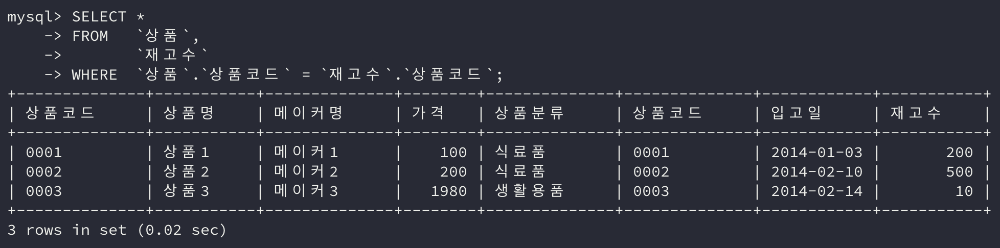
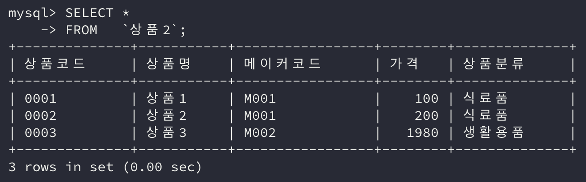
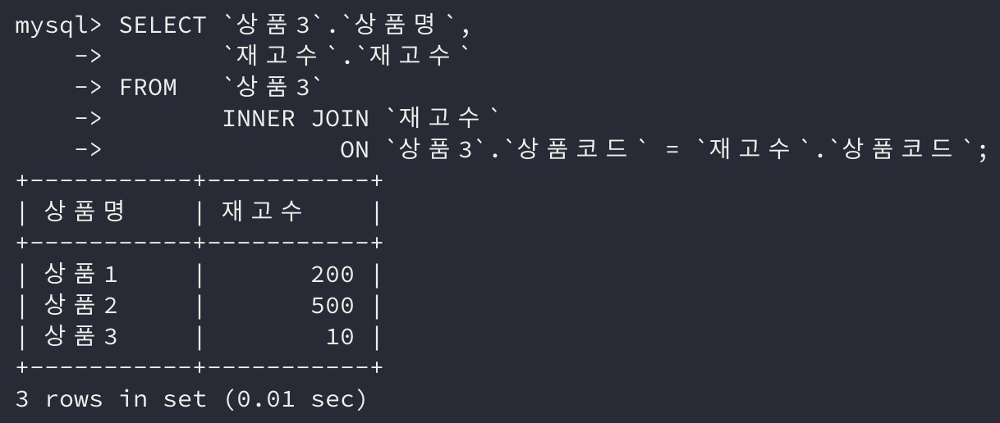

이번에는 RDBMS에서 매우 중요한 개념인 **테이블 결합(*join*)**에 대해 알아보자.

이전에 배운 **합집합(**`UNION`**)의 경우는 세로(행) 방향**으로 데이터가 늘어났다면, 이번에 배울 **곱집합(**`JOIN`**)은 가로(열) 방향**으로 데이터가 늘어난다.

## 1. 곱집합과 교차결합

곱집합은 두 개의 집합을 곱하는 연산 방법으로 **적 집합 또는 카티전 곱(*Cartesian product*)**이라고 불린다.

만약 집합 X의 요소는 `{A, B, C}`, 집합 Y의 요소는 `{1, 2, 3}`일 경우 두 집합의 곱집합은 아래와 같다.


### 교차결합(Cross Join)

SELECT 명령에서 FROM 구에 하나의 테이블이 아닌 두 개의 태이블을 지정하면 **곱집합**으로 계산된다.

```sql
SELECT * FROM 테이블명1, 테이블명2, ...
```

아래 두 예제 테이블의 교차결합을 진행하면 어떤 결과가 나오는지 확인해보자.

```sql
SELECT * 
FROM   sample72_x;
```


```sql
SELECT * 
FROM   sample72_y;
```


```sql
SELECT *
FROM   sample72_x, sample72_y;
```


### UNION 연결과 결합 연결의 차이

`UNION`에서도 집합을 더해 새로 큰 집합을 만들었다. 그러나 `UNION`으로 합집합을 구했을 때는 세로 방향으로 더해진다면 FROM 구로 **테이블을 결합할 때는 가로 방향으로 더해진다.**

## 2. 내부 결합

교차결합의 경우 결합하는 테이블 수가 많아질수록, 내부에 존재하는 데이터가 많아질 수록 집합이 거대해진다. 그래서 **필요한 조건에 해당하는 값만 결합하는 내부 결합이 더 많이 사용**된다.

데이터베이스에는 다양한 데이터가 저장되지만 동일한 데이터를 중복해서 여러 곳에 저장하지 않도록 하는 편이 좋다. 상품 테이블과 재고수 테이블을 통해 원하는 상품이 몇 개의 재고를 가지고 있는지 **내부 결합을 통해 확인**해보자. 

```sql
SELECT *
FROM   `상품`;
```


```sql
SELECT *
FROM   `재고수`;
```


재고수 테이블은 상품명이 아니라 상품 코드를 가지고 있고, 이는 상품 테이블에서 상품 각각이 가지는 코드와 동일하다.

> 다른 테이블의 데이터를 참조해야 하는 경우, 참조할 테이블의 기본키와 동일한 이름과 자료형으로 열을 만들어 행을 연결하는 경우가 많다.

그럼 우선 상품 테이블과 재고수 테이블을 **결합**하고 원하는 결과를 조건에 맞춰 뽑아보자.

```sql
SELECT *
FROM   `상품`, `재고수`;
```


위 결과에서 상품코드가 동일한 행만 우리가 검색할 데이터이다.

```sql
SELECT * 
FROM   `상품`, 
       `재고수` 
WHERE  `상품`.`상품코드` = `재고수`.`상품코드`;
```



이렇게 교차결합으로 계산된 곱집합에서 원하는 조합을 검색하는 것을 **내부 결합(*Inner Join*)**이라고 한다.

위 내부 결합 명령에서 `WHERE` 구에 지정된 조건의 경우 **결합조건**이라 부르기도 한다.

## 3. INNER JOIN으로 내부결합하기

위에서 설명한 **내부결합에서 보다 편하게 쓸 수 있는,** `INNER JOIN` 키워드를 사용한 결합방식을 알아보자.

앞서 확인한 예시를 `INNER JOIN`을 사용해 바꿔보면 아래와 같다.

```sql
SELECT `상품`.`상품명`, 
       `재고수`.`재고수` 
FROM   `상품` 
       INNER JOIN `재고수` 
               ON `상품`.`상품코드` = `재고수`.`상품코드`;
```


INNER JOIN에서는 ON을 사용하여 결합 조건을 지정한다.

## 4. 내부 결합을 활용한 데이터 관리

메이커코드와 메이커명을 가지는 메이커 테이블이 있다고 가정하자.

상품을 제조하는 메이커가 아무리 많아도 상품 수보다는 적을 것이다. 이때 코드와 이름을 가지는 테이블로 분할해 관리하면 저장공간을 절약할 수 있다.

결합 조건을 상품 테이블의 메이커코드와 메이커 테이블의 메이커코드가 동일한 경우로 연산해보자.

```sql
SELECT *
FROM   `상품2`;
```



```sql
SELECT S.`상품명`, 
       M.`메이커명` 
FROM   `상품2` S 
       INNER JOIN `메이커` M 
               ON S.`메이커코드` = M.`메이커코드`;
```


위 명령에서는 내부 결합에 사용하는 테이블의 이름을 매번 적기 번거로우므로 **별명을 사용**했다.

그리고 상품 테이블을 보면 동일한 메이커코드를 가지는 행이 존재한다. 그러나 메이커 테이블에는 모든 메이커코드가 유일한 값을 가진다.

즉, A 테이블과 B 테이블을 결합했을 때, A와 B 중 **어느 쪽이 하나의 행만 가지는지(일대다, 다대일)** 아니면 **양쪽 모두 하나의 행을 가지는지(일대일)** 등과 같은 **서로 결합하는 테이블 간의 관계가 중요**하다.

### 외부 키

**다른 테이블의 기본키를 참조하는 열이 외부 키**가 된다. 상품 테이블에 메이커코드와 같은 값을 외부 키라 한다.

### 자기 결합(Self Join)

같은 테이블 각각에 별명을 붙여 **같은 테이블끼리 결합**하는 것을 말한다.

```sql
SELECT S1.`상품명`, 
       S2.`상품명` 
FROM   `상품` S1 
       INNER JOIN `상품` S2 
               ON S1.`상품코드` = S2.`상품코드`;
```


## 5. 외부 결합

결합 방법은 크게 내부 결합과 **외부 결합**의 두 가지로 구분된다. 앞서 설명한 내부 결합과 달리 **외부 결합**은 **어느 한쪽에만 존재하는 데이터행을 어떻게 다룰지를 변경할 수 있는 결합 방법**이다.

A 테이블과 B 테이블을 결합하는데 A 테이블에만 존재하는 데이터라도 가져오고 싶을 경우 **외부 결합**을 사용하면 된다.

동일한 결합 조건을 `INNER JOIN`에 사용한 명령은 아래와 같다.

```sql
SELECT `상품3`.`상품명`, 
       `재고수`.`재고수` 
FROM   `상품3` 
       INNER JOIN `재고수` 
               ON `상품3`.`상품코드` = `재고수`.`상품코드`;
```



결합 조건을 **상품 테이블에만 존재하는 값도 가져오고 싶을 경우**에 사용하는 `LEFT JOIN`에 사용한 명령은 아래와 같다.

```sql
SELECT `상품3`.`상품명`, 
       `재고수`.`재고수` 
FROM   `상품3` 
       LEFT JOIN `재고수` 
              ON `상품3`.`상품코드` = `재고수`.`상품코드`;
```


상품 테이블에만 존재하는 추가 상품이 검색되었는데 재고수 테이블에는 관련 행이 존재하지 않기 때문에 **NULL이 반환**되었다.

두 테이블 중에 **왼쪽 테이블을 기준**으로 하고 싶다면 `LEFT JOIN`, **오른쪽 테이블을 기준**으로 하고 싶다면 `RIGHT JOIN`을 사용하면 된다.

### 구식 방법에서의 외부 결합과 표준 SQL

가장 먼저 살펴봤던 구식 방법을 사용해 외부 결합을 구할 수 있다. 그러나 **구식 방법은 SQL 표준이 아니기 때문에 사용하지 않도록** 하자!

## 정리하면

**테이블 결합**은 **복잡한 데이터베이스를 다룰 때 필수적으로 사용되는 방법**이다.

각 명령어들에 대한 이해도를 높이고 적절하게 사용하도록 하자.

