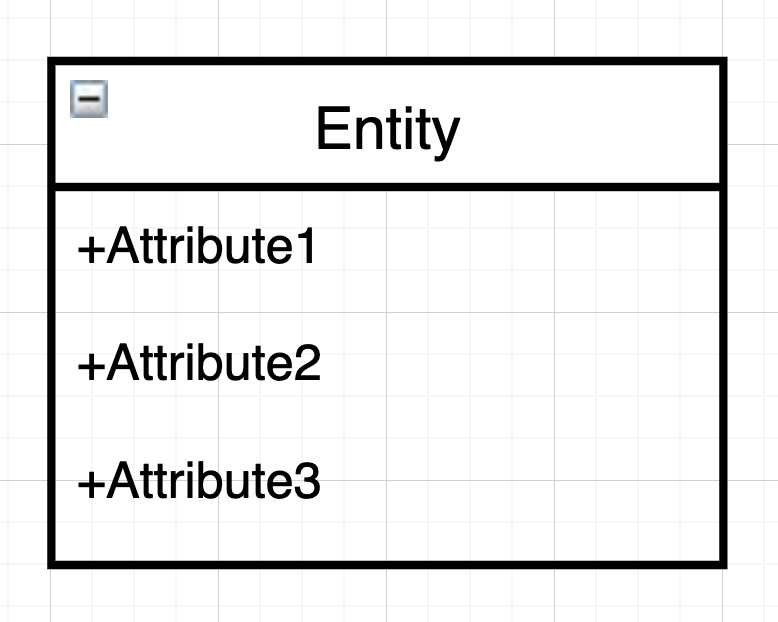
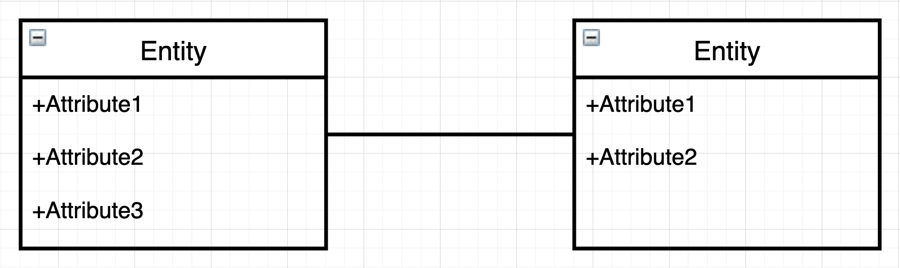

## 1. 데이터베이스 설계

데이터베이스를 설계한다는 것은 **데이터베이스의 스키마 내에 테이블, 인덱스, 뷰 등의 데이터베이스 설계를 정의하는 것**을 말한다. 스키마 내에 정의한다는 뜻에서 **스키마 설계**라 부르기도 한다.

### 논리명과 물리명

- **물리명** : **데이터베이스에서 사용될 이름**으로 CREATE TABLE에 지정하는 이름을 말한다.

- **논리명** : **테이블의 설계상 이름**에 해당한다.

물리명은 데이터베이스 시스템 규칙에 따라 길이에 제한이 있거나 공백 문자를 사용할 수 없는 등의 **제약**이 따른다. 이런 이유 때문에 약자로 이름을 정하는 경우가 많다.

논리명은 **언제든지 바꿀 수 있다는 장점**이 있다. 테이블의 정의서나 설계도에 논리명 또는 비고라는 열 명으로 논리명을 기록해둔다.

### 자료형

데이터로 **어떤 것이 저장될 것인지**를 잘 파악하여 **자료형**을 정해야 한다.

데이터에 따라서는 '1, 2, 3 중 하나' 또는 'yes, no 중 하나'와 같은 데이터가 있다. 이런 경우에는 데이터베이스 기능으로 **제약(CHECK 제약)**을 걸 수 있다. **데이터 정합성**이 중요한 부분에는 적극적으로 사용할 필요가 있다.

> **정합성**은 데이터가 **서로 모순이 없이 일관되게 일치**해야 한다는 의미이다.

데이터베이스 시스템에서 데이터 정합성을 체크할 수 있다면 **데이터베이스에 맡겨버리는 편**이 가장 확실하고 편리하다.

### 고정 길이와 가변 길이

문자열의 자료형에는 **고정 길이와 가변 길이**가 있다. 만약 데이터가 제조번호처럼 자릿수가 정해져 있는 경우 고정길이를, 길이의 변동 폭이 큰 경우는 가변 길이를 사용하는 것이 좋다.

그러나 가변 길이 자료형인 VARCHAR의 경우 지정할 수 있는 최대 크기는 수천 바이트에 불과하다. 긴 문자열을 저장하기에는 턱없이 부족한 크기이다.

이런 경우는 LOB(Large Object) 형을 사용하면 된다. 이 자료형은 인덱스로 지정할 수는 없다.

### 기본키

기본키 제약은 **테이블의 행의 유일성을 지정하는 일**이기 때문에 매우 주의해야 한다. 만약 테이블에서 기본키로 지정할 열이 없을 경우 **자동 증가 열**을 사용해서 **기본키로 지정**하면 된다.

**자동 증가 열**은 `INSERT`를 할 경우 행 번호를 자동으로 증가시켜서 저장해주는 열이다. MySQL의 경우는 `AUTO_INCREMENT`를 지정하는 것으로 자동 증가 열을 만들 수 있다.

앞서 소개한 몇 가지 요소들을 통해 테이블 정의서가 만들어진다. 이는 테이블을 관리하고 설계할 때 중요하므로 소홀히 여기지 않도록 하자.

## 2. ER 다이어그램

ER의 **E**는 **개체**를 뜻하는 *Entity*의 약자이며 **R**은 **관계**를 뜻하는 *Relationship*의 약자이다. **ER 다이어그램**은 **개체 간의 관계**를 표현한 것이다.

>  **ER다이어그램**의 **관계**는 관계형 데이터베이스의 릴레이션과 달리 **릴레이션십**을 가리킨다.

**엔티티**, 즉 **개체**는 **테이블 또는 뷰**를 말한다. ER다이어그램에서 개체는 **사각형으로 표시**한다. 상단에는 개체 이름을 적고 내부에는 개체의 속성을 표기한다.

개체와 개체가 서로 연계되는 경우에는 선으로 이어서 표현한다.

**릴레이션십**을 표현할 때는 **몇 대 몇의 관계**를 가지는지를 숫자나 기호로 나타낼 수 있다.

> 이를 **Cardinality** 또는 **다중도**라고 한다.

여러 가지 패턴의 표기방법 중에서도 가장 기본적인 세 가지는 다음과 같다.

- 일대일(1 : 1)

- 일대다(1 : *)

- 다대다(* : *)

ER 다이어그램의 릴레이션십은 데이터베이스에서는 **외부 참조 제약(외부 키 제약)**으로 지정되는 경우가 있으므로 기억하길 바란다.

## 정리하면

지금까지 데이터베이스가 어떤 식으로 설계되는지 살펴보았다. **테이블 정의서**나 **ER 다이어그램**은 **전체적인 데이터베이스의 구성**을 알 수 있는 중요한 자료이다.

이를 잘 이해하고 작성할 수 있도록 연습을 해보자!

