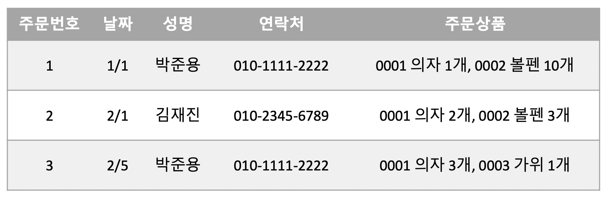
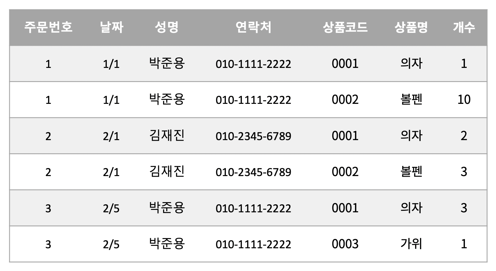
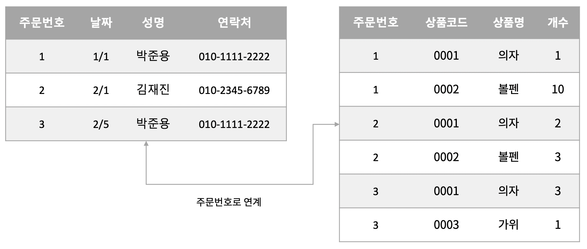
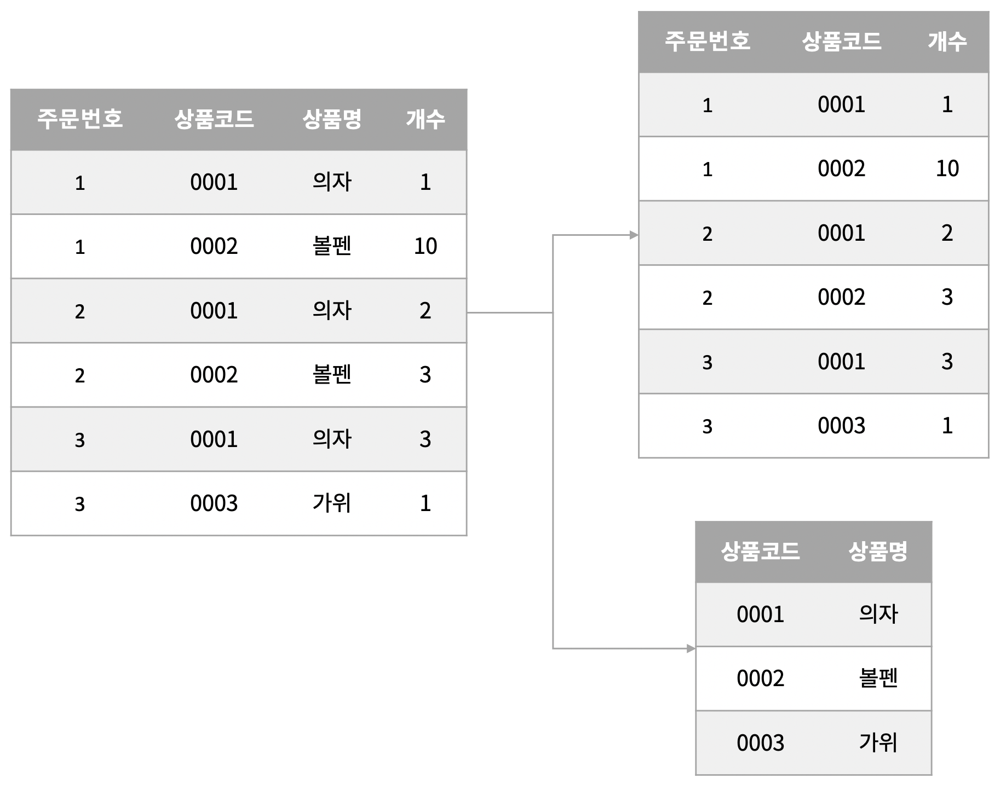
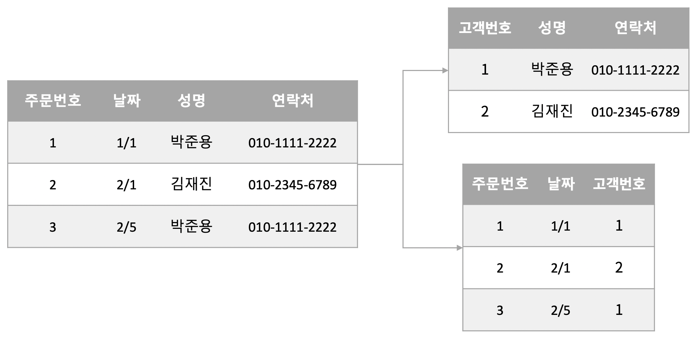
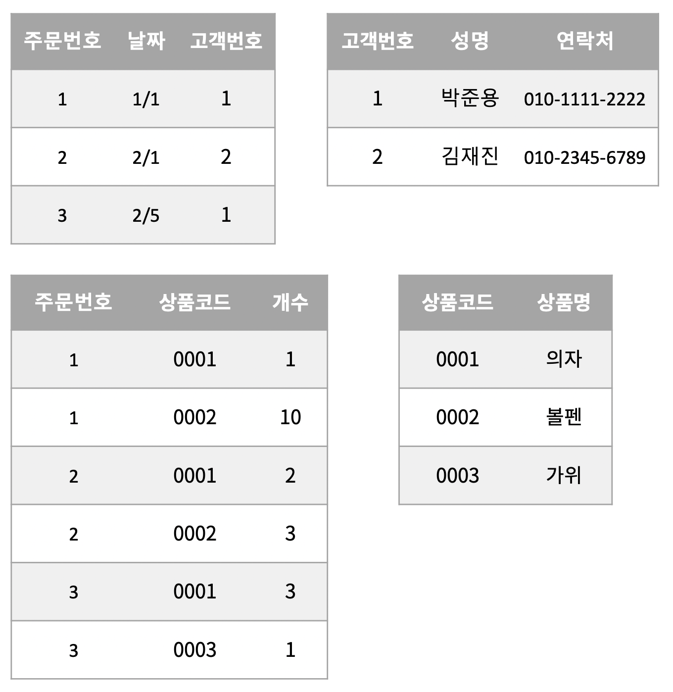
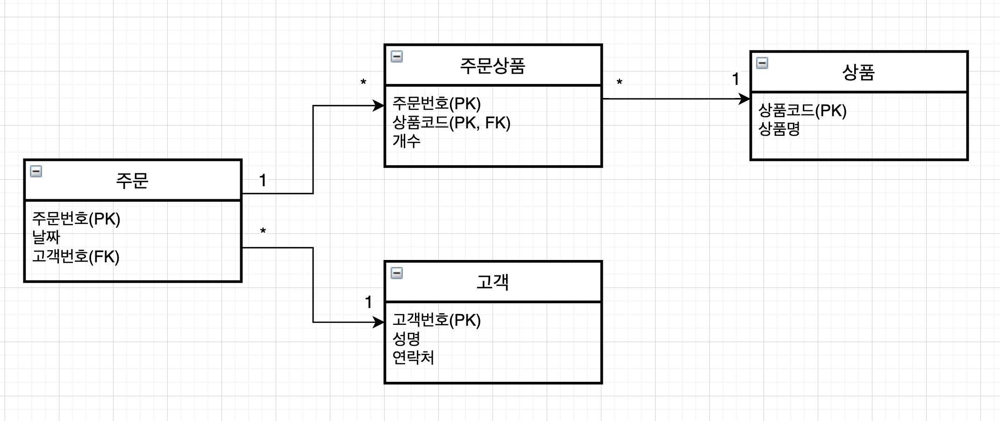

테이블을 올바른 형태로 변경하고 분할하는 것을 **정규화**라 한다.

정규화는 데이터베이스의 **설계 단계**에서 행해진다. 때에 따라서는 기존 시스템을 재검토할 때 정규화하는 경우도 있다.

## 1. 정규화

정규화가 어떤 순서로 진행되는지 간단한 예제를 통해 확인해보도록 하자.

## 2. 제1 정규형

관계형 데이터베이스의 테이블에는 **하나의 셀에 하나의 값만 저장**할 수 있다는 제약이 있다. 위의 예시에서는 주문상품 열이 여러 데이터를 가지고 있으니 이를 상품코드, 상품명, 개수를 담는 세 개의 열로 나누어야 한다.

주문상품 열을 분리한 결과 하나의 셀에는 하나의 값만 저장되었다. 열은 2개가 추가되었고 행도 늘어난 것을 볼 수 있다.

이렇게 **하나의 셀에 하나의 값만 저장**할 수 있도록 하고, **반복되는 부분을 세로(행) 방향으로 늘려나가는 것**이 **제1 정규화의 제1단계**이다.

제1 정규화에서는 **중복을 제거하는 테이블의 분할**도 이루어진다. 위를 보면 주문번호, 날짜, 성명, 연락처는 같은 값이 반복되고 있으므로 이를 주문 테이블로 나누어보자.

그 결과 위와 같이 주문번호로 주문 테이블과 주문상품 테이블로 깔끔하게 분리되었다. 이로 인해 만약 주문 데이터가 변경되더라도 주문 테이블 **한 군데에서만 수정**하면 된다.

주문 테이블은 **주문번호가 유일**하기 때문에 **기본키**로 지정할 수 있다. 그러나 주문상품 테이블은 **주문번호와 상품코드**가 유일한 식별자이기 때문에 **이 둘을 묶어 기본키**로 지정할 수 있다.

이처럼 제1 정규화에서는 **반복되는 부분을 찾아내서 테이블을 분할**하고 **기본키가 될 열을 작성**할 수 있다.

## 3. 제2 정규형

**제2 정규화**에서는 **데이터가 중복하는 부분을 찾아내어 테이블로 분할**해 나간다. 이때 **기본키에 의해 특정되는 열과 그렇지 않은 열로 나누는 것**으로 정규화가 이루어진다.

앞서 분리한 테이블 중 주문상품 테이블을 보자. 주문상품 테이블은 **주문번호와 상품코드가 기본키**로 사용되어진다.

**개수 열**은 기본키가 결정되고 나면 **특정할 수 있는 값**이다. 그러나 **상품명**의 경우는 주문번호와 상관없이 **상품코드로만 특정할 수 있는 값**이다. 그렇다면 이 두 가지를 테이블로 분리해보자.

새로운 상품 테이블을 분리하였고, 상품 테이블은 **상품코드**만으로 기본키를 지정했다.

이처럼 부분 **함수 종속성**을 찾아내서 **테이블을 분할하는 것**이 **제2 정규화**이다.

> **함수 종속성**이란 키 값을 이용해 데이터를 특정 지을 수 있는 것을 가리킨다.

## 4. 제3 정규형

제2 정규화는 기본키에 중복이 없는지 조사했다면, **제3 정규화**는 **기본키 이외의 부분에서 중복이 없는지를 조사**한다.

이전에 작성된 주문 테이블을 보면 성명과 연락처가 같은 사람이 주문을 반복해서 하는 경우가 생긴다. 그렇다면 이를 테이블로 분리할 수 있을 것이다.

이전에 동일한 고객의 정보가 반복되었던 부분을 고객 테이블로 분리하고 고객번호를 기본키로 지정하였다. 고객번호는 이전 주문 테이블의 성명과 연락처 열을 대신해 사용된다.

그럼 정규화를 마친 후의 테이블을 확인해보자.

이처럼 정규화를 통해 테이블을 분할해 나간다. 분할할 때에는 서로 결합할 수 있도록 **기본키를 추가해 분할**한다.

테이블 간의 연계는 **ER 다이어그램**으로 표현하면 알기 쉽다. 정규화 이후의 테이블 간 연관관계를 ER 다이어그램으로 표기해보면 아래와 같다.

## 5. 정규화의 목적

**정규화**에서는 중복하거나 반복되는 부분을 찾아내서 테이블을 분할하고 기본키를 작성해 사용하는 것을 기본 개념으로 삼는다. 이는 **하나의 데이터는 한 곳에 있어야 한다는 규칙**에 근거한다.

하나의 데이터가 반드시 한 곳에만 저장되어 있다면 **데이터를 변경하더라도 한 곳만 변경하는 것으로 끝낼 수 있다.**

반면 정규화되지 않은 경우에는 여기저기 중복해서 저장된 데이터를 검색하고 일일이 변경해야 한다. 또한 인덱스가 지정된 열의 데이터가 변경되는 경우에는 인덱스도 재구축해야 하는 단점이 있다.

## 정리하면

정규화는 데이터베이스 설계 단계에서 행해지며, **하나의 데이터가 한 곳에만 있게 하기 위한 방법**이다. 이러한 방법을 통해 정규화된 테이블은 **수정이나 변경에 매우 유연하게 대처**할 수 있다.

> 마치 **객체지향적인 프로그래밍**을 함으로 얻는 장점과 비슷한 것 같다.

초기 설계 때 데이터베이스를 잘 정규화해둔다면 이후 데이터베이스를 **유지 관리할 때 편리할 것**이란 생각이 든다.

