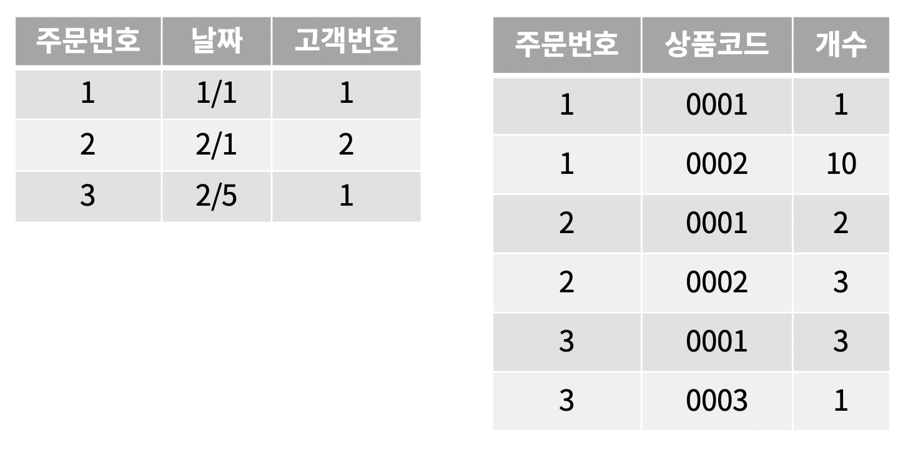

## 1. 트랜잭션

정규화로 분할한 테이블 중 주문 테이블과 주문상품 테이블을 예시로 트랜잭션을 알아보자.



주문 테이블과 주문상품 테이블 사이에는 의존 관계가 존재한다. 주문 테이블에 행이 존재한다면 주문상품 테이블에는 적어도 하나의 행이 존재해야 한다.

### 발주처리

주문이 발생하는 때를 생각해보자. 먼저 주문번호가 발행될 것이다. 그리고 이 번호를 키로 사용해서 **주문 테이블에 한 번, 주문상품 테이블에 주문한 상품 갯수만큼** `INSERT` **명령이 실행**된다.

복수의 테이블에 `INSERT` 되므로 실행되는 명령은 **최소 두 번 이상**이 된다.

```sql
INSERT INTO `주문` 
VALUES     (4, 
            '2020-10-04', 
            1); 

INSERT INTO `주문상품` 
VALUES     (4, 
            '0003', 
            1); 

INSERT INTO `주문상품` 
VALUES     (4, 
            '0004', 
            2);
```

여기서 INSERT 명령이 특정 원인으로 인해 **에러가 발생한 경우**를 가정해보자.

트랜잭션 기능을 사용하지 않을 경우 `INSERT` 명령을 실행 전으로 되돌릴 수 없으므로 따로 `DELETE` 명령을 실행해 지워야한다. 이는 분명 상당히 번거로운 작업이다.

## 2. 롤백과 커밋

위의 예시와 같이 **몇 단계로 처리를 나누어 SQL 명령을 실행하는 경우**에 **트랜잭션을 자주 사용**한다.

트랜잭션을 사용해서 데이터를 추가한다면 **에러가 발생해도 트랜잭션을 롤백(*Rollback*)해서 종료**할 수 있다. 아무런 **에러가 발생하지 않는다면 변경사항을 적용하고 트랜잭션을 종료**하는데, 이때 **커밋(*Commit*)**을 사용한다.

> 트랜잭션을 **롤백**하면 변경한 내용이 적용되지 않는다.

### 자동 커밋

트랜잭션을 사용하려면 **자동커밋**을 꺼야하는데 이는 **명시적으로 트랜잭션을 실행하는 명령**인 `START TRANSACTION`을 사용함으로 해결할 수 있다.

```sql
START TRANSACTION
```

앞서 변경된 내용을 적용한 후 종료하려면 커밋을,

```sql
COMMIT
```

적용하지 않고 종료하려면 롤백을 하면 된다.

```sql
ROLLBACK
```

트랜잭션 내에서 실행된 SQL 명령은 **임시 데이터 영역에 저장**된다. 그리고 `COMMIT` 명령을 내리면 **임시 데이터 영역에서 정식 데이터 영역으로 변경**이 적용된다.

앞서 살펴본 예시에 트랜잭션을 적용해보자.

```sql
START TRANSACTION;INSERT INTO `주문` VALUES 
            ( 
                        4, 
                        '2020-10-04', 
                        1 
            );INSERT INTO `주문상품` VALUES 
            ( 
                        4, 
                        '0003', 
                        1 
            );INSERT INTO `주문상품` VALUES 
            ( 
                        4, 
                        '0004', 
                        2 
            );COMMIT;
```

이렇게 트랜잭션을 통해 처리하는 방법을 **'트랜잭션을 걸어서 실행한다'**라고 말하기도 한다.

## 3. 트랜잭션 사용법

하나의 명령에 트랜잭션을 사용하는 것은 별로 의미가 없다. 트랜잭션은 **세트로 실행하고 싶은 SQL 명령을 묶어서 실행**하는 것이다.

자동커밋의 경우 **클라이언트 툴의 기능**이다. 그리고 데이터베이스는 언제나 트랜잭션을 걸 수 있는 상태로 SQL 명령을 실행한다. 따라서 트랜잭션을 사용할 경우 접속형태나 클라이언트 툴의 자동커밋 사용 여부 등 **트랜잭션 관련 기능을 파악**해 둘 필요가 있다.

## 정리하면

트랜잭션은 실제로 다양한 서비스를 구현할 때 자주 사용된다. 데이터에 여러 번 접근해야 하는 작업의 경우 하나의 트랜잭션으로 처리하지 않으면 **일관성이 보장되지 않기 때문**이다.

또한 트랜잭션을 언급할 때 항상 나오는 특징인 **ACID**가 있다. 해당 내용도 함께 학습해두면 좋을 것 같다.

